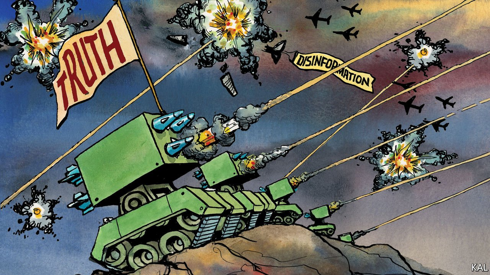

###### Lexington

# Deploying reality against Putin 

##### The administration is countering Russian disinformation on Ukraine 

 

> Feb 26th 2022 

THE INTERNET, microchips and semiconductors are all products of American defence spending during the cold war. Another, less well-known, is a school of social psychology that President Joe Biden has drawn on heavily in recent weeks. It has been evident in his administration’s remarkable openness with intelligence in both its diplomacy and public messaging on Ukraine.

This effort started shortly after the administration concluded last October that Vladimir Putin’s military build-up was an invasion plan. It began reclassifying the supporting intelligence in order to make it widely available within NATO. From early December, when it published an intelligence assessment that Russia meant to invade Ukraine with 175,000 troops in early 2022, it applied the same tactic to its communications. For example, it released details of a supposed Russian plot to topple Ukraine’s government and another to create a pretext for invading eastern Ukraine by means of a “very graphic propaganda video” of fake attacks by Ukrainian troops “which would include corpses and actors who would be depicting mourners”. Naturally, Russia denied it. The administration also released alleged intercepts of Russian officers complaining that the Americans were broadcasting their schemes.


A senior administration official explains this “unprecedented” transparency as a lesson learned from previous fights with Russian disinformation (especially the downing of a Malaysia Airlines plane over eastern Ukraine in 2014). It appears to have succeeded. By releasing Mr Putin’s designs, corroborated by publicly available satellite imagery, the administration prevented him from dividing NATO and the American public and establishing a pretext for his aggression. It may even have delayed his invasion, which began in an early-morning assault on February 24th.

Security experts are impressed. Stephen Hadley, a former national security adviser to George W. Bush, praises the administration’s tactics and believes only the president could have overridden the intelligence agencies’ customary attachment to secrecy. After years of gloomy news on disinformation, this looks like a notable blow for reality—especially given the lead role Russia has played in America’s own epistemological crisis. Its disinformation helped elect Donald Trump in 2016. And if the extent of that assistance is hard to gauge, the former president does not hide the inspiration he takes from Mr Putin’s truth-bending. This week Mr Trump described the Russian president’s bogus claim to be advancing into eastern Ukraine to keep the peace—immediately proven false by his subsequent invasion—as “genius”.

The administration’s tactics originated in a smaller crisis, 70 years ago, over the collaboration of a few American prisoners-of-war in Korea with their Chinese captors. This prompted the agencies to fund research into how such “brainwashing”—a term coined to describe the Korea phenomenon—could be resisted. The psychologist William McGuire duly considered new information to be a form of virus that the mind could be defended against through a mild version of the pathogen, just as bodies are immunised against actual viruses.

This “inoculation theory” rested on two insights that have loomed ever larger in the fake-news age. False narratives, as Mr Trump’s stolen-election lie demonstrates, can be extremely contagious. And heading them off, through a pre-emptive dose of the facts, is much easier than deprogramming a mind where the virus has taken hold. Experts such as Andy Norman of Carnegie Mellon University call this approach “prebunking”—and the administration’s approach to Ukraine appears to illustrate it.

This success also highlights how much more difficult it is to counter disinformation at home. The power of the administration’s approach lies in its combination of promptness and clarity about the alleged distinction between truth and falsehood. Both qualities are much harder to achieve domestically. The federal government cannot spy on American social-media trolls as it can on Russian military intelligence. Nor can Mr Biden’s administration pre-empt the biggest troll, Mr Trump, because half the country would condemn that as a political act.

In a democracy that enshrines people’s right to spout nonsense, politicians can also be reluctant to draw stark lines between truth and falsehood—even, as with anti-vax conspiracy theories, when the nonsense causes real harm. And when pre-emptive action is essential, there is no time for hesitation. By the time the 2020 election took place, around 70% of Republicans already believed it had been stolen and, as it turned out, were not persuadable by evidence to the contrary. Similarly, by the time Mr Biden sought to introduce a federal covid-19 vaccine mandate, around a fifth of Americans were irredeemably anti-vax. Battling such entrenched belief is a lost cause.

A chronic condition

To preserve pre-emptiveness and moral certainty, the pro-truth lobby must be more creative. The rapidly evolving field of disinformation research (which Mr Trump unwittingly helped inspire) suggests some possible ways. Pro-truth campaigners in America should now anticipate, for example, a welter of disinformation ahead of every election. The conspiracist American right is even more predictable in this regard than Mr Putin.

To counter it, suggests Renée DiResta of the Stanford Internet Observatory, which studies online information flows, governments must seek the help of trusted interlocutors. Doctors and religious leaders stood a far better chance of heading off anti-vax conspiracies than politicians, for example. But the administration did not make a sufficient effort to organise them for the purpose.

Learning from its recent success, it must do better against the next wave of disinformation. And there will be one soon. Disinformation is an evolving virus. Immunisation is possible. But it is not a single treatment so much as a permanent struggle. ■

Read more from Lexington, our columnist on American politics:

 (Feb 19th) (Feb 12th) (Feb 5th)

For more coverage of Joe Biden’s presidency, visit our dedicated  and follow along as we track shifts in his . For exclusive insight and reading recommendations from our correspondents in America, , our weekly newsletter.

