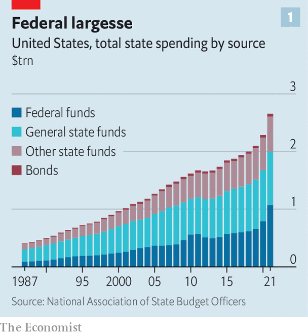
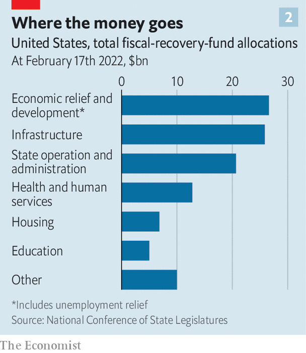

###### Take the money and run

# How states are using, and misusing, funds from the American Rescue Plan 

##### Governors benefit politically today, but they are creating liabilities for tomorrow 

 

> Feb 25th 2022 

WHEN KAY IVEY, Alabama’s governor, announced a plan to build two new 4,000-bed prisons, Democrats and progressive activists were unsurprisingly opposed. One objection was to how the construction would be financed: $400m would come from the state’s $2.1bn share of funds from the American Rescue Plan Act (ARPA). This was intended partly to relieve states from the economic and health toll of the covid-19 pandemic.

Critics said the new prisons tackled neither. “This is a gross misuse of funds when Alabama is at the bottom of the country in providing health care,” says JaTaune Bosby, executive director of the American Civil Liberties Union of Alabama. Republicans pushed the plan through in a special legislative session focused on prison construction. Building is set to begin later this year.


, the $1.9trn in stimulus from ARPA (equivalent to 9% of GDP) was predicated in part on the belief that state and local governments were in dire financial straits. In fact, tax receipts were recovering quickly even before the law came into effect. As they now start to prepare budgets for the coming fiscal year, governors and state legislators are finding creative ways to use the money—for better and for worse.

Although some cash is being spent on responsible investments that will yield benefits for years, much is being used for massive new infrastructure projects and social programmes with long-term costs. The indulging Democratic and Republican governors are enjoying rising political fortunes. But the money will run out. For the states, the fiscal high will be short-lived.

 


After a sharp contraction when the pandemic first hit America, state general funds (mostly revenues from tax receipts) are overflowing: many states are posting their largest surpluses ever. Federal funds from ARPA, in the form of $350bn in direct transfers and more than $300bn in aid to health infrastructure, schools and transit agencies, have given states unprecedented fiscal resources (see chart 1). They have until 2026 to spend ARPA funds or lose them entirely, by which point many budget analysts expect revenues will have reverted to their pre-pandemic trend. Though the law includes some rules for how the money can be used, states have been adept at deploying it as they see fit.

 


Start with the more responsible investments. Most states have stuffed away money for a rainy day. The median state rainy-day fund now stands at the highest level as a share of spending in over three decades. Unemployment-insurance trusts, depleted during covid, have been restocked (see chart 2), though states have yet to use more than $80bn in federal funds remaining for that purpose. These sensible outlays will help states weather the next storm. Many have used ARPA to make one-time investments expected to bring long-term benefits. Nearly every state is putting some money towards clearing their collective $873bn backlog in maintenance, cleaning up pollution and replacing ancient computers. ARPA largesse has helped bolster public-health systems and schools amid the upheaval of the pandemic.

Many lawmakers are also giving money back to their constituents rather than letting it go to waste. Almost half of states have sent or plan to send bonuses to government employees, such as health-care workers, police officers and teachers. Coupled with pay rises, this is intended not only to retain valuable workers in a tight labour market, but also to curry favour with voters. Inspired by the popularity of the  to households in the CARES Act (a $2.2trn fiscal stimulus passed under Donald Trump), Governor Tim Walz of Minnesota is promoting his proposed “Walz checks”, payments of up to $350 that would be sent to every household in the state. California, Indiana and Pennsylvania have similar schemes afoot.

The infrastructure projects that many state governments are embarking on, however, are a mixed bag. On paper, the Treasury Department’s rules administering ARPA allow states to spend funds on only three types of physical infrastructure: broadband, sewerage and water. States have eagerly allocated money to broadband, with an estimated $7.6bn already going to it, though Adie Tomer of the Brookings Institution, a think-tank in Washington, DC, cautions that few states have relevant bureaucratic experience. These efforts will get a further boost this year as the $1.2trn Infrastructure Investment and Jobs Act begins disbursing money, much of it earmarked for broadband infrastructure.

ARPA diem

In practice, however, the ability to use funds for “revenue replacement” has allowed many state policymakers to support cherished priorities, no matter how misguided. This is how Alabama justified its prison construction. From rural broadband to environmental clean-up, it is not hard to think of good long-run investments for the state, but prisons are a priority for Alabama’s Republicans. Iowa’s governor, Kim Reynolds, is handing $11m in ARPA funds to improve the “Field of Dreams”, the baseball diamond made famous in a film starring Kevin Costner.

More worrying are the new social programmes and tax cuts that several states are embarking on. These may prove unsustainable. Colorado will spend $275m on behavioural-health programmes thanks to ARPA, along with $13m just to build the bureaucracy for a future universal pre-kindergarten programme. New York’s governor, Kathy Hochul, has proposed $150m in tuition assistance for part-time students. Jared Walczak of the Tax Foundation, another think-tank, says nearly every state has reduced, or is contemplating trimming, its taxes, after Republicans led the way in 2021. “This is the year of the Democratic tax cut,” he says, pointing to the many Democratic governors who are proposed slashing the more regressive sales tax. Some Republicans are going further—Mississippi, the poorest state in America, may repeal its state income tax entirely.

If such profligacy is cause for concern, voters hardly seem to notice. For Republicans, so often the apostles of austerity, the funds have been a boon. Vermont’s governor, Phil Scott, who is angling for another term in a state that leans heavily towards the Democrats, is emphasising his large spending commitments. The new governor of Virginia, Glenn Youngkin, is moving to eliminate the state’s grocery tax and raise teachers’ salaries, key planks of his winning campaign. Nearly all Republican incumbent governors facing re-election look safe. Only embattled Brian Kemp of Georgia appears in any danger of losing—he is desperately pushing pay rises for state employees and income-tax refunds.

Those same state leaders will probably have moved on by the time federal funds run dry. For now, states risk squandering the opportunity to make productive investments, and may be exposing themselves to liabilities that will bite when the next recession comes. With patterns of work disrupted by the pandemic, Laura Kalambokidis, Minnesota’s chief economist, warns states to plan their long-term spending with caution: “None of us fully understands yet how the pandemic has permanently changed the economy.” ■

For more coverage of Joe Biden’s presidency, visit our dedicated  and follow along as we track shifts in his . For exclusive insight and reading recommendations from our correspondents in America, , our weekly newsletter.

