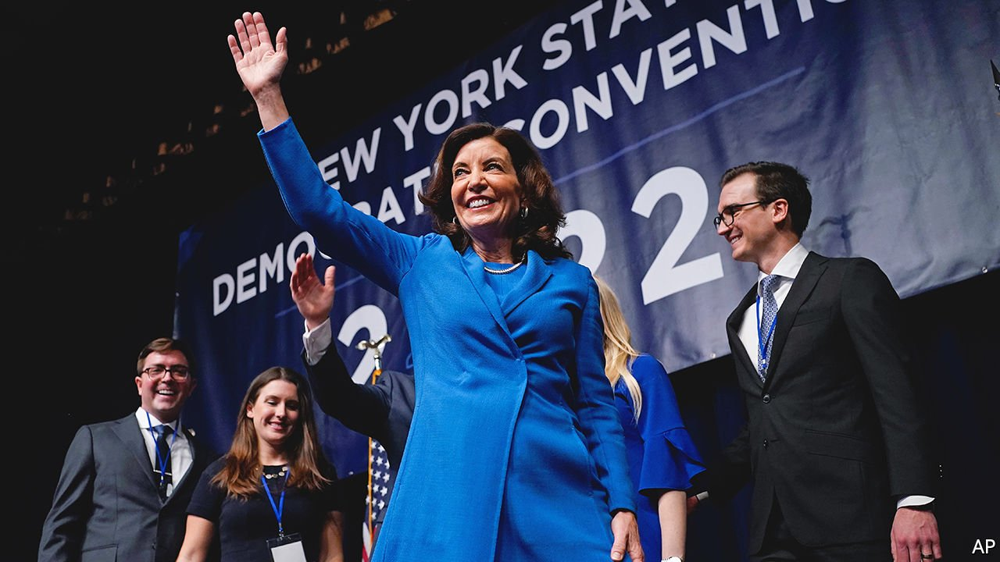

###### The Empire State

# New York’s new governor is proving to be adept at the power game 

##### The unexpected Kathy Hochul 

 

> Feb 26th 2022 

“I’M A BUFFALO BILLS fan. I always have an underdog mentality,” said Kathy Hochul, New York’s governor, earlier this month. Last summer she succeeded Andrew Cuomo, who had resigned amid sexual-harassment and abuse allegations. Few then would have predicted she would be the front-runner in November’s governor’s race and scoring umpteen political touchdowns. The recent state Democratic convention, where she was introduced by Hillary Clinton, resembled a coronation. Supporters carried tote bags depicting Ms Hochul as Rosie the Riveter. Ms Hochul is an underdog no longer.

She has surprised even longtime observers of Albany, New York’s capital. “Politically, she’s off to a roaring start,” says John Kaehny of Reinvent Albany, a government watchdog. Despite being Mr Cuomo’s deputy, she has successfully distanced herself from him and his alleged misdeeds. She is more cordial with lawmakers (Ron Kim, a Democratic assemblyman, has said Mr Cuomo threatened to “destroy” him after he criticised the governor). Instead of vetoing bills, she requests tweaks to get the legislation she wants. “She may not agree with what you want to do, but at least there’s a conversation,” says Sandy Galef, a Democratic assemblywoman.


Ms Hochul has promised to forge a “new era of transparency” in Albany, where ethics scandals are the norm. She is proving to be far more politically effective than anyone imagined.

The success of Ms Hochul’s rebrand should perhaps be no surprise. Ms Hochul was an aide to Daniel Patrick Moynihan, a legendary senator, and won a congressional seat in one of the state’s more Republican districts. She is backing several big-ticket infrastructure projects, including a new link (using a freight line) between Queens and Brooklyn that would provide transport to 1m underserved New Yorkers. She has a good relationship with Eric Adams, New York City’s new mayor. Mr Cuomo and the previous mayor could not stand each other.

Ms Hochul is also benefiting from the state being in the best fiscal health in 200 years—astonishingly, given that not long ago New York was bracing itself for budget cuts of 20% because of covid-related revenue losses. Instead, the coffers are overflowing, thanks to federal help and an “emergency” income-tax increase on New York’s top earners last year. Ms Hochul’s budget is full of goodies for important voters, such as tax giveaways to homeowners. She has proposed increasing spending on education and health, which should please the unions. Peter Warren of the Empire Centre, a think-tank, worries that “the state keeps increasing its reliance on the wealthy and at the same time, it’s sort of pushing them to leave” for places, like Florida, with no personal income tax.

Mr Kaehny is concerned that billions in discretionary funds (far more than usual) are not subject to review by the state comptroller. New York’s governor has a strong role in setting the budget. Mr Cuomo often pushed back against the legislature. Ms Hochul may be a less effective check on largesse, especially in an election year.

Ms Hochul has been under little pressure since Letitia James, the state’s attorney-general and erstwhile front-runner for governor, dropped out of the race. But tricky choices loom. Mr Adams has called on the state to tighten the law eliminating cash bail for some criminal defendants. If she takes his side, however, she could upset progressive voters. Yet she cannot ignore swing voters worried about crime.

In November she revamped a plan to redevelop Penn Station and the area around it, including ten new office towers. “We don’t need more heavily subsidised office space,” says Nicole Gelinas of the Manhattan Institute, a think-tank. Ms Hochul must soon decide whether to lift the mask mandate for schools, one of the more contentious issues on her docket.

Still, with a campaign chest of $20m she looks set to win her primary in June and the general election in November. She would be the first woman to be elected governor of New York and also the first person from Buffalo to be elected to the job since Grover Cleveland in 1882. Cleveland then went on to become president. ■

For exclusive insight and reading recommendations from our correspondents in America, , our weekly newsletter.

