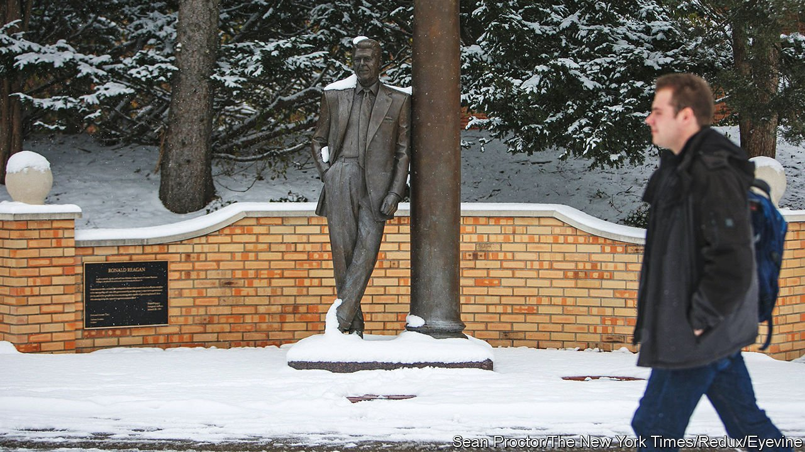

###### New universities

# Pushback at cancel culture is leading to new educational initiatives 

##### Some Americans want to reform from within. Some want to build anew 

 

> Feb 26th 2022 

A BLOG POST by a self-professed liberal, atheist 19-year-old student put culture warriors in a spin in January. She described her transfer from an elite, liberal-arts college to a Christian college in Michigan. Conservatives said it showed young people were sick of leftist indoctrination. Liberals pointed to the fact that the student’s mother was an anti-vaxxer, who boasted online that this was the reason for the transfer.

Beyond these skirmishes, the case of the student, Jane Kitchen, raised questions about what good a liberal-arts education is in America today. Ms Kitchen arrived at Bryn Mawr College in Philadelphia in 2019, and loved much about it. But she was surprised at the cultural virtue-signalling and lack of intellectual inquiry. Even before covid, “I didn’t sit around with my friends all night arguing about big questions like I thought I would,” she wrote. “It was assumed that we all agreed on the answers.”


Because she did not want to accept a two-week quarantine and a mask mandate on her return to college, she spent a depressed year at home, and decided to transfer. Many of the colleges operating normally were religious. Still, she took a chance on Hillsdale, where she found an intellectual diversity that she had missed. She told a professor that she had privately objected to a point in class but had not wanted to seem argumentative. “Be argumentative,” he responded. Someone on Twitter called her move “an example of following an ideology to my own peril,” she wrote. “I think just the opposite happened; I rejected an ideology and it set me free.”

Ms Kitchen’s tale is unusual, but it highlights the questions that a growing number of young people have about the intellectual orthodoxy of American colleges. Few students are yet openly pushing back as she did, but some educators are.

In recent years administrators at left-leaning colleges such as Haverford, Smith and Yale have yielded tamely to student activism on everything from Halloween costumes to “institutional racism”. Bryn Mawr itself was hit by a student strike in November 2020, when activists said the progressive campus was a hotbed of racism.

One mother’s anonymous account of the college caving in, published in Quillette, an online magazine, concluded that this taught students that “might makes right, that discussion and debate are for racists”, and that administrators “will sell them out…all the while publicly thanking the social-justice shakedown artists who engineered their own humiliation, thus incentivising more tantrums in the future”. The parent’s child also transferred out. Watching the final town-hall meeting in which the college capitulated to all the activists’ demands, the mother says, “I felt like I was watching the end of liberal education.” The college declined to comment.

The marketplace of ideas

The right has plenty of illiberalism, too, as shown by Republican state legislatures banning topics such as “critical race theory” in schools. But Niall Ferguson, a historian at Stanford University, says it is not just conservative students and faculty who are sick of what he calls “totalitarianism lite” on campus. “Any student of the totalitarian regimes of the mid-20th century recognises all this with astonishment,” he writes. “It turns out that it can happen in a free society, too, if institutions and individuals who claim to be liberal choose to behave in an entirely illiberal fashion.”

A report in January by the Legatum Institute, a think-tank in London, found that half of academics in elite American universities feel the need to self-censor (compared with 35% in Britain, 39% in Australia and 44% in Canada). A study by the American Council of Trustees and Alumni found that, from 2010 to 2018, spending on student services and administration rose faster than spending on actual instruction.

A report in 2021 by James Paul of the University of Arkansas and Jay Greene of the Heritage Foundation found that based on American universities they sampled, the average one has more than 45 people working in offices devoted to diversity, equity and inclusion (DEI). There were often more people working in DEI than there were history professors.

The pushback is modest but, broadly, there are three models offering an alternative. One is religious colleges such as Hillsdale. Plenty of these—such as staunchly evangelical ones—are unlikely to appeal to disgruntled centrists. But others, including some Catholic colleges, may be attractive, partly because they prize the Western philosophical and literary canon, which is compulsory for two years at places like Hillsdale. “The people who still believe in truth are often people who come out of faith traditions, who believe that there is a truth,” says Bruce Gilley of Portland State University. The Association of Catholic Colleges and Universities has not seen an increase in enrolment overall, but some small colleges say they are having a boom. Thomas Aquinas College near Los Angeles recently opened a second campus in liberal Massachusetts. Applications to Hillsdale have nearly doubled since 2015.

A second strand is trying to reform the academy from within. Leading the way is the Heterodox Academy (Hx A) in New York. Founded in 2015, it uses workshops and conferences to connect and equip academics to promote “open inquiry, viewpoint diversity and constructive disagreement” on their campuses. Some 5,500 have joined so far globally, with publication of your name a requirement of membership. Hx A’s new leader, John Tomasi, gave up a chair at Brown University to take the job.

“No organisation in the history of American academic life…is doing more to promote the basic freedoms and viewpoint diversity we urgently need in our colleges and universities today,” writes Robert George, a conservative law professor at Princeton University. He serves on the advisory council, alongside progressive academics such as Cornel West. “Great minds don’t always think alike,” says the website.

The pursuers of the third approach believe the academy cannot be saved, so they must build anew. In November, Mr Ferguson and other academics announced the foundation of a new college, the University of Austin, to be set up in the Texan capital. They say UATX, as it will be known, will resist the identity politics that they believe has captured mainstream academia. It will be committed to the pursuit of truth, freedom of inquiry and conscience, they say, and be “fiercely independent”.

Advisers include Glenn Loury, Harvard University’s first tenured black economics professor, who is now at Brown University, and Jonathan Haidt of New York University. Kathleen Stock, recently hounded out of the University of Sussex in Britain, is to be a visiting fellow. It has raised $90m towards a goal of $250m, says its president, Pano Kanelos. UATX is still little more than an idea and a website, but in its first week it received 7,000 emails from would-be students, and 3,000 from academics asking about jobs, says Mr Ferguson.

It has had 11,000 enquiries for the 80 places on its Forbidden Courses programme this summer. A graduate programme in entrepreneurship will follow in the autumn. Undergraduates are to be accepted in 2024. But it has already run into problems. Several academic advisers, such as Steven Pinker of Harvard and Robert Zimmer of the University of Chicago, have resigned. Other academics are sceptical, too. In the New Republic, Aaron Hanlon of Colby College called its backers “a who’s who of the Intellectual Dark-cum-Substack Web”. “It’s a solution to a problem that doesn’t exist,” says Mr Colby, who suspects it will be filled with conservative students. “It will just be another version of what they say we are not supposed to have.”

Left, right and centre

Others are trying, too. Ralston College, a startup in Savannah, Georgia, is preparing to accept its first graduate students in the autumn. Its website calls the reform of higher education from within “a losing battle”. It has raised more than $30m. Jordan Peterson, a Canadian psychologist, has been mooted as chancellor. Arif Ahmed, a Cambridge philosopher who has campaigned for academic freedom, will teach a class. Ralston already has the authority to award degrees (which UATX does not yet).

All of this remains small beer. And most students are still likely to aspire to established colleges, even if these do lean further left than some would like. But the leaders of the scrappy startups, and the handful of dissident students, are issuing important warnings. “We can’t take for granted that our fundamental freedoms, of speech, conscience and association, will still be there 20 years from now,” says Ralston’s president, Stephen Blackwood. Western liberalism is being deconstructed before our eyes, he says. “The ideological presumptions and weaponised activism that universities now teach are a closing of our horizons. The work of our time is to open those horizons up again.” ■

For exclusive insight and reading recommendations from our correspondents in America, , our weekly newsletter.

