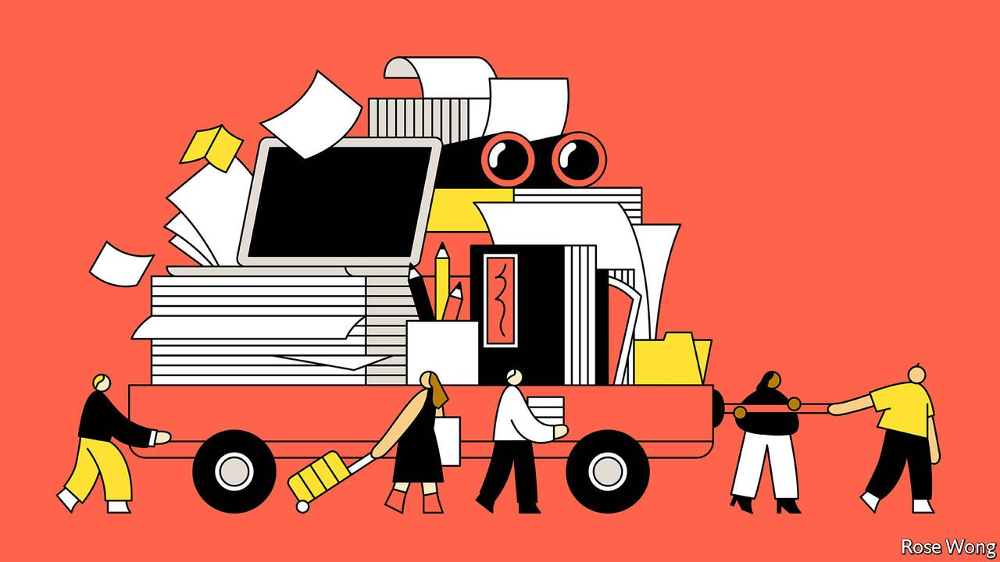

###### Offshore Beijing

# China-watchers are fleeing the country for other Asian hubs 

##### The exodus is turning Singapore into the Vienna of the 21st century 

 

> Mar 5th 2022 

IN THE HERMIT days of Mao Zedong’s China, few foreign observers of the country lived there or could even visit. China-watchers—whether they were academics, journalists, diplomats or spooks—were scattered across Asia and beyond, or perched on China’s edge in the listening post of British-run Hong Kong. Analysis of the Chinese economy and, especially, of the Communist Party’s secretive politics was often just finger-in-the-wind speculation—and frequently wrong.

That all changed when China opened to the world in the late 1970s and normalised relations with America. Western embassies were opened or expanded; foreign journalists moved to Beijing and Shanghai and businessfolk opened branches and factories. The new arrivals, many of them fluent Chinese-speakers, seeded a new ecosystem of foreign China-watchers. The quality of economic, political and social analysis about China leapt in bounds.


The flow has now gone into reverse. The pandemic is the main reason. Even as much of the world reopens for business, China remains closed under a draconian regime of lockdowns, travel restrictions and strict quarantines. But a worsening political climate has also  for businesses, academics, diplomats, NGOs and journalists, something that predates and is likely to outlast the pandemic. A growing exodus over the past couple of years suggests that, for the first time in decades, more China hands may soon sit outside the country than in it, with other Asian capitals as the chief receiving stations.

New clusters of China-watchers have formed in various Asian cities. The New York Times and the  Washington Post have opened or expanded bureaus in Seoul, South Korea’s capital, in part to accommodate journalists expelled from China. They are attracted by relatively cheap commercial rents, a good airport in normal times and a democratic government chuffed to host the international press. But Seoul lacks a well-developed international China-watching scene, and most of the new arrivals do not speak Korean.

Taipei, the capital of Taiwan, offers many of Seoul’s benefits. But it also uses the same official language as China, Mandarin, and has no end of China-watchers of its own. Indeed, in Taiwan, parsing China is an existential matter, given that the Communist Party considers the island to belong to China and  to take it back at gunpoint. At the same time, commercial and economic ties across the Taiwan Strait bring with them a nuanced understanding of the business environment—a further argument for moving to Taipei. Reporters and editors, including from the Wall Street Journal, have thus headed to the city, as have correspondents who have waited months or years for Chinese visas before giving up. Some newspapers now have more staff on the island than in China. The Taiwan Foreign Correspondents’ Club has grown by half, to 60 members, in three years.

Academic and cultural institutions are also shifting to Taiwan. Harvard’s Chinese-language programme, one of the world’s best, moved to the island after losing support from its Chinese host institution, Beijing Language and Culture University.

Yet Taiwan’s focus on China tends to be narrowly confined to the cross-strait dimension and is prone to parochialism. Moreover, the country makes it difficult for mainland Chinese nationals to work as journalists or news researchers, on whose help most international news organisations rely to report on stories about China. William Yang, president of the Taiwan Foreign Correspondents’ Club, says he doubts that Taipei will become the pre-eminent regional news hub.

For that, Singapore has better prospects. Some China-based journalists wound up in the city-state by chance—the Financial Times’s Beijing bureau chief happened to be in Singapore with his family as China locked down and has stayed. Others are drifting in as China remains all but closed, including from Hong Kong.

Crucially, it is not only journalists who are coming to Singapore. The Carnegie-Tsinghua Centre for Global Policy in Beijing is a joint venture between an American think-tank and one of China’s most prestigious universities. It aims to encourage dialogue and collaboration between scholars in China and the West. Its American head, Paul Haenle, a former White House official, now resides in Singapore. Some Western countries have spread staff who were formerly based in Beijing to other embassies around the region, including missions in Singapore. Such arrivals jokingly refer to their new home in the city-state as “Beijing South”.

Few say they will never return to China if or when it reopens—but nor do they openly commit to doing so. Meanwhile, a trickle of expat business executives moving to Singapore from Hong Kong is turning into a steady stream. The country’s attractions are undeniable. Its people are refreshingly direct. English is universally spoken, which is not the case in Hong Kong. Clean, green, prosperous and safe, it is, as one of its officials jokes, “Asia-lite”—easy for many Westerners to adjust to, but with plenty of exotic brushstrokes.

For China-watchers, much is lost from not being on the ground, having conversations with Chinese from the top of the hierarchy to the bottom, and simply observing with their own eyes. But much has changed since the 1970s and analysis has adapted, for instance through creative use of a wide variety of open-source information. Collaboration is aided by listservs and Zoom calls. And more than in Seoul and Taipei, many arriving China-watchers plug naturally into Singapore’s own geopolitical priorities. The tiny state of 5.7m was born at a time of turmoil in South-East Asia. Its position on the narrow Malacca Strait, through which much of the world’s shipping and energy passes, gives it a precarious sense of being a nut that could be smashed in a fight between great powers. Regional rivalry between China and America has grown sharply.

“We have always invested a lot of time and resources trying to understand the environment we live in,” says one Singaporean policymaker. The country’s diplomatic corps, for its size, is one of the savviest in the world, and by far the most effective among the ten-member Association of South-East Asian Nations. A plethora of academic institutes, all with ties to the state, specialise in covering the region.

Much in Singapore’s domestic political, cultural and social discourse remains officially out of bounds for public debate. But policymakers insist that little is taboo when it comes to foreign-policy priorities. On the contrary, they say, it is crucial to get those right. Singapore is increasingly the first port of call for American and European officials visiting the region. Some see it as a Vienna for the 21st century—the natural place for antagonists in Asia’s growing Great Game to meet. It already hosts the region’s pre-eminent security talkfest, the annual Shangri-La Dialogue organised by the International Institute for Strategic Studies, a think-tank based in London.

The city-state’s informal motto is to avoid dangers, seize opportunities and maximise the space for manoeuvre. One diplomat sums up this mantra more earthily: “Either get out of harm’s way or hitch a ride.” The China-watching refugees help Singapore do both. ■

