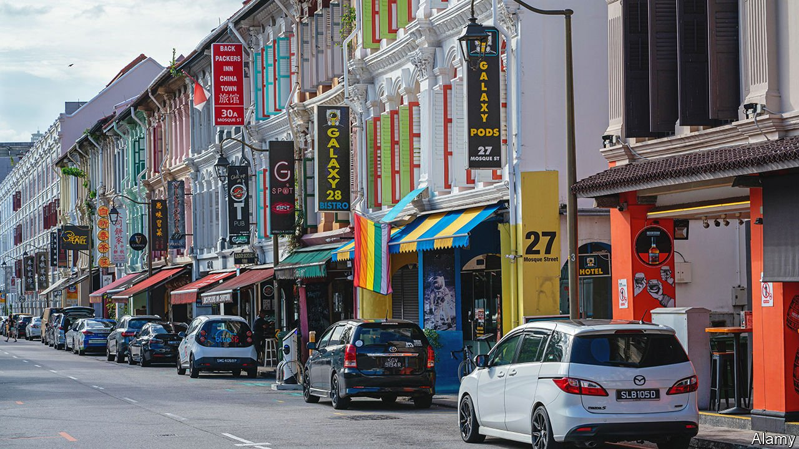

###### Crime and no punishment

# Singapore’s high court retains an anti-gay law 

##### But only because it is not enforced 

 

> Mar 5th 2022 

IN A REGION where governments often disregard or contort their own laws, Singapore stands out for punctilious observance. That is why a recent judgment from its high court raised eyebrows. On February 28th the Court of Appeal dismissed a challenge brought by three gay-rights activists against a law, dating from the colonial era, that criminalises sex between men. The legislation will remain on the books—yet the court has in effect told the government it can carry on pretending it does not exist.

Section 377A of the Penal Code, which punishes acts of “gross indecency” between men with up to two years in jail, is a “lightning rod for polarisation”, as the justices put it. They have done their best not to get electrocuted. The court sidestepped the question of the law’s constitutionality by arguing that the judges had to take into account the government’s stance. When parliament debated 377A in 2007, Lee Hsien Loong, the prime minister, declared that it would remain but would not be “proactively enforced”.


Mr Lee argued that it was necessary to strike a balance between accepting gay men and respecting society’s “traditional” mores. The court said that this “political compromise” took on legal weight in 2018 when the attorney-general said that it was not in the public interest to prosecute consenting men who engage in sexual acts in private. The law cannot violate the plaintiffs’ constitutional rights, the court argued, if the authorities are not enforcing it.

“This is really a live-and-let-live approach,” says Eugene Tan, a law professor at Singapore Management University. Yet it has satisfied no one. Though the ruling seems a blow to gay Singaporeans, it is in fact “a partial but significant victory” for them, said one of the plaintiffs, because the court gave legal weight to the attorney-general’s position.

That will displease Singapore’s many conservatives. But gay activists are also unhappy. As the court acknowledged, there is nothing to stop the government from deciding to start enforcing the law once again. Legislation should “provide clarity on how citizens conduct their lives”, says Remy Choo Zheng Xi, a lawyer for one of the plaintiffs. The judgment has instead muddied the waters. Keeping the law on the books, he says, makes “a mockery of what the rule of law is supposed to be”.

