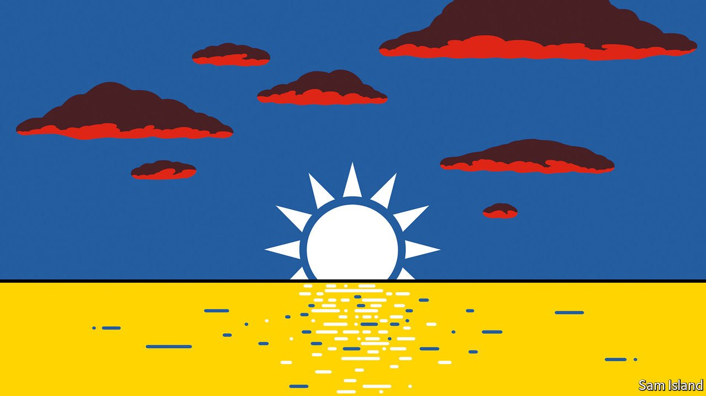

###### Banyan

# Ukraine has changed how Taiwanese see themselves 

##### The spectre of a powerful country gobbling up a smaller neighbour has sharpened minds 

 

> Mar 5th 2022 

NO DATE in the Taiwanese calendar is more poignant than February 28th. Starting on that day in 1947, and continuing over the weeks that followed, China’s Kuomintang (KMT, or Nationalist) government, which had taken over Taiwan on Japan’s surrender two years previously, put down an uprising by islanders sick of the KMT’s harsh and corrupt administration. It did so with utter ruthlessness. By the time the revolt was over, tens of thousands of civilians had been gunned down or executed, including much of the island’s intelligentsia.

The “February 28th incident” ushered in nearly four decades of martial rule, known as the White Terror. But since then Taiwan has undergone a dramatic political and social transformation. The KMT long ago formally apologised for the slaughter, even though debates continue about whether justice has been seen to be fully done. Meanwhile, the party has morphed into merely one constituent of Taiwan’s peaceable, if fractious, democratic politics. The threat to Taiwanese is no longer the KMT but its Communist vanquishers on the mainland.


As Taiwanese marked the 75th anniversary of the massacre this week, they were reminded of that threat by events towards the other end of the Eurasian landmass. More than the people of any other country in Asia, they are stirred by the plight of Ukraine, as its people bravely resist a gargantuan invader. Bridges and skyscrapers across the island blaze in the blue-and-yellow of Ukraine’s flag.

That should not be surprising. A slogan coursing through Taiwanese social media is “Ukraine today, Taiwan tomorrow!” Even more emphatically than Vladimir Putin claims Ukraine, China’s rulers insist that Taiwan is part of the motherland and reserve the right to use force to compel its return. To Taiwanese, the parallels between what Mr Putin is doing to Ukraine and what Xi Jinping might do to Taiwan are glaring, all the more so since Mr Xi and Mr Putin say that theirs is a relationship with “no limits”.

Viral videos of defiant Ukrainians have changed how many Taiwanese see their future selves. One protester outside the gates of Russia’s de facto embassy in Taipei, Carey Chang, a 25-year-old working at an education startup, says that if ordinary Ukrainians, even when left to fight alone, can still manage to resist a much larger power, “then why can’t Taiwanese too?”

Lai I-chung, a security specialist close to the ruling Democratic Progressive Party at Taiwan Thinktank, a policy outfit, describes a new direction in the national conversation. Ukrainian heroics, he says, are a strong morale-booster. His institution and others are getting calls from ordinary people inquiring about how to get onto military training courses so as to be ready to fight if China tries to invade Taiwan. A new debate about national conscription (currently just four months, with plenty of ways to avoid it) has erupted. The example of Ukraine, says Eric Huang, a millennial high-flyer in the opposition KMT, “has made everyone think more about self-reliance”.

That will be music to American ears. The United States is committed to Taiwan’s security (though not if Taiwan is rash enough to provoke China by declaring formal independence). To emphasise the point in the context of the war in Ukraine, in late February it sent a naval destroyer through the Taiwan Strait to show its “commitment to a free and open Indo-Pacific”, a move that China condemned as provocative. And on March 1st a delegation of American former security officials, sent by President Joe Biden and led by Mike Mullen, a former chairman of the joint chiefs of staff, arrived in Taipei. Part of the mission was to reassure President Tsai Ing-wen and her administration of America’s support.

Still, American security types have long grumbled that Taiwanese, especially the young, seem too uninterested to fight to defend their land. They will take comfort from the mood change. A more substantive concern has been Taiwan’s sloth in reforming its defence capabilities and strengthening its deterrence.

It takes imagination to conjure Ms Tsai, with her low-key persona, effortlessly channelling Ukraine’s passionate president, Volodymyr Zelensky, who has united his nation in the past weeks. But she seems ready to appear more often in public, including in front of the troops. As she laid a wreath in honour of the victims of 75 years ago, she said that, as president, she had “responsibility to bring Taiwan together and safeguard our democracy”. That message is finding a more receptive audience than it did even just over a week ago.

Read more from Banyan, our columnist on Asia: (Feb 26th) (Feb 19th)

 (Feb 12th)

