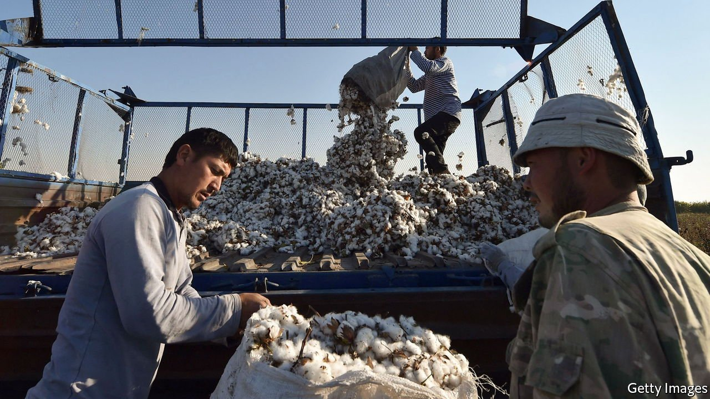

###### Liberty bale

# Uzbekistan has succeeded in abolishing forced labour 

##### Workers are even usually paid in full and on time 

 

> Mar 5th 2022 

STRIDING THROUGH a cotton field in Uzbekistan one sunny morning in October, Shukhrat Ganiyev recalled how just a few years ago he would have had to sneak around to speak to cotton-pickers about whether they were there voluntarily. A lot of them were not. But during last year’s harvest Mr Ganiyev, a human-rights campaigner, was openly leading a fact-finding mission a short drive away from the silk-road city of Bukhara. The group had been sent by the International Labour Organisation (ILO), a UN body. This time there were few instances of coercion to be found. On March 1st the ILO reported that forced labour was now “so insignificant that it was exacting to detect and measure” even with 11,000 interviews. What is more, wages were usually paid in full and on time.

It is remarkable progress for a country that as recently as 2017 required adults—and before that many children, too—to help with the harvest. Under Islam Karimov, the country’s strongman president until his death in 2016, Uzbekistan had one of the world’s largest state-orchestrated forced-labour systems. The government had a monopoly on cotton and set production quotas that encouraged local officials to frogmarch citizens into the fields. ILO monitoring of the harvest in 2015 found that 14% of the 2m-odd Uzbeks involved in picking cotton had been press-ganged. By 2020 that number had declined to 4%, falling further in 2021. Other monitors reported similar findings: the Uzbek Forum for Human Rights (UFHR), an NGO, documented no “systemic or government-imposed forced labour” for the first time in 11 years of tracking the harvest.


This is good news for Shavkat Mirziyoyev, the current president, who made a surprise pledge to abolish forced labour soon after coming to power in 2016. He stiffened penalties on local officials for pushing unwilling workers into fields while raising state-set wages for pickers. Pay has risen by around 170% since 2017, though labourers must still collect around ten kilos of cotton (under an hour’s work for a skilled picker) to earn a dollar. Two years ago he scrapped quotas and ended the state’s monopoly on the industry, which had been in place for a century.

Cotton production is now organised around privately owned “clusters”, so called because they both grow and process the cotton. One such cluster, called Silverleafe, is in the Jizzakh region of central Uzbekistan where Mr Mirziyoyev once had to meet cotton quotas when he served as governor. There Dan Patterson, a cotton-grower from Mississippi, shows off his picking machines and a fancy control centre, promising “transparency and trace ability of the supply chain”. The idea is to prove to foreign buyers that no forced labour has been used.

Yet perceptions have been slower to change than Uzbekistan’s practices. More than 300 big brands—including behemoths like Inditex, H&amp;M, Nike and Walmart—have signed a pledge established in 2011 by the Responsible Sourcing Network (RSN), an American NGO, to boycott Uzbek cotton. The government is urging campaigners to end the embargo now that the ILO says systematic forced labour is a thing of the past. Selling to global brands would boost demand and create more jobs as Uzbekistan tries to move from exporting raw cotton to the more lucrative business of producing finished garments.

Campaigners are wary of rewarding Mr Mirziyoyev too soon. Although civil society has more freedom than under Karimov, the government still keeps it on a short leash. Non-governmental groups that the authorities do not like are denied the permits needed to operate. According to Umida Niyazova of the UFHR, the country still needs “political reforms, independent trade unions, civil-society groups and real mechanisms that can hold power to account”. Still, campaigners are not ruling out a change of position on the boycott. The environment is far from “risk-free”, said Patricia Jurewicz of the RSN, but “there is an opening to be able to source responsibly from Uzbekistan”. ■

