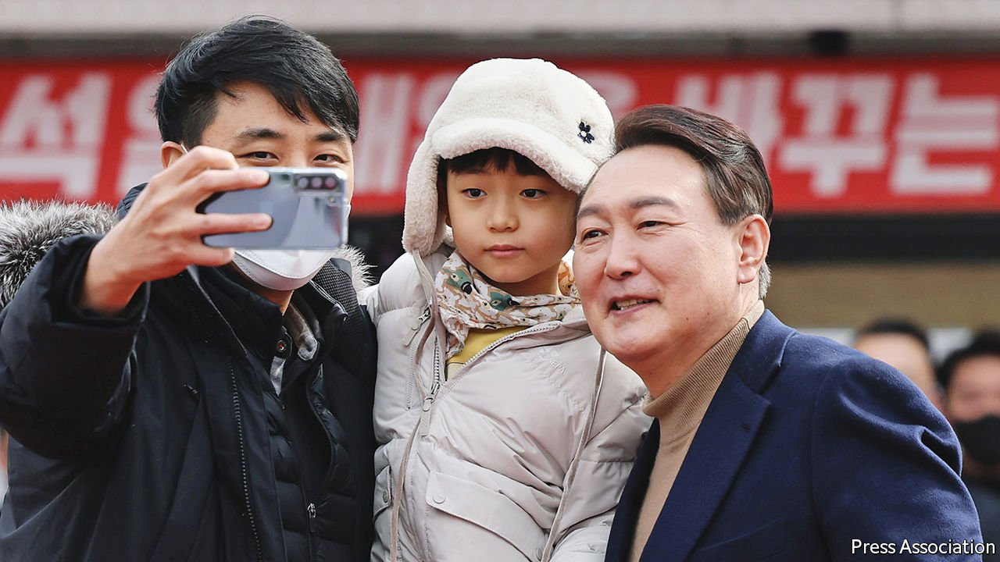

###### An unedifying campaign

# Voters are split down the middle in South Korea’s presidential election 

##### Both main candidates are equally unpopular 

 

> Mar 5th 2022 

KISSING BABIES, playing up local connections and framing elections in existential terms are familiar tactics of politicians everywhere. Yoon Seok-youl, the main opposition candidate for the presidency of South Korea, deployed all three during a recent rally in Gangneung, a city of some 200,000 people on the country’s north-eastern coast. Once he was done posing for the obligatory picture with a bemused toddler, Mr Yoon reminisced about childhood holidays spent in the city. Then he adopted a more solemn tone: the presidential election on March 9th, he said, was not a matter of party allegiance but about whether South Korea would “live or die”.

The crowd, mostly middle-aged and elderly supporters of Mr Yoon’s conservative People Power Party, gave an approving roar. But nearby, few non-participants in the rally seemed to share their enthusiasm. A woman selling dried fish in a market complained about traffic jams caused by the event; another cast doubt on the accuracy of Mr Yoon’s recollection of his early-life holidays. Passers-by sidestepped a campaign aide trying to convince them to go on stage to shake the candidate’s hand.


Gangneung’s indifference is representative of the national mood. South Koreans do not share Mr Yoon’s view that the election is a matter of life and death. Neither he nor Lee Jae-myung, the nominee of the ruling Minjoo party, had managed to establish a firm lead by the time pre-election polls were released on March 2nd.

With little to distinguish their proposed policies on high housing costs or the economic fallout from the pandemic—the public’s main concerns—the presidential hopefuls have spent the campaign slinging mud at each other while becoming mired in personal scandals themselves. Partly as a result, they are the least popular pair of contenders for the presidency since the country democratised in 1987.

It is fitting, therefore, that the election will probably not turn on either candidate’s appeal. Instead, a last-minute decision on March 3rd by Ahn Cheol-soo, a minor conservative candidate, to abandon his candidacy and merge his campaign with Mr Yoon’s, may prove more important. Before the merger, polls suggested Mr Ahn had the support of about 10% of voters, compared with roughly 40% who backed Messrs Lee and Yoon respectively. Even if only some of Mr Ahn’s supporters hold their noses and switch allegiance to Mr Yoon, that may be enough to tip the scales.

The last-ditch dealmaking in the conservative camp will do little to dispel voters’ disillusion with the presidential campaign. Before Mr Ahn’s endorsement, Mr Yoon had failed for weeks to benefit from a prevailing mood of anti-incumbency. Instead he has suffered from his lack of political experience. Mr Yoon is a former chief prosecutor who helped bring down Park Geun-hye, a former president. He entered politics only in June after falling out with Moon Jae-in, the current president, over attempts to introduce reforms in the prosecutor’s office.

Since then, conservatives have been embarrassed by Mr Yoon’s association with prominent shamans and his apparent belief in superstitious practices. He has pandered to conspiracy theories about alleged irregularities in legislative elections in 2020, for which there is no evidence; threatened to prosecute the outgoing president for corruption if elected; and railed against foreigners and feminists.

Mr Lee, meanwhile, has faced questions about his possible role in a land speculation scandal in Seongnam, a middle-class suburb of Seoul, which occurred while he was its mayor. More recently he has come under fire for blaming Russia’s invasion of Ukraine on the inexperience of Volodymyr Zelensky, the Ukrainian president—an apparent dig at Mr Yoon’s status as a political novice. He later apologised.

At a press conference announcing the merger of their campaigns, Messrs Yoon and Ahn promised to create a “successful government of national unity” and usher in an “era of grand transformation for change and innovation”. Were Mr Yoon to win, voters can only hope that this newfound presidential demeanour outlasts election day. ■

