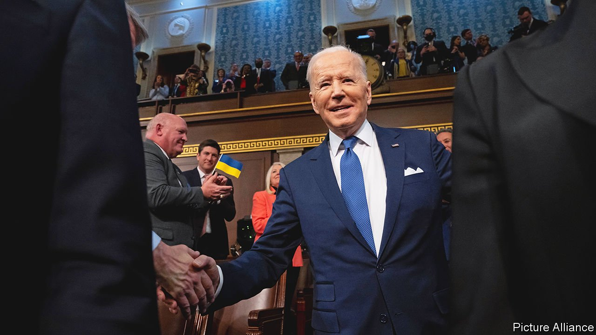
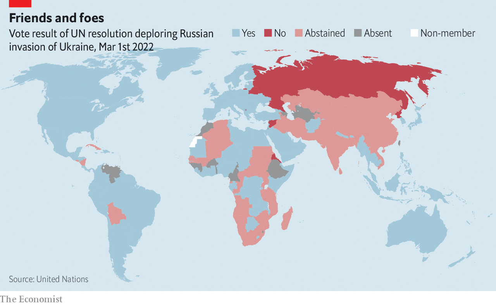
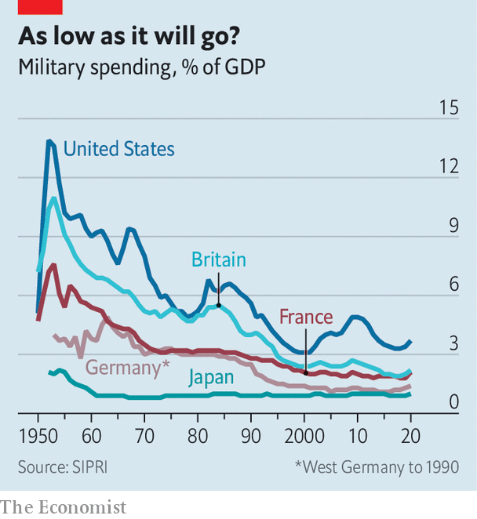

###### The post-post-cold-war world

# The war in Ukraine is going to change geopolitics profoundly 

##### Some bits will look familiar, some will look unprecedented 

 

> Mar 5th 2022 

“THIS MORNING we are defending our country alone,” declared Volodymyr Zelensky, Ukraine’s president, on Friday February 25th, the day after Russia’s invasion began. It was “the beginning of the war against Europe”. Yet Europe’s only forces in the field were those of Ukraine.

The rest of Europe was shamed. Over the weekend, appalled by the baselessness of Mr Putin’s invasion, inspired by the bravery of Ukraine’s soldiers, pushed by demonstrators on its streets and moved by Mr Zelensky’s words and actions, the continent took steps which days earlier had seemed unthinkable.


The EU, born from the idea that economic integration could stop war, promised to pay for arms sent to Ukraine. Neutral Switzerland promised sanctions aimed at entities of the sort it holds most dear: banks. In Germany the newish coalition of social democrats, greens and liberals threw off the country’s pacifist robes: having once offered Ukraine only helmets, it is now rushing to send anti-tank and anti-aircraft weapons, and it has announced a massive boost in defence spending. Having earlier suspended Nord Stream 2, the pipeline which was to have tied Germany ever more tightly and exclusively to Russian gas supplies, the government even indicated it could imagine keeping the country’s remaining nuclear power plants on line if doing so proved crucial to reducing its dependence on Russian gas.

At the other end of Eurasia, Japan, Singapore, South Korea and Taiwan joined in sanctions against Russia, as did Australia. The change of mood in Japan has been particularly striking. Over the past decades it has tirelessly wooed Russia, in part to counterbalance China but also in the hope of settling the problem of four northern islands seized by the Soviet Union. Abe Shinzo, the former prime minister, met Mr Putin 27 times, including a trip to an onsen bathhouse. Now, under Kishida Fumio, Japan has frozen the share of Russia’s central bank reserves held in the country and is urging fence-sitters to take a clearer stance against its former pal.

The end of the cold war was never going to usher in perpetual peace. But the Ukraine crisis is giving new form to the possibilities for future conflict and ways in which it may be averted. It is raising the previously outré possibility of territory being stripped from a developed county by force. By bringing Russia and China closer together, it is putting a new burden on the system of American alliances that partially encircles them. It has started consolidating Europe’s belief in itself and its ideals, and may increase its willingness to fight for them; it may also be seeing Germany and Japan, a lifetime after their defeat in the second world war, taking on new martial roles. And it is posing afresh old questions about the role of nuclear weapons.

Nobody yet has a name for this new post-post-cold-war era. In the search for parallels, though, the ghosts of Nazism keep returning. Mr Putin evokes the horrors of the second world war when he perversely accuses Mr Zelensky, who is Jewish, of running a “Nazi” state. Yet, for what it’s worth, it is Mr Putin’s violent irredentism—the war in Georgia in 2008, the one in eastern Ukraine in 2014, the effective annexation of Belarus—that is more reminiscent of Hitler. The resemblance led Mr Zelensky and others to talk of wishy-washy Western attitudes to him as appeasement.

“We never thought we would be waking up in 1939,” said one senior White House official on the first day of the invasion. But some parallels of similar vintage point ominously towards 1945: American officials worry about the state of mind of a Russian leader who is isolated, out of touch and has proved prone to miscalculation; the use of nuclear weapons has become conceivable.

Seeing things through a second-world-war prism makes the idea of an axis seem natural—and perhaps more useful than calling each other names. President Joe Biden’s view of a global contest that pits democracies against autocracies casts Russia and China in the role. The two countries have undoubtedly been moving closer together both strategically and, as Mr Putin pushes Russia deeper into dictatorship, politically. He and Xi Jinping, China’s president, share a desire to undercut America as a global leader as well as a horror at what happened to the Soviet Union in 1991.

Jude Blanchette of the Centre for Strategic and International Studies (CSIS), a think-tank, says that though the two leaders are not formal allies they are militarily useful to each other. Their relationship is encouraged by geography; standing “back-to-back” means neither has to worry about their common border as each projects power outward. Russia’s movement of large numbers of troops from its far east to Ukraine would have been much dicier had it been worried about China’s intentions.

The original pivot

Trying to make sense of this new axis, some find themselves turning to strategists of old, and in particular those who set more store by the abiding facts of geography than the contingencies of history. The obvious starting place, for this question and for the modern history of geopolitics more generally, is the idea of the “Heartland” put forward by Halford Mackinder in 1904. Mackinder argued that whoever controlled the core of Eurasia, roughly between the Arctic Sea and the Himalayas, could command the world. On that analysis, Russia and China united in common cause represent a big problem.

One response to Mackinder is to concentrate not on the continent but on the oceans, drawing inspiration from his contemporary, Alfred Thayer Mahan, who saw control of commercial sea lanes as the key to global power. Another is to follow Nicholas Spykman, a political scientist who argued in 1942 that it was not the heart of Eurasia which mattered, but its rim. He held that a maritime strip stretching through the Mediterranean, south of the Himalayas and across South-East Asia to Japan was the key. “Who controls the Rimland rules Eurasia;” he wrote. “Who rules Eurasia controls the destinies of the world.”

 


Michael Green, also of CSIS, is one of those seeing lessons from Spykman in the modern world. American officials think the rapprochement between Russia and China will allow them to fuse their alliances in Europe and Asia into a stronger whole. But many in the rimlands—from Turkey to Israel, the oil monarchies of the Gulf and several countries in South-East Asia—are havering on account of links to Russia, an admiration for Mr Putin or something more. Syria, unsurprisingly, is cheering Mr Putin on.

The heftiest fence-sitter is India, which on March 2nd abstained from a UN General Assembly motion condemning Russia’s invasion. It is trying to balance its old friendship with Russia, which provides most of its military equipment, with a flourishing partnership with America. Indian diplomats say that such is their concern about China—the two countries fought a border war in 1962 and have skirmished intermittently since 2020—that they cannot forsake Russia. “India is walking a tightrope but with a serious risk of falling off,” says Manjari Chatterjee Miller of the Council on Foreign Relations, a think-tank.

The most obvious wobbling point concerns its purchase of S-400 air-defence missiles from Russia over heated American objections. If, as expected, the missiles are soon deployed, America may impose sanctions under a law known as CAATSA. Some in Congress are urging Mr Biden to waive the penalties to keep India sweet. But at a time when America is orchestrating a global campaign to isolate Russia, a waiver for a waverer may be hard to justify.

The alternative to reinforcing the rim is breaking up the heartland. Russia and China fell out in the 1960s, a rift President Richard Nixon exploited almost exactly 50 years ago with a historic visit to China in early 1972. But dividing them would be a tall order. A member of the administration says America is only now grasping the depth of the friendship between Messrs Putin and Xi. “The Chinese and Russians spend an enormous amount of time talking to each other about the need to resist the United States’s efforts to split them,” he says. “It’s almost like an Alcoholics Anonymous meeting.”

This land is not your land

With China already under economic pressure from America, Mr Xi is doubtless displeased with the chaos Mr Putin is causing in Europe, one of his country’s main export markets. But he faces a dilemma. Though he does not want Mr Putin to fail, helping him means being spattered by his carnage.

Mr Xi must also be considering what this means for his plans with respect to Taiwan, a country over which China has asserted historical dominion to a more thoroughgoing degree than Russia has over Ukraine. “If Putin has his way, Xi will do the same,” says Kanehara Nobukatsu, once Japan’s deputy national security adviser. But it may not be as simple as that.

The military difficulties the Russians are having may lead China to rethink the feasibility of an invasion across the Taiwan strait. American officials hope the opprobrium being heaped on Russia, and the truly punishing sanctions imposed on it, will add yet more to the case against. They are also trying to make sure that China and their Asian allies know that America is still looking to Asia as well as Europe. Days before the outbreak of war in Ukraine, the Biden administration published its new Indo-Pacific strategy. To mark the occasion Antony Blinken, the secretary of state, had meetings with the foreign ministers of Australia, India, Japan and South Korea.

As America rallies its allies, China may choose to bide its time. Mr Putin must have felt time was against him when it came to Ukraine: the smaller country’s links to the West and taste for democracy were strengthening even as Russia’s capabilities and economy stagnated. Mr Xi’s calculations look tougher. China’s military power is growing; but so is the Taiwanese sense of a separate national identity.

The possibility that Russia may hold on to bits of Ukraine, or that China could feel emboldened with respect to Taiwan, might suggest the new era will place less weight on territorial integrity. That is not necessarily so. Most countries continue to hold the principle dear; an overwhelming majority in the General Assembly denounced Russia. As Martin Kimani, Kenya’s representative at the UN, pointed out in a Security Council debate, many countries, including his own, were created from collapsed empires in borders not of their choosing. Yet they seek to live “in a way that does not plunge us back into new forms of domination and oppression.”

As much as the war’s reverberations are felt around the world, though, they sound most strongly in Europe. The invasion has upended the idea of a continent “whole, free and at peace”. Kyiv, once ignorably distant, feels terribly close.

Olaf Scholz, Germany’s newish chancellor, has seized the moment more firmly than anyone, reversing both his country’s reluctance to pay for strong armed forces and its belief that buying Russian gas could create a special sort of bond between the countries. “Germany had outsourced its security to the United States, its energy needs to Russia and its export-led growth to China,” says Constanze Stelzenmüller of the Brookings Institution, a think-tank. That Mr Scholz is from the party which, in the 1970s, pioneered Ostpolitik, a more gentle approach to the Soviet Union, makes his “astounding volte-face” even more remarkable—yet also, oddly, more plausible. “Only a social democrat could have done this,” says Ms Stelzenmüller. “It is Scholz’s Nixon-to-China moment.”

 


Germany’s renewed commitment will be welcomed by the rest of NATO. If Ukraine were to fall and Russian forces to remain in Belarus indefinitely, NATO’s eastern flank would become much more exposed. Of particular concern would be the “Suwalki Gap”, a narrow passage which is the only land route between the three Baltic states once occupied by the Soviet Union, Lithuania, Estonia and Latvia, and the rest of NATO. To the west of the gap lies Kaliningrad, a Russian exclave on the Baltic coast; to the east lies Belarus. Were Russia to take on NATO by occupying the land between the two territories, defending the Baltic states would become a lot harder.

In 2016 NATO started deploying small multinational “tripwire” forces in the Baltic states and Poland so that a Russian attack would be an attack on NATO as a whole not just in principle, but in practice. Those units have now been strengthened, and may need to be strengthened further. That said, Russia’s initially slow progress in Ukraine is also prompting NATO to reassess its adversary’s capabilities.

The darker worry, though, is that the Russia’s conventional military power may not be the key point. As recently as January the permanent (“P5”) members of the Security Council, Russia among them, signed a declaration that nuclear weapons “should serve defensive purposes, deter aggression, and prevent war”. Since then, though, Mr Putin has rattled his nuclear sabre three times in as many weeks: before the invasion he oversaw a nuclear exercise; on the day of the attack he said anyone who intervened would suffer “consequences that you have never encountered in your history”; three days later he said he was placing his nuclear forces on higher alert. It seems pretty likely he will behave in a similar way in conflicts and stand-offs to come. “This is the first test of what happens if a P5 leader is a crazy old rogue with nuclear weapons,” says Mr Kanehara.

According to one senior American defence source, “The [nuclear] rhetoric is over-cranked relative to what we’re actually seeing in the field.” But the rhetoric is a problem in itself. If the West seems cowed by it, it will be used again. If the West does something aggressive enough to make clear that it has not been cowed by it, the stakes will have been raised.

Mr Biden has been keen on arms control since he first ran for the Senate, the same year that Nixon went to China. Last year he extended the New START treaty, which limits American and Russian deployments of strategic nuclear warheads to 1,550 each. He has also tried to entice China into arms-control talks. And he has argued that America should shift to a doctrine declaring that the “sole purpose” of nuclear weapons is to deter nuclear attack.

Such a change now looks unlikely. China is fast building up its nuclear warheads. The Pentagon reckons a total in the “low-200s” in 2020 might reach 1,000 or more by 2030. America’s allies have lobbied hard for America to preserve “extended deterrence”, which leaves open resorting to nuclear weapons against superior conventional forces. Russia’s threats supply a powerful new argument. Mr Abe says Japan should think of hosting American nuclear weapons, as Germany does. This would be a big shift from Japan’s long-standing “three non-nuclear principles”: not making nukes, not possessing nukes, and not allowing nukes to be stationed in the country.

Like much of the new geopolitics, the effect on nuclear strategy around the world will depend to some extent on what transpires in Ukraine. “If Putin's threat is seen to be successful, it could spur further proliferation,” says James Acton of the Carnegie Endowment for International Peace, a think-tank. “If the threat ends up being seen as bluster because nuclear weapons are not usable, then it might end up actually reducing proliferation pressures.”

But some worries apply however the war ends. A wounded but victorious Russia may feel emboldened to further threaten NATO; a Russia bogged down by a Ukrainian insurgency may want to lash out at those equipping Ukrainian fighters; a Russia which tries to topple its leader will be unstable. The early years of the cold war, notes Thomas Wright of Brookings, were filled with danger—from the Soviet Union’s blockade of West Berlin in 1948-49 to the Cuban missile crisis of 1962—before detente eventually brought greater predictability. As Mr Wright points out, “We are at the beginning of a new era, and beginnings can be dangerous.” ■

Our recent coverage of the Ukraine crisis can be found 

