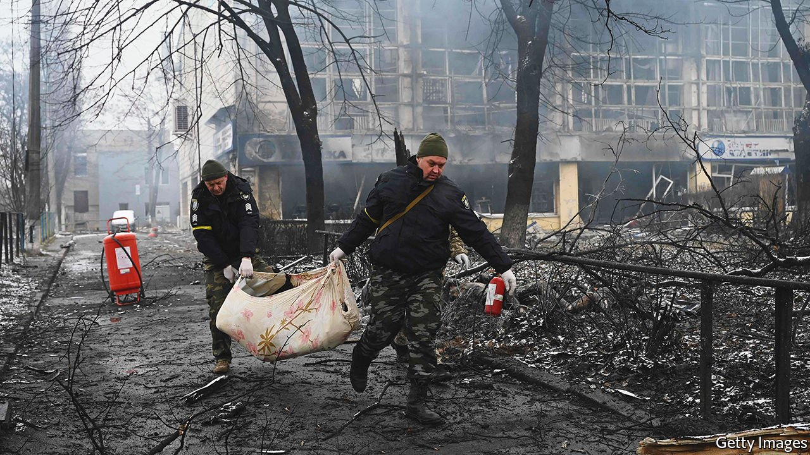
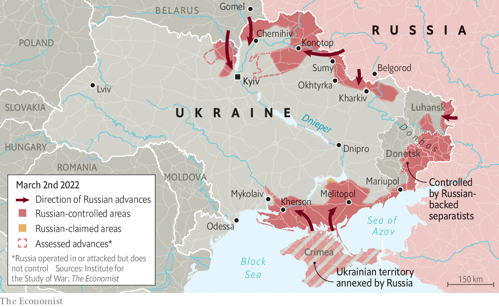

###### Fearful symmetry

# Vladimir Putin’s invasion of Ukraine is wrecking two countries 

##### It is a tragedy, and it is a catastrophe 

 

> Mar 5th 2022 

TO THOSE WITH long memories, Moscow currently feels oddly similar to the way it did during the attempted coup of August 1991. Admittedly, there are no tanks on the streets this time—they are occupied elsewhere. But the security forces of the FSB have a far firmer grip on the city, and the country, than their predecessors in the KGB had during their last-ditch effort to rescue the Soviet Union 30 years ago—an effort which precipitated its final collapse.

There seems no scope today for resistance like that which back then made Boris Yeltsin, the Russian Federation’s president, into a Russian hero. But in a country fast turning totalitarian, one where a law which allows a 15-year-jail sentence for “spreading fake news about the actions of the Russian armed forces” will soon be rubber-stamped by parliament, there is plenty of room for bravery. More than 1m people have signed a petition against the war. On February 24th, in St Petersburg, President Vladimir Putin’s hometown, the police detained Liudmila Vasilieva, a survivor of the 872-day siege the city suffered during the second world war, for protesting against the invasion of Ukraine—one of 7,000 such detentions to have taken place. A video posted on Twitter of her being led away by two policemen instantly become an icon of defiance.


“If there is anything in Russia you can be proud of right now, it is those people who have been detained,” Alexei Navalny, Russia’s jailed opposition leader, wrote in a statement his lawyer posted on Instagram. “Let’s at least not become a nation of frightened silent people. Or of cowards who pretend not to notice the aggressive war against Ukraine unleashed by our obviously insane Tsar.”

There is doubtless some such pretence. Mostly, though, there is shock. “I feel like I'm going mad,” says a banker. “I take part in conference calls where people talk about financial plans and discuss analytical reports about companies’ results, as if nothing is happening.”

 


Most Russians had no idea that their country was going to war until just before it did so, in part because the idea made no sense, in part because they were lied to. For months the Kremlin’s official line was that the troops at the Ukrainian border were simply exercising. Plans for the “special military operation”, as Mr Putin has branded his war, were even kept from the army itself. (Tellingly, “special operation” is a KGB term, not a military one.) The operation was supposed to be over before anyone realised it had taken place.

It wasn’t. Russia’s generals opted to begin their assault with a series of baffling and fruitless raids and failed at the vital task of suppressing their enemy’s air defences. Though Russian forces were quick to advance out of Crimea in the south, their progress towards Kyiv and various cities in the east was slower than expected.

This could, in part, have been due to a desire to limit civilian casualties. The invaders may have made sparing use of artillery—surprisingly sparing, given that it has always been the backbone of the Tsarist, Soviet and now Russian ground forces—because it is a hard form of firepower to use discriminately in built-up areas. The same impulse might explain their limited use of air power, though the persistence of some Ukrainian air defences could also be part of that story.

But the Russians were also poorly prepared for the amount of resistance they encountered. Anti-tank missiles sent to Ukraine by the thousand in recent months have worked well, says one European defence official. The absence of air superiority allowed Ukraine’s Turkish-made drones to get to their targets.

The fact that the war is taking place on Ukrainian soil, and that Ukrainians have proved adept at getting their message out, means that outsiders are undoubtedly getting a somewhat skewed picture: few people are uploading photos of burnt-out Ukrainian tanks. Nevertheless, Russia’s early performance was “worse [than] in Georgia in 2008,” Konrad Muzyka, a defence analyst, observed on February 27th.

The Georgian war, in which Russian forces performed poorly, was said to have led to sweeping reforms. They were evidently not sweeping enough. Mr Putin has spent over a decade pouring money and technology into his armed forces, but in the words of one Western defence official he only has a “Potemkin army” to show for it. In some cases, its tactics have verged on the suicidal. A video reportedly taken in Bucha, north-west of Kyiv, shows a Russian armoured vehicle using its loudspeakers to tell civilians to remain calm. A man wielding a rocket-propelled grenade strolls up to the vehicle and calmly destroys it.

Such almost nonchalant effectiveness typifies what has appeared inspiring about Ukraine’s resistance. Andrey Kurkov, a Ukrainian novelist, has written of a “democratic anarchy matrix” which grew up in the country after it abandoned feudalism and rejected monarchy, mixing individualism and common cause in such a way that they reinforce, rather than contradict, each other. Since the tanks came over the borders it has been easy to spot.

Ukrainians are trusting strangers as they never have before. Armies of civilian volunteers work to import military kit from other parts of Europe; others help organise evacuations for those trying to leave the country. Tweets from the defence ministry tell citizens which parts of a tank are most vulnerable to Molotov cocktails. Ordinary people risk their lives by standing in front of armoured vehicles. Confronting Russian troops—many of whom are conscripts still grappling with the fact that they are in a real war—with such solidarity has remarkable effects. Video footage shows at least one Russian tank column hurriedly reversing after being confronted by unarmed civilians.

The lady with the dog

At the centre of this has been Volodymyr Zelensky, the country’s unlikely president. Having spent months playing down the threat of war he has made an astonishingly rapid transformation from hapless political outsider to wartime hero and global icon of decency. His charisma and acting background have suited him perfectly to a war immersed in social media.

As Mr Putin harangues subordinates in gilded halls, Mr Zelensky posts selfies with his team in which he explains the thinking behind their conduct of the war and urges his fellow citizens to be strong. He wants to make use of global goodwill with an International Legion which will integrate foreign soldiers into Ukrainian forces. Ukrainian embassies worldwide report numerous requests to join.

Any such new troops are likely to find the going getting tougher. Russian tactics are changing; artillery is back in its accustomed role as the army’s mainstay. On February 28th the city of Kharkiv was bombarded with shells, rockets and cluster munitions which release bomblets over a wide area. There were heavy civilian casualties.

The first major city to fall was Kherson, on the Black Sea. On the day that it fell, March 2nd, the mayor of Mariupol, on the Sea of Azov, said his own city was being “pounded” with shells, rockets and air strikes. Russia is on the verge of completing a land bridge from the Donbas region to the Dnieper river along the Black Sea coastline. A thrust north into the centre of the country, towards the city of Dnipro, looks likely to cut off Ukrainian forces in the east. Kyiv looks likely to be encircled and then presumably besieged. Petrol is close to running out, says the boss of a company in the city; food shortages are coming.

There is a widespread fear that Kyiv could share the fate of Grozny, the capital of Chechnya, much of which was left in ruins after an artillery pounding ordered by Yeltsin in 1994 left 20,000 civilians dead. It is a memory which should frighten the Russians, too. Even after a second battering pounded the ruins into rubble, victory required that ground forces fought their way in to take the city. And Kyiv, a much larger city than Grozny, offers Ukraine the “perfect terrain to defend”, according to Anthony King, author of “Urban Warfare in the Twenty-First Century”. It is large, dense, bisected by a river, criss-crossed with roads and railway lines and has an extensive metro and sewer system that could be used by defenders.

Watching a prolonged and bloody siege of Kyiv would further enrage public opinion in large parts of the world, and could thus lead to even harsher sanctions on Russia. Though  that came into force on February 28th have definitely been noticed—roubles to the tune of $15bn have been withdrawn from banks, adding 10% to the amount of cash in circulation—their full effect will not be seen for “two to three weeks,” according to a respected economist. That is when stocks of consumer goods will run down, new supplies will fail to arrive, and spending all those roubles will get a lot harder. For all Russia’s talk of a “fortress economy”, since 2014 the share of non-food consumption that is spent on imports has fallen by only four percentage points, from 44% to 40%.

Some Russian importers are already laying off staff. More will do so soon, as will restaurants running out of imported fish and meat. Russia, one economist says, is sliding back into the post-Soviet 1990s, the dismal period which Mr Putin says was forced on it by the West before he liberated it. Inflation could be anywhere between 40% and 80% if imports are frozen. The middle class looks likely to be shredded. Meanwhile the free media is gagged. On March 3rd Echo Moskvy, a liberal radio station on the air since 1991, was shut down.

Kirill Rogov, a political analyst critical of Mr Putin, calls what is happening in Ukraine a tragedy; what is happening in Russia, he says, is a catastrophe. Many are unwilling to stay and participate in it. A visit to a veterinary clinic on March 2nd found people queuing up to be able take their animals with them as they fled their country. Some came carrying suitcases, ready to dash to catch a train or a flight as soon as they left. “What if Turkey closes the border, how will you come back?” a middle-aged lady with a dog asked a younger woman leaving Russia for the first time. “I have no plans to return,” came the answer. ■

Our recent coverage of the Ukraine crisis can be found 

