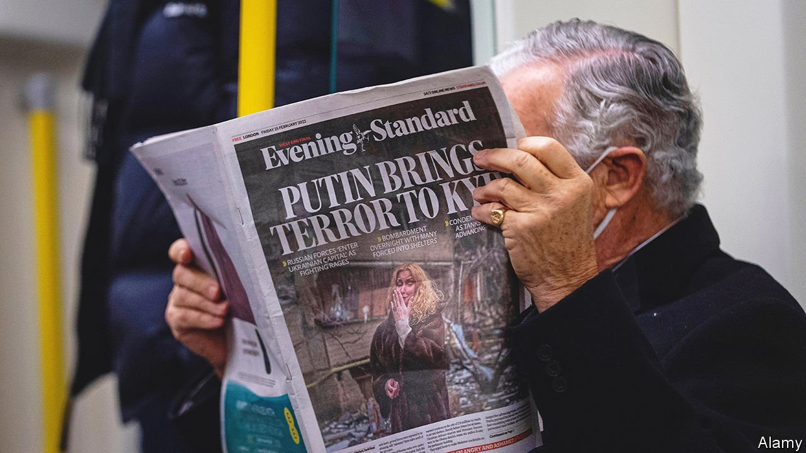

###### Economic warpath

# Britain is severing financial links with Russia at a blistering pace 

##### Among other measures is a long-delayed bill aimed at flushing out dirty money, whatever the source 

 

> Mar 5th 2022 

ON THE EVENING of March 2nd Roman Abramovich, the Russian billionaire who owns Chelsea football club, announced his decision to sell it. Net proceeds are to be placed in a fund for “all victims of the war in Ukraine”. After days in which he was battered in the press and in Parliament, it was, he said, “in the best interest of the Club”.

The sale of one of the world’s most valuable sports clubs is a knock-on effect of Vladimir Putin’s invasion of Ukraine, the latest in the cascade since the early morning of February 24th, when Russian troops crossed Ukraine’s border. Within minutes Britain’s prime minister, Boris Johnson, had taken to Twitter, saying that Mr Putin had “chosen a path of bloodshed and destruction” and promising a decisive response. Hours later he pledged a “massive” package of sanctions.


That evening Downing Street was lit up in Ukrainian blue and gold. London’s stockmarket had plunged; oil and gas prices had soared. Britain’s government had placed sanctions on Russia’s largest banks, banning them from raising debt in Britain and freezing £154bn ($206bn) of assets belonging to VTB, the second largest. Aeroflot, Russia’s state-owned airline, was banished from British airspace. The Church of England announced that it would sell its Russian holdings, denouncing the invasion as “an act of great evil”.

Over the weekend the pace and scale of activity increased. BP, a British energy company, said it would offload its 20% stake in Rosneft, the Kremlin’s oil company, a decision that could cost the firm £25bn (the Kremlin has since announced a ban it says is temporary on foreigners selling Russian assets, which may delay the divestment). At that stage, Mr Abramovich was attempting to get ahead of escalating sanctions by giving up control—but not ownership—of Chelsea football club. Russian-linked cultural and sporting events were cancelled and related visas rescinded, from ballet to basketball.

By February 28th Shell, another British energy company, had severed its own Russian links. Russian ships were banned from entering British ports. Ofcom, the national media regulator, began investigating RT, one of Russia’s state broadcasters. Lord Lebedev, a Russian billionaire who received his title in 2020 from Mr Johnson, ran a personal plea on the cover of the newspaper he owns, the Evening Standard: “President Putin, please stop this war”.

Some hours later, after enduring days of criticism for doing too little, the government said that it would introduce legislation to crack down on “dirty money” and “corrupt elites” in light of Russia’s invasion of Ukraine. Sanctions on individual oligarchs are unlikely to do much to deter Mr Putin, but inaction had become politically , given London’s long-standing status as a slop-bucket for dodgy Russian wealth.

The Economic Crime Bill was introduced to Parliament on March 1st, the next day. It represented a U-turn by the government, which had said it would not put the bill forward during the current session (it has been placed on the back burner several times before). If it passes, all foreign owners of British property will have to register their real identities so that “criminals cannot hide behind secretive chains of shell companies”, the government said. It also aims to make it easier for the Treasury to fine sanctions-busters.

The decoupling did not stop there. Centrica, Britain’s largest gas supplier, said it was in the process of ending its contracts with Gazprom, a Russian state energy giant. Gas prices rose to rival the level of last autumn, which had bankrupted many suppliers tied into fixed-price sales contracts. Glencore, an Anglo-Swiss mining conglomerate, said it was reviewing its stakes in Rosneft and in EN+, the world’s largest aluminium producer outside China. A suite of British firms, from JCB, a maker of construction equipment, to Jaguar Land Rover, a car manufacturer, said they would pause sales to Russia.

After a hectic week, Britain has few Russian ties left to sever. The Economic Crime Bill offers a refreshed framework for attacking one of Britain’s last heavily Russified sectors, the oligarchic money sloshing around London. But still lacking, as it has been for years, is anything like enough government cash to enforce anti-money-laundering laws and to prosecute corruption. With luck, that will come next. ■

