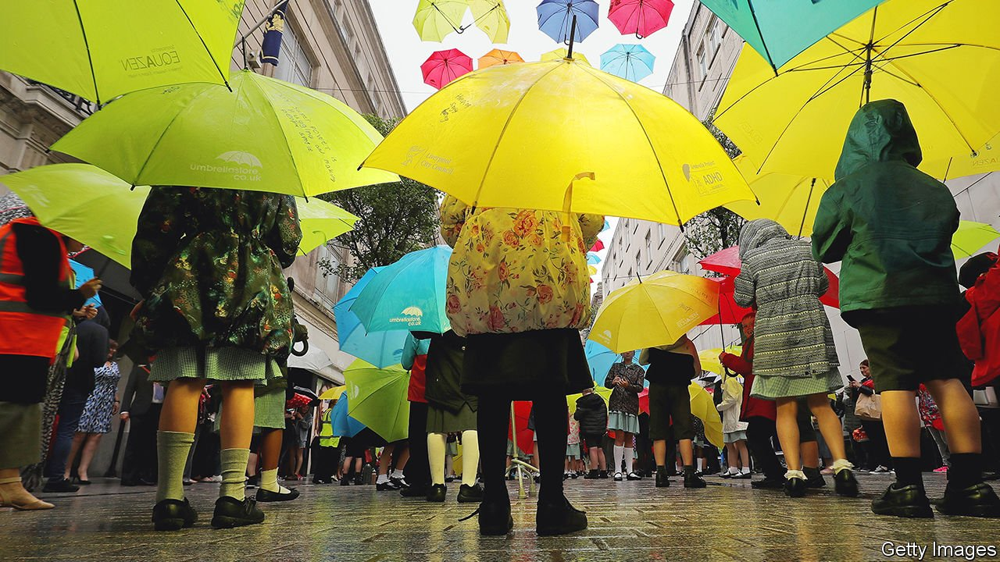

###### SEND help

# England’s special-education system is on its knees 

##### The number of pupils with the severest needs is shooting up 

 

> Mar 5th 2022 

HAYLEY HARDING’S son, born in 2014, began crawling late, around the time that other children were learning to walk. Pre-school staff warned that his speech was delayed and his concentration span was short. By the age of four he had been diagnosed with autism, of a sort doctors and teachers said could not be managed in a normal classroom. But when his mother began jumping through the hoops required to get him into a special school, his local council refused even to see him for an assessment. It seemed “unfathomable”, says Ms Harding, that a child who “could not hold a pencil for five seconds” had been abandoned by the authorities.

These days she runs a group campaigning to improve schooling for children with special educational needs and disabilities (SEND) in her borough of south London. Similar groups have been set up across England. The government appears to agree that children with SEND are not getting enough support. The question is whether a long-delayed review, due to be published in the coming weeks, can change that.


About 1.4m school children in England, or 16% of all pupils, have a special need of some sort. Those with common difficulties such as dyslexia might get occasional extra classes or attention from a teaching assistant, paid for by their school. The 325,000 or so who face the greatest challenges, such as blindness or Down syndrome, get more. Their needs are itemised in legally binding education, health and care (EHC) plans drawn up by local councils. A little under half of them are educated outside mainstream schools.

Some children with severe SEND will never meet the usual academic milestones. But those with more minor conditions should be able to do so, if they receive sufficient support. With that in mind, achievement across the group looks low. In 2018 only about 14% of children with SEND in state schools got good GCSEs in mathematics and English, compared with 48% of their peers. They make up around half of the children expelled from state schools for behavioural infractions. Poor marks not only limit their opportunities but complicate efforts to narrow gaps between rich and poor pupils, since children with extra needs are more likely than others to come from disadvantaged homes.

The share of children identified by schools and councils as having special educational needs varies wildly by region, from 7% to 17%. Overall, however, the trend is upwards. The number of school pupils classified as having the most severe needs is rising fastest, for reasons that remain much contested. Their ranks have swelled by almost 40% in five years.

Councils say central-government funding lags behind rising demand. Two-fifths of children who apply for an EHC plan, required for the priciest help, wait longer than half a school year to be assessed. The number of irate parents taking local authorities to tribunals has doubled since 2014. Almost all complaints are upheld. Stresses caused by the pandemic have heightened conflicts between parents, schools and local authorities. Children with the most severe needs were allowed to attend school during lockdowns, but no more than half did at any point.

Any new effort to fix special education will have to resolve recent failures. Parents’ expectations were raised by changes in 2014, intended to give them more say in the help their children receive. But councils say they were given new jobs—such as to support school-leavers who have special needs up to age 25—without enough extra money. Parents and some MPs hope the government will get tough with local authorities they regard as shirking. But they also fear the government might tighten rules about which children qualify for extra help, in order to save cash.

Improving how mainstream schools handle milder difficulties could bring the greatest benefits. Failing to help children early may mean small problems grow into big ones. But making schools more inclusive may also be the trickiest part of the puzzle. Parents of children with SEND commonly argue that efforts to push up school standards, for example through league tables based on exam results, have made schools less welcoming.

Recent government rhetoric about improving classroom behaviour has made parents nervous, too. The way money is allocated to schools gives heads little incentive to do right by children with SEND. Schools that put a lot of effort into teaching them tend to attract more such pupils. Their reward is higher costs and perhaps lower positions in league tables.

Ms Harding’s son is now seven. He goes to a school for autistic children attached to a mainstream primary. That is ideal. But it was only arranged after she started to take her council to a tribunal—a time-consuming and tricky task she was unusually well-placed to handle, since she is a solicitor. Only parents who are educated, know their children’s rights and can afford lawyers, she says, are able to navigate the system. ■

