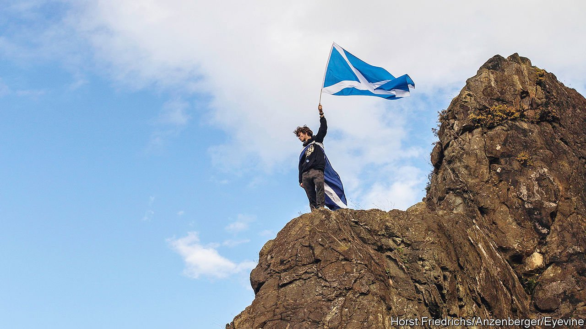
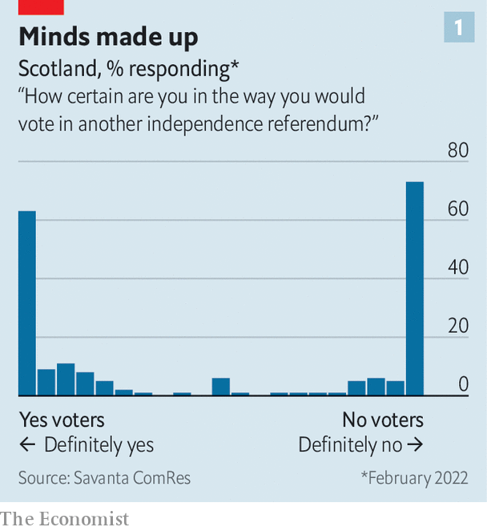
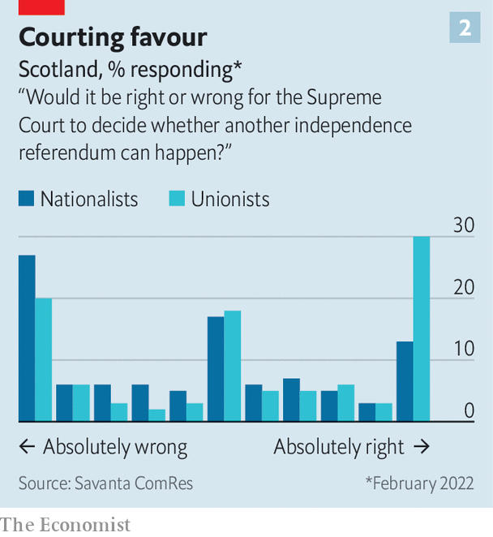

###### Peak Nat

# Scotland’s constitutional debate is deadlocked, despite one crisis after another 

##### The United Kingdom seems to have weathered its moment of maximum danger 

 

> Mar 5th 2022 

IN RECENT YEARS, the disintegration of the United Kingdom has sometimes seemed nigh. Scottish independence was a “very high probability”, wrote one fund manager in January 2021. A few months later Citi, a bank, put the odds of separation at 35% within a decade. Some senior Tories thought a break-up was near-inescapable.

Scots rejected independence in a referendum in 2014 by 55% to 45%. Yet within years a remarkable second chance seemed to be on the cards for nationalists, as the Scottish electorate was buffeted by three shocks: Brexit, Boris Johnson’s elevation to prime minister and covid-19, each of which threatened to reshape public opinion in favour of independence.


These days senior Scottish Conservatives are in a bullish mood. Nicola Sturgeon, Scotland’s first minister, has sustained the Scottish National Party (SNP) as a dominant force. It has been in power in Scotland since 2007 and holds 45 of Scotland’s 59 seats in the House of Commons. Ms Sturgeon vows to hold a second referendum on independence in 2023.

Yet the shocks have not shifted opinion all that much, and British ministers now think the union has weathered its moment of maximum danger. Scots would vote against divorce by 51% to 49%, excluding “don’t knows”, according to polling for The Economist by Savanta ComRes. Just a third of Scots want a referendum in the next two years. The impact of Brexit on the desire for independence has been “limited”, and that of covid-19 “barely discernible”, writes Robert Johns of the University of Essex in a recent edition of Political Quarterly, a journal. He thinks it is therefore “hard to conceive of an external shock that could appreciably shift opinion”. Or, as one Scottish Tory puts it: “If Boris and Brexit can’t deliver the numbers, nothing will.”

Nationalists need to break this stalemate. The SNP’s preferred option is a referendum to be held with the agreement of the British government—which, for its part, says its approval is needed under domestic law. But Alister Jack, the Scottish secretary, has said that should happen only after 25 years have passed since the 2014 referendum, and only if a vote is the “settled will” of Scots. He defines that as support of over 60% for both a referendum and for independence, sustained for a year.

In its internal deliberations, the SNP used to regard that as the benchmark for a fresh referendum too. But Ms Sturgeon has declared Brexit, which most Scots opposed, a “material change of circumstances” that would justify a re-run. It hit Scotland’s exporters hard, and degraded the British government’s reputation for stability. But although it drove some Remainers towards independence, that was partly counterbalanced by Leavers going the other way. A majority of Scots still want to rejoin the European Union, but polls suggest the issue has lost electoral salience.

Mr Johnson, almost a nationalist caricature of the English Tory toff, was declared nationalism’s recruiting sergeant when he entered Downing Street in July 2019. The recent scandal over lockdown-busting parties while the pandemic raged meant his net approval ratings sank to -57%, according to Savanta ComRes. Ms Sturgeon’s sit at 23%. Yet Mr Johnson’s falling popularity has not increased support for independence. The more likely it is that Labour can win the next election, the weaker the nationalist claim that only independence can end Tory rule.

 


This stalemate is caused by a remarkable degree of entrenchment, in particular among unionist voters. The Economist’s polling asked Scots how settled they are in their views on the issue of independence, from zero, meaning not at all certain, to ten, meaning absolutely certain. Among those with a view and likely to vote, 73% of unionists and 63% of nationalists put themselves at ten. Only 10% of respondents gave a score of six or lower (see chart 1).

The nationalist movement puts its hope in young voters, who lean towards independence, but they are far less likely to say their views are fixed than are their parents and grandparents, who lean towards the union. Fewer than one in ten Scots say they are undecided. That is a small pool for nationalists to fish in.

If the British government does not consent to a referendum, Ms Sturgeon has a Plan B: to push ahead and wait to be challenged in the Supreme Court. That has never looked like a promising route, but in recent months its chances of success have fallen further. A referendum bill might have survived such a challenge if the court adopted an expansive view of the Scottish Parliament’s powers. But the court has recently taken a conservative turn, and in an important judgment in October 2021 it emphasised the Scottish Parliament’s limited purview. That, constitution-watchers reckon, makes a green light for a referendum highly unlikely.

 


Nationalists hope that obstacles in London will rally more support for independence. But evidence for that is sparse. Only a third of Scots, and 45% of nationalists, told Savanta ComRes it would be wrong for the Supreme Court to decide whether a referendum can go ahead. A similar share think the British government should not have a veto on a referendum. “It’s a reasonable conclusion that the proportion of Scots who can be persuaded to support independence purely by a ‘Tories down south are telling us what to do’ argument is close to maxed out now,” says Dr Johns.

In the years of crisis, Westminster made nationalists’ case for them. As Ms Sturgeon’s referendum deadline nears, they must do it for themselves. A small team of officials is drafting a blueprint for independence. Yet fundamental weaknesses of the 2014 campaign persist. There is no clarity regarding the SNP’s plan to adopt a new currency, or how the deficit between Scotland’s tax revenues and public expenditure would be bridged, or what would become of the border with England. Just a quarter of Scots, and half of nationalists, think independence offers more opportunities than risks for their personal finances. Mr Johnson’s era looks less likely to be remembered as the end of the union than as Scottish nationalism’s false dawn. ■

