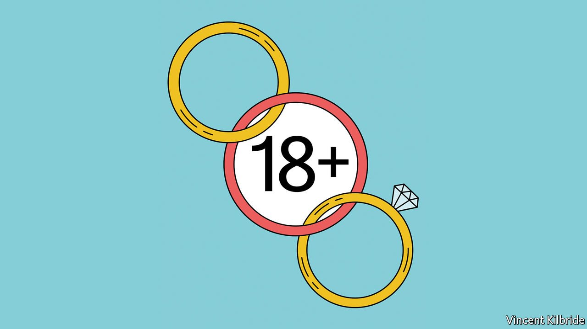

###### Indecent proposals

# The age of marriage is being raised in England and Wales 

##### The move is welcome, but late 

 

> Mar 5th 2022 

IT IS A truth universally acknowledged that when it comes to marriage, Britain is a bit odd. On most matters of sexual mores, it behaves like other northern Europeans, sharing liberal attitudes towards abortion, contraception and same-sex relationships. But on the issue of marital age it is an outlier. Unlike most of its neighbours, who insist that people must be 18 to marry, Britain allows 16-year-olds to wed with parental consent (and in Scotland without it).

That is about to change. In late February the Marriage and Civil Partnership Bill, which sets a minimum age for marriage of 18 in England and Wales, passed through the Commons. It aims to help prevent forced marriages and has been welcomed by campaigners. “Child marriage is child abuse,” said the health secretary, Sajid Javid. The old law did not merely make Britain locally peculiar; it made it a debating point. At international summits, countries where teenage girls are commonly pressed into marriage could point to “progressive” Britain: if it allows marriage at 16, why shouldn’t they?


Some believe the new law is unnecessary. Forced marriage is already illegal; and if someone can have sex at 16, why should they not be allowed to wed? Jasvinder Sanghera, who founded a charity that has campaigned against child marriage, disagrees. You cannot, she points out, drink alcohol or gamble at 16. “But you can get married. It’s a nonsense.” And marriage at 16 is not merely sex at 16; it carries numerous other damaging corollaries. Around the world, girls who marry while still minors commonly drop straight out of education.

The term “marriage”, with its connotations of canapés and champagne, has clouded the issue. Poets and pop songs have led to a modern misconception that tying the knot is about love. But for most of its history, and for many still, marriage has been about property and power, not passion. The Montagues and Capulets understood this; Romeo and Juliet did not. At the turn of the 19th century, Mrs Bennet of Jane Austen’s “Pride and Prejudice” understood that a suitor with a stately pile and £10,000 a year (about £890,000, or $1.2m, today) would benefit not merely the daughter who married him, but the whole family.

What changed marriage—and is still changing it in other places—is the emancipation of women. “Everywhere that women start to get educated and start to get options the age of marriage goes up,” says Stephanie Coontz, an author on the subject. Today, as with Austen’s Eliza Bennet, nothing but the deepest love—or at least a passable husband of her choosing—will induce most educated women into matrimony. A law banning marriage at 16 will give more women greater liberty to make a similar choice.

