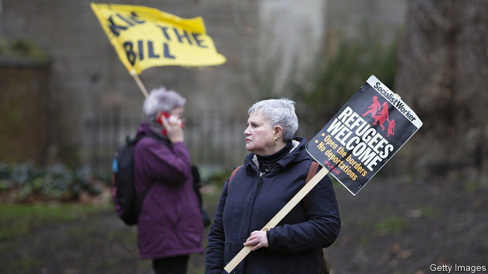

###### Attitudes to immigration

# When it comes to refugees, Britons are both harsh and liberal 

##### No wonder their government is confused 

 

> Mar 5th 2022 

IT HAS BEEN a rough week for anti-immigrant populism. On February 28th the House of Lords torpedoed a flagship government bill that would criminalise asylum-seekers and make it easier to strip people of British nationality. More than 1,000 religious leaders had declared themselves “horrified and appalled” by the bill. Meanwhile YouGov, a pollster, revealed that 77% of people supported allowing Ukrainian refugees to come to Britain without a visa. Has the country gone soft?

It is a crucial question, because opposition to immigration has been one of the most potent, and disruptive, forces in British politics over the past decade. The answer is nuanced. The public wants Ukrainian refugees to be treated more generously than the government intends. It started out with stingy proposals, although by March 1st it had been cajoled into admitting close relatives of Ukrainians already settled in Britain and opening a new sponsored visa route. But liberals who believe that the Ukraine crisis will usher in a tolerant policy towards all refugees have equally misread the public mood.


Over the years Britons have grown more sympathetic to people fleeing war, persecution and despotism. In 1990 just 33% of those aware of proposals to allow Hong Kongers to settle in Britain approved. By 2020 fully 64% backed a more generous policy. Going further back, in 1972 only 6% of Britons thought that the Asians menaced by Idi Amin, Uganda’s loopy president, should immediately be let in, even though they had British passports.

Rob Ford, who studies the politics of immigration at Manchester University, calls this “event-driven liberalism”. Britons have become more inclined to help the obviously desperate, especially if other countries are too. They are swayed by media. Last year British Future, a think-tank, showed a two-minute film in which refugees expressed gratitude to Britain to a sample of people. Those who saw it were more likely to say refugees deserved protection than were those who did not. The film-watchers were even more likely to conclude (by 59% to 44%) that immigration had affected Britain positively.

Britons worry about refugees, but not for the same reasons as other Europeans. A poll of 12 countries by Ipsos in 2016 (when Syrians were on the move) found that Britons were the least concerned that they would fail to integrate. They worried only a little more about refugees committing crimes or hazarding national security—a fear that the home secretary, Priti Patel, clumsily tried to evoke this week when she warned that dropping visa requirements for Ukrainians would allow “extremists” in. But Britons were most worried about competition for welfare and public services. Nobody likes a queue-jumper.

That obsession with order and fairness explains the deep resentment towards people who turn up uninvited and apply for asylum. Last year 28,500 people arrived in small boats across the English Channel. Many have strong claims—in 72% of the asylum cases heard last year, the applicant was granted some kind of protection—but it does not matter. A poll in November showed that most Britons support turning the boats back; they also favour refusing claims from people who turn up illegally and could have claimed asylum elsewhere. The public would therefore go even further than the government’s asylum bill that so affronted religious leaders and peers.

These are tricky demands to satisfy. British people appear to want extremely harsh asylum rules by default, but generous exceptions for groups that have captured their sympathy. They seem to assume that the state, or perhaps an agency like the UN, is capable of identifying worthy refugees and transporting them to Britain at short notice, following bespoke rules for each nationality. It is big-state conservatism on a global scale. ■

