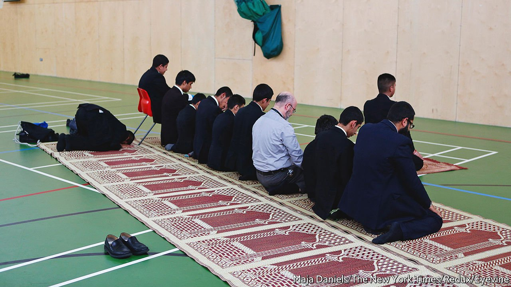

###### Trojan Horse rides again

# “The Trojan Horse Affair” reignites a row over radicalisation in schools 

##### A punchy podcast fuels debate over Prevent, a British anti-terrorism programme 

 

> Mar 5th 2022 

MANY FACTS about Tahir Alam’s record as an educator are contested—but not all. The same goes for a decade-old controversy over the influence of Islam in Birmingham’s schools. Mr Alam thinks Muslim children perform best in schools with an atmosphere that reflects their faith. As chairman of a trust overseeing three Birmingham schools, he won some official credit for boosting exam results in areas where poverty and crime were rife.

In Mr Alam’s telling, he helped ensure Muslim children “did not have to leave their culture or faith background at the gate”. That meant Islamic assemblies and prayers, and an Islamic-tinged curriculum (he insists no regulations were broken). But since 2015, following the “Trojan Horse affair”, which began with an anonymous document delivered to Birmingham City Council, Mr Alam has been banned from teaching and administrative roles in any school regulated by the state.


The document, which purported to describe a concerted effort to infiltrate the city’s schools and boost Islamic influence, was widely dismissed as a fake. And the inquiries it led to—by the Department for Education, schools inspectorate and Birmingham City Council, among others—found no evidence that extremism was being incubated. But they did find staff with sexist and homophobic attitudes, and that life had been made hard for staff who did not share the schools’ Islamic ethos.

The most lasting consequence was the ban on Mr Alam. It did not, however, end his interest in Birmingham’s schools. In 2019 he was an enthusiastic supporter of Muslim parents who protested against a new syllabus encouraging positive attitudes towards gay and transgender people.

In recent weeks arguments over Islam, education and security, with east Birmingham and Mr Alam at their centre, have flared up again. For he features in an eight-part series about the Trojan Horse affair by “Serial”, an immensely popular podcast produced by the New York Times. It is presented by Hamza Syed, a Muslim doctor-turned-reporter brought up in Birmingham, and his American journalistic mentor, Brian Reed. Like many Muslim activists, including Mr Alam, Mr Syed thinks Trojan Horse was indeed a cooked-up affair—but not by Islamists. He argues that the document was seized on as a pretext by those who elide conservative Islam and violent extremism, and wanted to crack down on both.

The podcast is an engaging listen, in part because Mr Syed is disarmingly frank. In expletive-laden banter, Mr Reed scolds him for displaying hostility towards liberals who make formal complaints about conservative Muslim attitudes. In a complaint to the New York Times, two whistleblowers described an interview they had given as leaving them feeling “beaten into submission, held hostage in our own home”. Humanists UK, a secularist charity, complained that the podcast distorted an interview with one of its officers. The script was amended.

In truth, worries about Islam in Birmingham schools would have come to a head with or without the Trojan Horse document, and whatever its provenance. For the government, the rise to prominence of conservative Muslim school leaders was an embarrassing consequence of its flagship “academies” programme, which granted state schools greater independence. Local politicians and police, for their part, were coming under pressure for looking the other way. Now, by raking over the coals, the “Serial” podcast has reignited a row over the government’s anti-radicalisation scheme, Prevent, which requires schools, universities, prisons and so on to be on the lookout for violent extremism. Referrals lead to a conversation with police officers or specialist counsellors and the offer of a deradicalisation course.

Critics of Prevent see the podcast as vindication of their belief that the policy stigmatises Muslims. Its supporters retort that such opponents offer no suggestions for improvement. Moreover, those thought to be toying with violent forms of Islamism made up just a quarter of referrals in the year ending March 2021, the same share as those suspected of right-wing radicalisation. Out of 4,915 cases, half fell into a vaguer group: those attracted to unstable, incoherent ideologies that raise concerns.

One qualified defender of Prevent, and critic of Mr Alam’s educational project, is Khalid Mahmood, a practising Muslim and Labour MP for Birmingham who has chided politicians of all stripes for naivety regarding militant Islamism. The Prevent policy could be better, he says—it should involve a wider range of mosques and imams, since they are best-placed to judge when a youngster suddenly takes up a strand of the faith different from that of his family. In his view, pious educational projects that lack transparency are a sign of Islamism—the notion that the ideal form of government is explicitly Islamic—and even when ostensibly non-violent, can be a gateway to extremism.

Inside the city walls

That view has triggered arguments within both Labour and the Conservatives. Hawks in both seem to have prevailed. An ongoing review of Prevent may make the programme tougher, for example by making post-referral counselling compulsory. It is being led by William Shawcross, a journalist and author who has expressed trenchant views on “Islamo-fascism”. His appointment prompted some human-rights groups to boycott the review. Consensus on how conservative Islam should be accommodated in wider British society has never seemed more elusive. On that central question, “Serial” is right. ■

