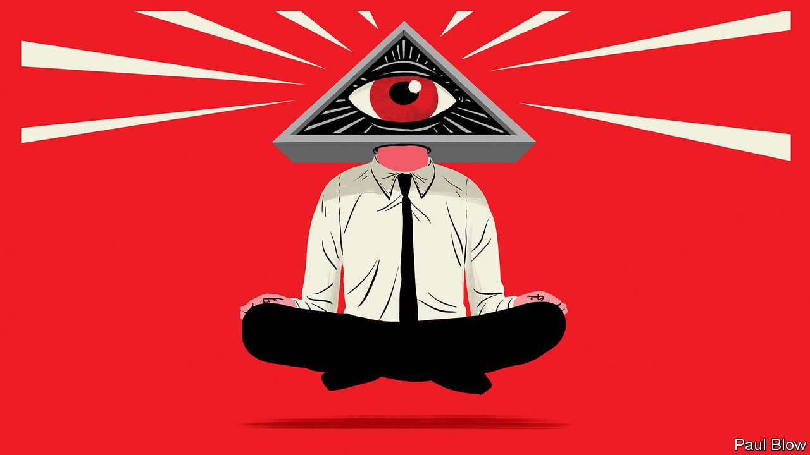

###### Bartleby

# Company or cult? 

##### The dividing line between firm and sect is often thin. How to tell them apart 

 

> Mar 5th 2022 

HERE ARE some common characteristics of cults. They have hierarchical structures. They prize charismatic leaders and expect loyalty. They see the world as a hostile place. They have their own jargon, rituals and beliefs. They have a sense of mission. They are stuffed with weirdos. If this sounds a bit familiar, that is because companies share so many of these traits.

Some cult-companies are easier to spot than others. Their bosses are more like deities than executives. These leaders have control of the company, and almost certainly founded it. They have name recognition among the masses. They really like rockets and have a brother called Kimbal.


But in other cases it can be hard to tell where a company ends and a cult begins. That is true even of employees. So here is a handy guide to help you work out whether you are in a normal workplace or have fallen into the clutches of an even stranger group.

Workforce nicknames. It is not enough to be an employee of a company any more. From Googlers and Microsofties to Pinployees and Bainies, workforce nicknames are meant to create a sense of shared identity. If you belong to one of these tribes and use its nickname without dying a little inside, you may be losing your grasp of reality. If you work in the finance team and are known as one of the Apostles of the Thrice-Tabbed Spreadsheet, you already have.

Corporate symbols. Uniforms are defensible in some circumstances: firefighters, referees, the pope. And so is some corporate merchandise: an umbrella, a mug, a diary. But it can easily go too far. Warning signs include pulling on a company-branded hoodie at the weekend or ever wearing a lapel pin that proclaims your allegiance to a firm. If your employer’s corporate swag includes an amulet or any kind of hat, that is also somewhat concerning.

Surveillance. It is reasonable for executives to want to know what their workers are up to. But it is not reasonable to track their every move. Monitoring software that takes screenshots of employees’ computer screens, reports which apps people are using or squeals on them if a cursor has not moved for a while are tools of mind control, not management.

Rituals. Rites are a source of comfort and meaning in settings from sport to religion. The workplace is no exception. Plenty of companies hand out badges and awards to favoured employees. Project managers refer to some meetings as “ceremonies”. IBM used to have its own songbook (“Our reputation sparkles like a gem” was one of the rhymes; “Why the hell do we have this bloody anthem?” was not). Walmart still encourages workers in its supermarkets to bellow a company cheer to start the day. Some of this is merely cringeworthy. But if you are regularly chanting, banging a gong or working with wicker, it becomes sinister.

Doctrines. More and more firms espouse a higher purpose, and many write down their guiding principles. Mark Zuckerberg recently updated his company’s “cultural operating system”—which, among other things, urges Metamates (see “Workforce nicknames”) to defy physics and “Live In The Future”. Amazon drums its 16 leadership principles (“Customer Obsession”, “Think Big”, “Are Right, A Lot”, and so on) into employees and job candidates alike. Corporate culture matters, but common sense doesn’t become a belief system just because capital letters are being used. If values are treated like scripture, you are in cult territory.

Family. Some companies entreat employees to think of their organisation as a family. The f-word may sound appealing. Who doesn’t want to be accepted for who they are, warts and all? But at best it is untrue: firms ought to pay you for your time and kick you out if you are useless. At worst, it is a red flag. Research conducted in 2019 into the motivations of whistle-blowers found that loyalty to an organisation was associated with people failing to report unethical behaviour. And the defining characteristic of families is that you never leave.

If none of the above resonates, rest easy: you are not in a cult. But you are unemployed. If you recognise your own situation in up to three items on this list, you are in an ordinary workplace. If you tick four or five boxes, you should worry but not yet panic; you may just be working in technology or with Americans, and losing your sense of self may be worth it for the stock options. If you recognise yourself in all six items, you need to plan an escape and then write a memoir.

Read more from Bartleby, our columnist on management and work:

 (Feb 26th)

 (Feb 19th) (Feb 12th)

