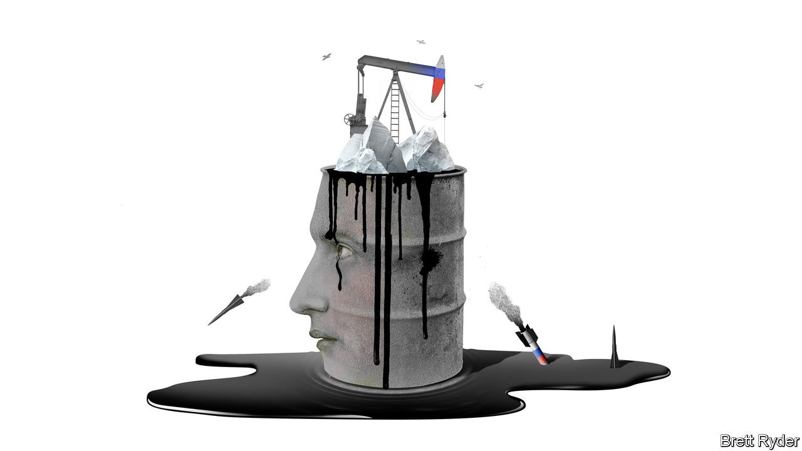

###### Schumpeter

# How Europe’s commodities traders took a gamble too far on Putin’s regime 

##### This is one war they may not be able to win 

 

> Mar 5th 2022 

IN RUSSIA’S FROZEN north is a megaproject that has long been seen as an answer to President Vladimir Putin’s prayers. By the mid-2020s the Vostok oilfield is expected to supply about 15% of Russia’s crude exports. By that time Rosneft, the Russian oil giant leading the effort, plans to ship Vostok oil via the Northern Sea Route, a shortcut through the Arctic to Asia. The route will enable Russia to bypass the West geopolitically as well as geographically, allowing oil to travel along waters beyond the control of the American navy and out of reach of Western sanctions. Besides Rosneft, its backers include two mostly European oil and gas traders, Trafigura and Vitol. For years they have competed fiercely to be among the biggest buyers of Russian crude.

These firms are part of a group of commodities traders, including Glencore and Gunvor, that often thrive amid geopolitical turmoil. They are clear-eyed realists who in the past have struck deals with autocrats to gain access to cheap raw materials. In recent years some have doubled down on Russia, doing business with the figures who surround Mr Putin, such as Rosneft’s boss, Igor Sechin, and winning big oil and liquefied natural gas (LNG) contracts (piped gas is the domain of Gazprom, a state monopoly). The arrangement served both sides well. The traders invested in Russia and secured more supply from the world’s third-biggest oil-producing country and biggest natural-gas exporter. Higher energy prices bolstered Russia’s hard-currency reserves.


But if they believed Mr Putin’s goal was a modern economy that he would not jeopardise by invading Ukraine, they were wrong. In fact, oil revenues have financed an ever more autocratic and belligerent regime. After the West moved to strengthen penalties on Russia’s financial system on February 26th, they faced the consequences of their bet. As one executive put it two days later, everything in the Russian oil business was “frozen”: banks, ports, ships and suppliers. Auctions of Russian crude found no buyers. Prices of oil soared on global markets but so did the discounts on Russian Urals crude relative to international benchmarks. Amid fear of sanctions, Russian cargoes became kryptonite.

Some traders initially said the paralysis would be short-lived. After all, oil and gas producers were spared sanctions in order to keep Russian energy flowing to the West. One executive described the biggest risk as “overzealous bank compliance officers” causing more damage to Russia’s oil market than the architects of sanctions intended. Yet the traders may have been in denial. The speed with which two European supermajors, BP and Shell, pledged to dump their Russian assets suggested that political and social pressure to withdraw from Russia was mounting in the wake of the invasion. On March 1st Glencore said it was reassessing its equity stakes in EN+, an Anglo-Russian aluminium producer, and Rosneft. A day later Trafigura said it was reviewing its investment in Vostok Oil as it unconditionally condemned the war. Usually the trading houses thrive in times of conflict by keeping their heads down and capitalising on volatility. Not this time. Russia’s war on Ukraine suggests their gamble on Mr Putin may have been a throw of the dice too far.

In theory, excluding Russian oil and gas from sanctions should enable the trading houses to continue their day-to-day operations. In practice, it does not because energy trading is as much about the flow of money as of molecules. Cargoes are financed by banks. They require letters of credit guaranteeing payment. They involve frequent messaging between banks working for the buyers and sellers. Until March 1st, when names were released of the seven Russian lenders potentially blocked from the SWIFT interbank-communications system, many energy-related transactions in Russia were halted, traders said, owing to the counterparty risk. Moreover, fears surfaced that as Russia’s aggression on Ukraine escalates, sanctions will be strengthened. “The tit has to be reasonably in line with the tat,” says Jean-François Lambert, a commodities consultant.

The problem is exacerbated by the length of time cargoes of oil and LNG spend at sea. By the time they reach port, sanctions on Russian energy may be in place. “The biggest grey area is that no one knows what comes next,” says Daniel Martin, who specialises in shipping rules at HFW, a law firm. Logistical chaos compounds the uncertainty. Oil-tanker rates on the Black Sea adjacent to Russia and Ukraine have surged as fighting has intensified.

As well as business risks, the trading firms face reputational ones. This is exacerbated by long-standing links with firms and individuals at the heart of the regime. In “The World for Sale”, a recent book, the authors argue that the merchants have probably been more engaged with Mr Putin’s autocracy than anyone in the world of international business. Despite a stand-off between Russia and the West, they made vast loans to Rosneft in exchange for oil-supply deals. Two years after Russia seized Crimea in 2014, Glencore co-invested $11bn to buy part of the Russian government’s stake in Rosneft (it has since sold almost all of it). After Trafigura and Vitol invested in Vostok, they received supply deals from Rosneft. Mark Rossano, CEO of C6 Capital Holdings, a consultancy, believes that both the oligarchs and the traders were caught out by the economic reprisals that the war has unleashed.

Merchant misadventurers

They will survive. Even with business in Russia in free fall, crisis breeds opportunity. As Western countries such as America release strategic reserves of crude to stop the price of oil soaring, they are queuing up for cargoes. If Western sanctions on the sale of Iranian oil are lifted so that it can offset a potential loss of Russian crude, they have the contacts to move the stuff. But these are dangerous times. The West’s reaction to Mr Putin’s war is visceral. It is one thing to be considered a non-aligned merchant providing the world with what it needs. It is another to be seen as a mercenary. ■

 After this article was published Trafigura issued a statement about its operations in Russia and condemnation of the war in Ukraine. We have updated the article to reflect this.

Read more from Schumpeter, our columnist on global business:

 (Feb 19th) (Feb 12th)

 (Feb 5th)

