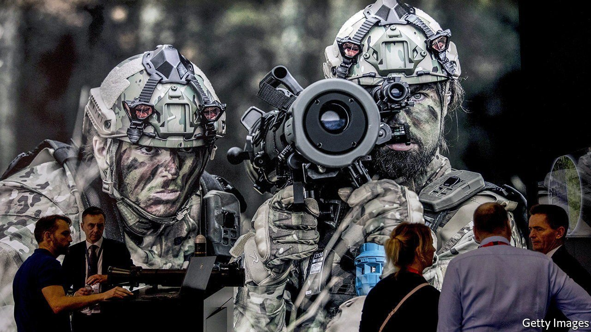
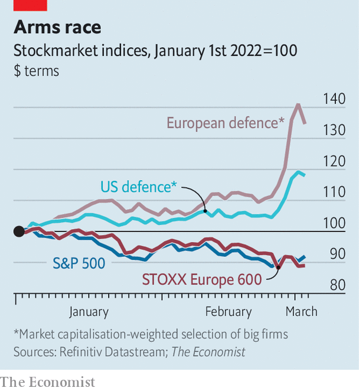

###### Advancing on all fronts

# Russia’s attack on Ukraine means more military spending 

##### The defence industry looks set for bigger business 

 

> Mar 5th 2022 

AS THE TRAGIC human consequences of Russia’s invasion unfold, there is little to celebrate beyond the stoic resistance of outgunned Ukrainian forces and Western unity in facing up to the unprovoked aggressor. One side-effect of the war is a sudden and profound shift in European attitudes to defence spending. Those expectations are behind a surge in the market value of firms that supply the weapons with which war is waged (see chart).

 


The idiosyncratic nature of the defence industry explains why it was having a good year even before Vladimir Putin sent tanks into Russia’s smaller neighbour. Arms makers’ customers are mainly governments. Guaranteed sales translate into predictable revenues. Contracts designed to pass on cost increases shield companies against inflation. The ability to withstand rising prices was a big reason for the sector’s outperformance relative to the stockmarket as a whole in the past few months.


McKinsey, a consultancy, notes that defence budgets—and so armsmakers’ revenues—are a function of threats and affordability. The spike in share prices since the attack on Ukraine reflects investors’ belief that the threats will outweigh the costs in governments’ calculations. Germany made the first move, surprising pundits with an about-turn. On February 27th it said it would spend an extra €100bn ($111bn) on defence in 2022, tripling its defence budget for the year. Besides this one-off investment, Germany aims to raise its annual spending from around 1.5% to 2% of GDP by 2024. A slug of the annual increase, equivalent to €18bn or so, will go on weapons.

The Russian threat may well encourage other laggards such as Italy, the Netherlands and Spain to meet NATO’s guidelines for all members to spend 2% of GDP on defence. Citigroup, a bank, reckons that spending will now rise more rapidly and that 2% will become a de facto minimum across NATO. Jefferies, another bank, points out that if all NATO members meet the target, their combined defence budgets (excluding America’s giant one) will go up by 25% to a total of around $400bn a year. Outside NATO, Sweden and Finland, both within striking distance of Russia, are likely to ramp up spending, too.

Defence spending covers an array of costs such as wages and operational expenses. Kit accounts for between a fifth and a quarter of the total. Jefferies reckons that procurement budgets in NATO (excluding America) could rise by 40-50% as armed forces gear up to face the Russian threat. Because European countries favour domestic arms manufacturers, European firms have seen the sharpest gains in their share prices. That of Rheinmetall, which makes military vehicles, weapons and ammunition, surged by nearly 70% in a matter of days. Hensoldt, a maker of military sensors, more than doubled its market value. Britain’s BAE Systems, Europe’s biggest defence firm, saw its share price rise by a quarter thanks to its large business serving European infantries. Thales of France and Leonardo of Italy made similar advances.

For once, America’s military-industrial complex has lagged behind its European equivalent. Lockheed Martin, Raytheon and L3Harris sell equipment around the world, but mostly to America’s government. The Pentagon already accounts for nearly two-fifths of global spending (or nearly half if you exclude countries such as Russia and China, which are not markets for American weapons). American military spending is unlikely to rise as sharply as Europe’s. But the revived threat from Russia will put paid to the idea, floated by some in Washington, to limit it on the margin. Russian revanchism raises the likelihood that Congress will shovel more money to the armed forces in the coming years.

Bernstein, a broker, points out that past regional conflicts, such as Russia’s invasion of Georgia in 2008, its annexation of Crimea in 2014, and the first Gulf war in 1990, boosted defence stocks for roughly six months, while the rest of the market wilted in the fog of war. The scale of the threat to Europe and the world, and the possibility of a long confrontation in Ukraine, may mean the boost lasts longer this time. That would perpetuate a secular trend. As Bernstein observes, weapons-makers have “massively outperformed” the S&amp;P 500 index of big American firms for more than 50 years. ■

For more expert analysis of the biggest stories in economics, business and markets, , our weekly newsletter.

