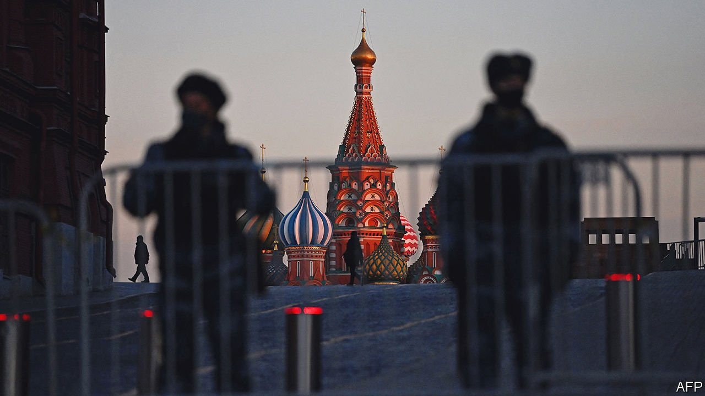

###### The exodus

# Western businesses pull out of Russia 

##### Abandoning the country is easier for some firms than others 

 

> Mar 5th 2022 

IT TOOK MORE than 30 years for BP, a British energy firm, to build its Russian business. It took less than four days to decide to dismantle it. As Vladimir Putin’s forces invaded Ukraine early on February 24th, the logic of BP’s 20% stake in Rosneft, Russia’s state-owned oil giant, began to collapse. BP’s board met to discuss the matter on February 25th; later that day Britain’s business secretary, Kwasi Kwarteng, expressed the government’s concerns to Bernard Looney, BP’s boss. By February 27th the board was ready to make its decision public: BP would sell its stake in Rosneft. Mr Looney has resigned from Rosneft’s board (as has his predecessor, Bob Dudley). The company may face a write-down of up to $25bn.

Mr Putin’s war has prompted a reckoning for multinational companies. Russia presents a host of risks, from reputational damage to logistical disruption and the peril of violating sanctions. For many firms disentangling from Russia, a middling market, will do little damage to their broader business. For others it will be financially painful and logistically difficult.


Many other multinationals have, like BP, spent decades prospecting for opportunity in Russia. In 1974 Pepsi became the first Western product made and sold behind the Iron Curtain. Disney hoped to charm sullen Soviets with screenings of “Snow White” and “Bambi” in Moscow and Leningrad in 1988. More companies arrived after the collapse of the Soviet Union—Danone, a French yogurt-maker, peddled its snacks from a store on Tverskaya Street in Moscow in 1992. BP opened its first petrol station in 1996.

Now companies are racing to devise new strategies for an uncertain era. The most decisive breaks with Russia came from entities with the least to lose. Norway’s sovereign-wealth fund said it would freeze all investments in Russian equities—which account for a piddling 0.2% of its portfolio. Companies with large exposures to the Russian market are more circumspect. Renault, a carmaker, and Danone, which earn 9% and 6% of revenue in Russia, respectively, have announced no plans to scale back.

Many Western businesses find themselves somewhere in between. Their response is similarly middling: a pause rather than a rupture. UPS and FedEx, two American logistics companies, have suspended deliveries to Russia. CMA CGM, Maersk and MSC, three European shipping giants, said they would not sail there for now. Bain, Boston Consulting Group and McKinsey, three management consultancies, are rethinking their business in Russia. Boeing is suspending deliveries of parts, maintenance and technical support for Russian airlines that use its aeroplanes.

Some of these actions were doubtless provoked by companies’ fears that they might fall foul of an expanding array of Western sanctions against Russia. Volvo, a Chinese-owned carmaker based in Sweden, mentioned “potential risks associated with trading material with Russia, including the sanctions imposed by the EU and US” as a reason for suspending sales in Russia. Others share similar worries.

But companies are fielding explicit or implicit demands from their home governments and, in some cases, domestic consumers in effect to boycott Russia even beyond the scope of official measures. On March 1st Apple stopped selling its products in Russia. Disney and other Hollywood studios said they will delay the release of films on Russian screens. Google, Meta and Twitter are seeking to limit Russian propaganda on their online platforms.

Some of these moves present quandaries for companies. Any decisions by tech firms in Russia, for instance, may complicate their situation in other controversial markets. Apple’s tough stance over the Ukraine war highlights its historically pliant position in China, a giant market that has admittedly not invaded any neighbours but whose rulers are accused of human-rights abuses. McKinsey’s declaration that it would not do business with “any government entity” in Russia comes after years of criticism for its work with state-backed enterprises there and in China.

Complying with demands from governments seeking to punish Mr Putin presents practical problems for firms, as well as moral and reputational ones. Non-Russian companies that lease aircraft to Russian airlines are a prime example. They have more than 500 jets and turboprops in the country, according to Cirium, a consultancy. Those lessors have the unenviable task of trying to recover the planes before sanctions against the supply of aircraft take effect later this month.

It is energy companies that have the most at stake. For years international oil firms provided capital and expertise to their Russian partners, which controlled the reserves and had the local know-how. In a sign of companies’ enthusiasm for Russia, European supermajors maintained investments there even as they trimmed their oil business elsewhere. Last year Rosneft accounted for 50% of BP’s reserves and 11% of its operating profits. Shell, a rival British giant, operates joint ventures with Gazprom, Russia’s state-owned gas company. For TotalEnergies, a French firm, Russia could supply 17% of growth in output over the next five years, reckons Wood Mackenzie, an energy consultancy.

TotalEnergies, which has long tolerated risky jurisdictions, is resisting calls to exit. But energy firms are re-evaluating their positions in real time. Three other big companies—Shell, Equinor of Norway and Exxon Mobil of America—have all said they would follow BP’s lead and leave. How quickly that might happen is another question. ExxonMobil has cautioned that safely exiting its project in Russia’s far east would take time. Selling stakes in joint ventures or in Rosneft itself may prove difficult, particularly if Russia’s government maintains the ban it has just imposed on the sale of foreign-owned Russian assets in order to curb capital flight. The moral and reputational case for firms to leave Russia will become stronger the longer the war goes on. Leaving may also become financially and logistically harder. ■

For more expert analysis of the biggest stories in economics, business and markets, , our weekly newsletter.

Our recent coverage of the Ukraine crisis can be found 

