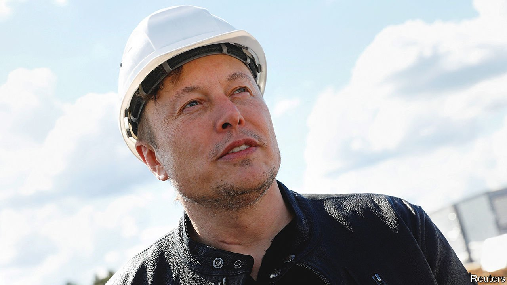

###### Tesla in Germany

# Will Elon Musk change Germany? 

##### Or will Germany change Elon Musk? 

 

> Mar 5th 2022 

THIS IS A big week for Tesla’s “gigafactory” in Grünheide, near Berlin. According to the German press, the American electric-car maker will get the final green light from local authorities to start operations within days. In one way, it already has. On February 28th Tesla workers elected their first works council, a group of employees that in German law co-decide with managers things like working hours, leave and training.

For Elon Musk, Tesla’s anti-union chief executive, this must rankle. He has tried to shield his first German plant from Germany’s strict labour laws by incorporating the business as a Societas Europaea (SE), a public company registered under EU corporate law that is exempt from some “co-determination” rules, such as the requirement for firms with more than 2,000 employees to give workers half the seats on supervisory boards. SEs are not, however, exempt from having a works council.


IG Metall, Germany’s mightiest union, which represents auto workers, has been on a collision course with Mr Musk ever since he refused to sign up to collective wage agreements for the industry (the only other firm not included is Volkswagen, which has its own generous wage deal). It has set up an office close to the gigafactory to advise Tesla workers about their rights and listen to their complaints. It has employed a Polish speaker to organise employees that Tesla is hiring across the border in Poland. It hopes that persuading enough Tesla workers to join its ranks would add oomph to its campaign to join the collective wage deal; the union says the company pays senior staff well but that production-line workers get a fifth less than those at BMW and Mercedes-Benz. Most important, it sees the works council as the first step to full co-determination.

Mr Musk must see it differently. He may have fast-tracked the election in order to get a more sympathetic council. Tesla has so far hired only around 2,500 mostly senior and skilled workers, out of a workforce that will grow to 12,000 or so. Such employees are likelier to see eye to eye with management. The rest of Deutschland AG will be watching to see if Germany changes Tesla into something less abrasive or if Tesla changes Germany’s labour relations into something less consensual. ■

For more expert analysis of the biggest stories in economics, business and markets, , our weekly newsletter.

