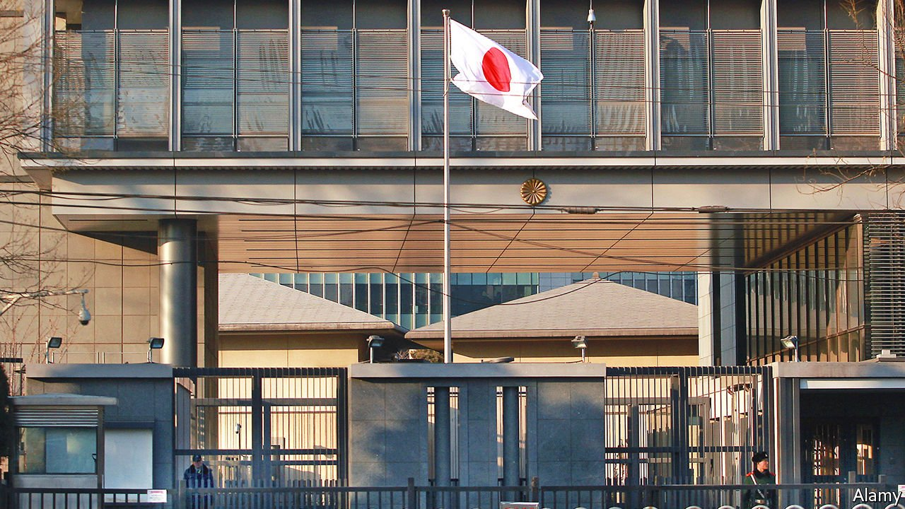

###### Immunity with Chinese characteristics

# Foreign embassies in China puzzle over a diplomat’s detention 

##### Was it a calculated warning or spooks gone rogue? 

 

> Mar 5th 2022 

FEAR IS A potent tool, but not always a precise one. In the foreign embassies of Beijing, there is no doubt that China’s secret police wished to send a chilling message when they detained a Japanese diplomat for some hours on February 21st, trampling the legal principle of diplomatic immunity. Envoys debate whether the operation was an attack on Japan, overreach by aggressive spooks or a calculated warning to foreign missions that even routine meetings with Chinese contacts are out of bounds, as national-security rules tighten further.

Some details of the case are shockingly clear-cut. Japan’s diplomat was accosted after lunch with a Chinese citizen at a hotel restaurant in Beijing. The envoy was taken to a room at the hotel and surrounded by ten or so men. A diplomatic identity card was shown, and ignored by the captors, as were the diplomat’s demands to call the Japanese embassy. Identifying themselves as state-security officers, they proceeded with a two-hour interrogation about the lunch. Yet the Vienna Convention on Diplomatic Relations, the treaty that protects diplomats, is unambiguous, stating: “The person of a diplomatic agent shall be inviolable. He shall not be liable to any form of arrest or detention.”


China’s official response is also dismayingly clear. The chief spokesman for the Chinese foreign ministry, Hua Chunying, rejected Japan’s demand for an apology. Instead, Ms Hua accused the envoy of “activities inconsistent” with diplomatic work, and demanded that the Japanese embassy (pictured) “respect Chinese laws and strictly discipline its diplomatic personnel in China to prevent similar incidents from occurring again”. Talk of “activities inconsistent” is typically used to signal a charge of espionage, and is often followed by expulsion. In this case, Japan’s foreign ministry is adamant that their official was carrying out legitimate, normal diplomatic work.

In embassies in Beijing the case is called “extremely serious”. Though China briefly detained a Japanese naval attaché in 2002 near a military base in a coastal province, diplomats struggle to recall a similar incident in Beijing. In Moscow Western diplomats suffer harassment and break-ins at their homes by Russian security services. But China generally dislikes being seen as a rogue state.

Because Japan’s bilateral relations with China are chilly but relatively stable, the most popular theory among diplomats is that security services want to make it even harder for foreigners to have candid contacts with Chinese. This is already a paranoid time, marked by speeches from Communist Party bosses about the need to protect national security from hostile foreign forces in all aspects of life. It has just got worse.

