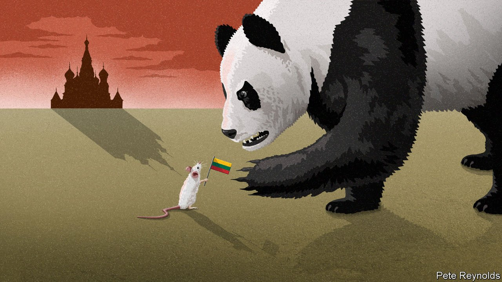

###### Bullying a Balt

# Lithuania sees threats from two big powers: Russia and China 

##### Russia is bombing one European democracy; China is boycotting another 

 

> Mar 5th 2022 

“CHINA SHOULDN’T get riled by Lithuania at all,” one of China’s best-known nationalist commentators, Hu Xijin, opined on his social-media account. “It’s a snotty little country—just not worth it.” The Chinese government is paying no heed. As Russia invades one European democracy, China is boycotting another. Ukraine’s offence was to be an independent country. Lithuania’s was to give Taiwan an opportunity to hint that it is.

Since late last year, Lithuania has become the target of the most sweeping sanctions that any country has faced for upsetting China’s Communist Party. Lithuanian officials play it down: only about 1% of Lithuania’s exports are to China, and China has little investment in Lithuania. But Lithuania’s foreign minister, Gabrielius Landsbergis, calls China’s actions a “dangerous precedent” that could “really disturb, politically and economically, the way that global trade works”.


In the past, when chastising countries that offend them, China’s rulers have been more selective, curbing or blocking only certain imports. In Lithuania’s case, not only are exports to China being stopped, but also some products containing Lithuanian parts. Supplies of Chinese raw materials to Lithuania are being disrupted, too. Ausrine Armonaite, Lithuania’s economics minister, says China’s retaliation against her country has been “unconventional”. “Today it’s Lithuania, right? Tomorrow it might be any other country.”

In the past two years Lithuania’s relationship with China has changed dramatically. China once regarded the country as a potential hub of its business operations in central and eastern Europe. Its ambassador to Lithuania predicted in 2020 that the “cake” of Sino-Lithuanian co-operation would “become bigger and bigger”.

Now there is no Chinese ambassador in Vilnius, and no Lithuanian embassy in Beijing. Lithuania withdrew its remaining diplomats in December, a few months after China recalled its envoy and forced Lithuania to do likewise. The proximate cause for the spat was Lithuania’s decision to allow Taiwan to open an outpost in Vilnius and call it the Taiwanese Representative Office. Other Western countries have bowed to China’s wishes by requiring the democratic island to attach the name Taipei to such missions. Using the word Taiwan or Taiwanese, China argues, could give the impression that Taiwan is a country—and that would never do.

Lithuania and China are hardly evenly matched. The population of Lithuania is not much more than twice that of an average Beijing district. Yet the dispute is being watched by Western governments, not least Lithuania’s fellow members of the European Union. In January the EU filed a suit against China at the World Trade Organisation over the sanctions. America, Australia, Britain and Japan are backing it.

China may have expected that a small country such as Lithuania would quickly capitulate and rename the Taiwanese office. Some foreign firms worry about being snared by the sanctions, raising the pressure on Lithuania. But backing down now would risk looking “a little bit stupid”, says Vidmantas Janulevicius, president of the Lithuanian Confederation of Industralists. In recent years attitudes in Lithuania towards China have been hardening. China’s refusal to condemn Russia for invading Ukraine has further soured the atmosphere. Lithuania borders on Russia as well as on Belarus, which Russia is using as a staging post for its attack on Ukraine. Like its Baltic neighbours, Estonia and Latvia, Lithuania was once an unwilling part of the Soviet Union. Although the Baltic states are now members of NATO, they worry that the invasion of Ukraine may be just the start of an attempt by Vladimir Putin to reconquer other former Soviet territories. China’s friendliness to the Kremlin thus creates an especially bad impression.

When explaining Lithuania’s transition from belt-and-road cheerleader to profound China sceptic, analysts in Vilnius mention China’s security ties with Russia, too. These have not only been evident in Asia, where the countries have staged several joint manoeuvres. In 2017, for the first time, China took part in a naval exercise with Russia in the Baltic Sea. The Chinese vessels included a Luyang-class guided-missile destroyer, an advanced new type. They berthed in Kaliningrad, an exclave of Russia that is home to its Baltic fleet and adjacent to Lithuania. “Increasingly, we do not see the China file and the Russia file as separate from one another,” says Konstantinas Andrijauskas of Vilnius University.

Politics has played an important role, as well. An escalation of human-rights abuses in China, including the sending of 1m or more ethnic Uyghurs and other Muslims in the Xinjiang region to camps for “deradicalisation”, and the imposition of a draconian national-security law on Hong Kong, have soured attitudes towards China in Lithuania as elsewhere in the West. The horrors Stalin inflicted on Lithuania still make its people understandably neuralgic about communists and gulags. An election in 2020 brought to power a centre-right coalition led by critics of China. It soon took steps that enraged the Chinese government: barring Huawei, a Chinese firm, from Lithuania’s 5G wireless network; shunning China’s offers to develop Lithuania’s main port; withdrawing from China’s “17 plus one” dialogue with central and eastern European countries; and, last November, allowing the Taiwanese office to open with that offending name.

Some Lithuanian politicians question the wisdom of that move. In January the country’s president, Gitanas Nauseda, who has no party affiliation, called it a “mistake”. But there appears little immediate prospect of a climbdown. Lithuania’s next parliamentary election is in 2024. Opposition politicians who are keen to reduce tensions with China may find it difficult to do so even if they win. Dovile Sakaliene, an opposition legislator who is a critic of the Chinese government (which has blacklisted her), says there is little chance of the Taiwanese office being renamed after the polls. “Pressure and intimidation by China [have] closed that avenue,” she says. Russia’s invasion of Ukraine has made politicians more than usually wary of appearing to bow to an authoritarian bully.

Taiwan has offered help: $1bn of credit for joint projects with Lithuania and a $200m investment fund for businesses there. Eric Huang, the chief of Taiwan’s office in Vilnius, says one focus of this largesse will be developing a semiconductor industry in Lithuania. He describes the punishment of the Baltic state as a “new stage for China’s coercion of the world”. It is, he says, “very meaningful for Western democracies” that a small country such as Lithuania has “weathered the storm”. It is not yet over, however. ■

