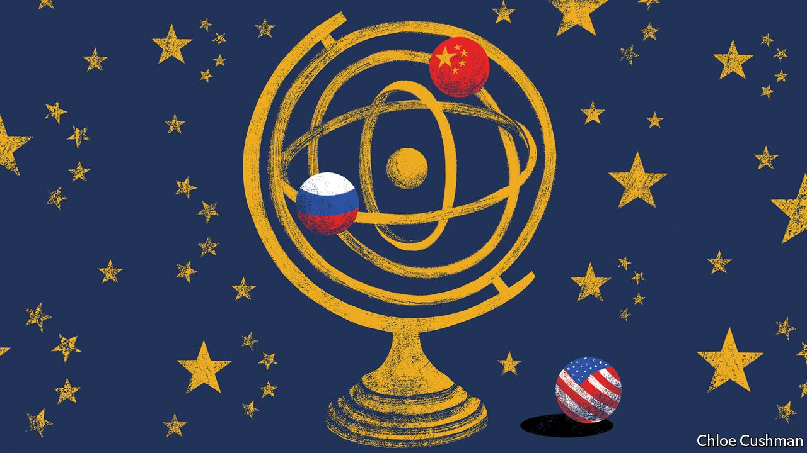

###### Chaguan

# Vladimir Putin is an imperialist, but China does not care 

##### China and Russia agree that big countries should run the world 

 

> Mar 5th 2022 

TO THE FERVENT revolutionaries who ran China in 1968, the Soviet invasion of Czechoslovakia was a monstrous crime, but not a surprise. Watching from Beijing, Chairman Mao Zedong and his aides saw a vindication of a long-standing suspicion: that the once-proud Soviet Union was now ruled by “socialist imperialists”, on a par with the capitalists in charge of America, the original imperialist superpower. Indeed, Mao’s deputy, Zhou Enlai, accused Soviet leaders of active collusion with America, involving a scheme to divide the world into two spheres of influence, one run from Moscow and the other from Washington. The invasion was evidence of that pact, Zhou charged: Soviet bosses dared to send tanks to roar down Prague’s cobbled streets, because they knew that America would not intervene.

Chinese outrage did not signal any sympathy for the liberal reforms of the Prague Spring that triggered the invasion, let alone for Alexander Dubcek, the local party boss arrested and flown to Moscow. Instead, Maoist officials described the invasion as a revolutionary struggle, pitting heroic Czechoslovak masses against “fascist” Soviet occupiers. Later, they turned indignant when the jargon of communist diplomacy was used to justify the invasion. Throwing their high-flown phrases back at Soviet leaders, the People’s Daily newspaper in Beijing demanded to know: “You have dispatched hundreds of thousands of troops to occupy the whole of Czechoslovakia. What ‘territorial integrity’ is there to speak of?”

Half a century after those Mao-era enmities, which eventually boiled over into a brief Sino-Soviet border war, the world order is turned upside down. China’s leader, President Xi Jinping, is the avowed best friend and ideological soulmate of Russia’s president, Vladimir Putin. As Mr Putin ordered an unprovoked invasion of Ukraine on February 24th, he did not conceal his war aims. He wants to turn that neighbouring country of 44m people into a neutral, demilitarised satellite. In the blunt words of the German chancellor, Olaf Scholz: “Putin wants to create a Russian empire.”

Mr Xi and his government maintain a pose of pseudo-neutrality towards the conflict in Ukraine, but nobody doubts China’s pro-Russian lean. China’s approach combines pious calls for peace with the tireless recycling of Russian arguments for the invasion, including the assertion that America is to blame, for welcoming former Soviet satellites into the NATO alliance after the end of the cold war. China’s foreign minister, Wang Yi, has called on Western governments to address Russia’s “legitimate security demands” and agree to a dialogue that places Russia on an equal footing with the 27-member European Union. This time it is the turn of Chinese diplomats to mouth empty phrases about their respect for the “sovereignty and territorial integrity of all countries” even as their Russian friends prepare to dismember Ukraine, echoing Soviet propaganda as tanks growled into Prague.

Chinese officials talk of Russia’s legitimate desire to see “a balanced, effective and sustainable European security mechanism”. That builds on a joint statement agreed to by Mr Xi and Mr Putin hours before the opening of the Winter Olympics in Beijing on February 4th, in which China backed Russian proposals for “long-term, legally binding security guarantees in Europe”. In plain language, Russia is demanding a veto over European security arrangements and alliances. A Chinese scholar in Beijing explains what his government thinks: that European security policies should neither target Russia nor ignore Russia’s wishes, and should be decided by Europeans alone—ie, America should leave.

Other governments understand what is at stake. On February 28th Singapore’s foreign minister, Vivian Balakrishnan, explained why his country stands ready to impose sanctions on Russia, though it traditionally seeks friendly ties with all large powers. “This is an existential issue for us. Ukraine is much smaller than Russia, but it is much bigger than Singapore,” he told parliament, adding that: “A world order based on ‘might is right’…would be profoundly inimical to the security and survival of small states.”

China’s dream of an American retreat

A world run by big countries appeals to many Chinese nationalists, who have filled social media with praise for Mr Putin, even as censors delete posts critical of Russia. The notion that NATO is a collective-defence pact which expanded in response to demand from former communist-bloc countries fearful of Russian bullying is almost unknown in China. Instead, the Atlantic alliance is seen as a tool of American aggression that is “in perpetual search of an enemy”, to quote a Chinese essay on Ukraine shared widely in recent days. NATO is best known as the vehicle used by America and allies to intervene in Yugoslavia’s civil wars in the name of preventing ethnic cleansing: a mission called illegal meddling by China. Then NATO bombed the Chinese embassy in Belgrade during the Kosovo war in May 1999, an event that China’s government refuses to accept was an accident. The date of the embassy bombing is recalled by the name of an important Chinese armament programme, “Project 995”. On the day that Russia invaded Ukraine, China’s assistant foreign minister, Hua Chunying, accused the West of a long history of trampling Chinese sovereignty, telling reporters that “NATO still owes the Chinese people a debt of blood.”

It may never be known how much Mr Xi knew in advance about Mr Putin’s plans. Chinese diplomats appeared startled by Russia’s invasion. They were “visibly squirming” when approached by Western counterparts in Beijing and at the United Nations in New York as tanks rolled into Ukraine. The war could still descend into violence so bloody it makes China’s pro-Russian stance politically costly. But in Beijing, cynical voices argue that China may gain from Mr Putin’s aggression, if it forces America to pay more attention to Europe and less to the Indo-Pacific. China wants a sphere of influence in Asia in which its writ goes unchallenged by America. As a result, it has made its peace with Russian imperialism. ■

Our recent coverage of the Ukraine crisis can be found 

 (Feb 26th) (Feb 19th)

 (Feb 12th)

