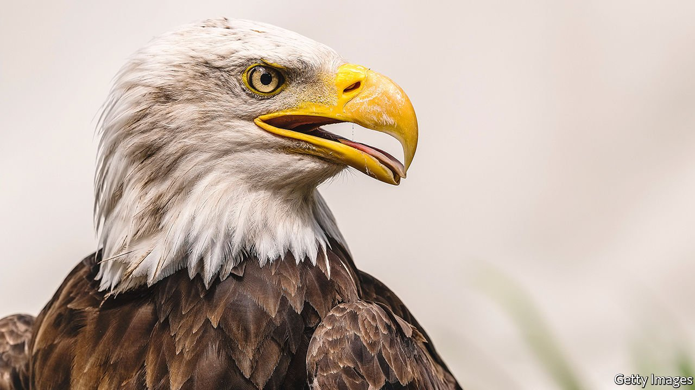

###### American fauna

# A new book charts the changing fortunes of America’s national bird 

##### The bald eagle was not always venerated, Jack Davis shows 

 

> Mar 5th 2022 

The Bald Eagle. By Jack Davis. Liveright; 464 pages; $29.95 and £18.99

THE COLLECTIVE nouns for birds can be revealing. A group of jays is disparaged in English as a “scold”, crows as a “murder” and titmice as a “banditry”. By contrast, several bald eagles are a “convocation”—as if the birds were cloaked in chasubles of feathers, bearing sceptres in their talons. The bald eagle, after all, is the symbol of America. Its don’t-mess-with-me glare appears on military buttons, coins and medals; its likeness adorns a statue on the dome of the Capitol in Washington, the ceremonial mace of the House of Representatives and the Great Seal of the United States. It has been adopted by football teams, car tyres and Kentucky bourbon.


It was not always so venerated, explains Jack Davis, a Pulitzer-prizewinning environmental historian, in his new book. After white settlers arrived in North America, the raptor was maligned, shot and poisoned nearly to extinction, before public sentiment shifted and more enlightened attitudes prevailed. In this exhaustive history of the bird, Mr Davis makes clear what the bald eagle is not. Chiefly, it is not bald—its head is covered with white feathers (“bald” perhaps being derived from “piebald”, meaning of different colours). A screaming eagle is a misnomer, too. Its sound, he says, “brings to mind a squealing gull or chirping teakettle”.

And despite the opprobrium of ranchers, insists Mr Davis, the eagle is not a livestock-snatcher. At most, an eagle can carry five pounds (a little over two kilograms), well below the weight of a calf or lamb. Gruesome rumours of baby-snatching were abetted by a silent film of 1908 that showed a father rescuing his abducted infant from a nest, and clubbing an eagle to death. Such slander fuelled a massacre of the birds in the late 19th and early 20th centuries. As a biologist in Indiana observed: “Scarcely does an eagle come into our state now and get away alive.”

As a symbol, the eagle thrived; the bird itself did not. By the 1930s eagles were no longer nesting in a dozen states. As fascism swept across Europe and American patriotism surged, their fortunes improved. In 1940 the Bald Eagle Protection Act made killing one illegal. Yet the respite was brief: DDT, a pesticide that killed malaria-bearing mosquitoes and crop-devouring insects—but proved destructive to wildlife—impaired eagle reproduction and supplanted guns as a threat. Eagles laid fewer eggs, which were blighted by thin shells and malformed embryos. The creature’s future was imperilled once again.

Thankfully, Rachel Carson’s “Silent Spring”, a book published in 1962, sparked awareness of the toxicity of pesticides and inspired an environmental movement. That led to the creation of the United States Environmental Protection Agency, which in 1972 banned DDT. Further beneficial legislation followed in short order: the Clean Water Act, the Endangered Species Act and eagle-restoration programmes reflected a growing awareness that nature does not exist for man alone. The link between the iconic bird and shifting American attitudes to wildlife makes this book as much a cultural history as a natural one.

Laws are still flaunted; environmental degradation continues. Nonetheless, Mr Davis reckons the current population of bald eagles in North America may be half a million. That is fairly close to their number at the time of European settlement—and more than enough for a convocation. ■

