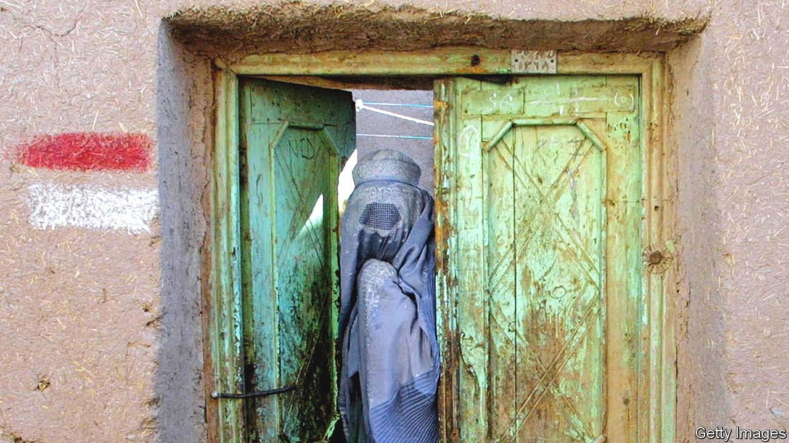

###### Behind the veil

# An anthology by female writers shows a different Afghanistan 

##### The stories in “My Pen is the Wing of a Bird” depict the resilience and humanity of Afghan women 

 

> Mar 5th 2022 

My Pen is the Wing of a Bird: New Fiction by Afghan Women. MacLehose Press; 253 pages; £12. To be published in America by Grand Central Publishing in October; $25

THE STORY of Ajah, or grandmother, begins with a child, born in 1905 in Chimtal, a district of the Balkh province of northern Afghanistan. The girl is orphaned at seven, when tuberculosis kills her parents, and is married off at 12. Her husband is paralysed after falling on a mountain path while searching for a cure for his infertility. By the age of 27 the character is a widow, and takes on the only name she is given in the story.


When Ajah’s village is struck by an earthquake, which reshapes the land and threatens to flood her beautiful orchard, she alone digs a drain to channel away the waters. “It’s men’s work,” the local imam tells her, but no men are available, having been enlisted in the army. When the rains come, the women of the village join her in widening the trench, saving their homes. At the story’s close, the men cannot believe what work the women have done. “And why not?” replies Ajah. “They till the land; they raise your children. They lift buckets of water from the well every day. How difficult is digging a tiny channel when us women come together?”

That message, in a tale by Fatema Khavari, might well stand for all 23 short stories in “My Pen is the Wing of a Bird”. They were written by 18 Afghan women and translated from the original Dari and Pashto by other Afghans; the anthology was put together by Untold, an NGO founded by Lucy Hannah that in 2019 recruited writers across the country via social media, text messages and local radio stations. The settings range in time and place, from “Ajah” in the early 20th century through to the present day, and from rural backwaters to Kabul. The plots include all manner of men and women in Afghanistan.

One story is about the challenge of being a refugee, another about having your family leave you for the safety of a foreign land. Others evoke grinding poverty or the fight against corruption. A few are about lost love and the tragedy of war. “Bad Luck”, by Atifa Mozaffari, is particularly heartbreaking. It tells of a young blind woman whose suitor, thought dead, returns from Iran with money for her cataract surgery—but too late to save her from marriage to someone else. All depict the resilience, stoicism and humanity of Afghan women.

Since August, when the Taliban seized power in Kabul, the lives of many of these authors have been cast into a new stage of chaos. A few have fled abroad. Others now live in hiding (and some write under pseudonyms). As Lyse Doucet, the BBC’s formidable international correspondent, notes in her introduction, not a week now goes by without a bigwig calling for the rights of Afghan women to be protected. The Taliban insist that idea is a Western cultural imposition and metropolitan obsession, and that the country’s women must remain silent.

These stories show why the militants are wrong. They take their readers into rooms that television cameras and journalists never reach. In the process, they reiterate how much Afghan women could again say and do, if only they were allowed to. ■

