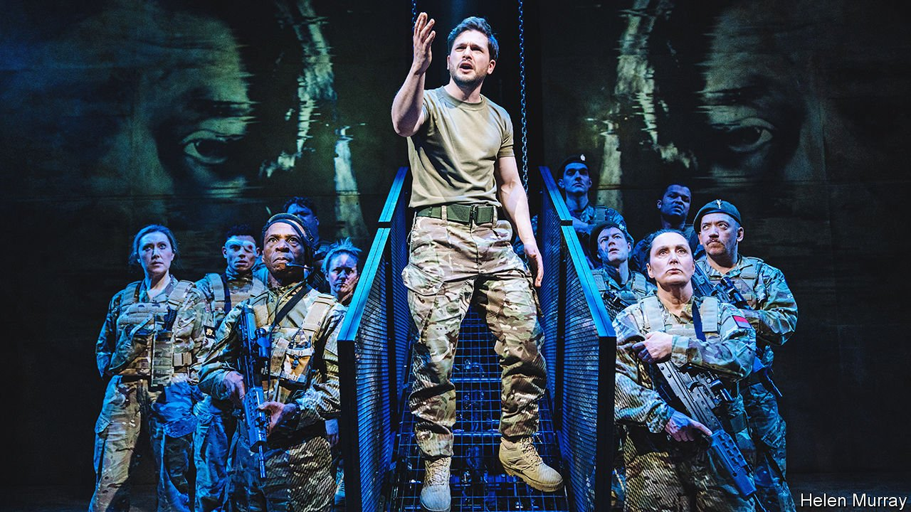

###### Back Story

# In a resonant staging of “Henry V”, war is murder in uniform 

##### Shakespeare was unblinking about the heartlessness and horror of conflict 

 

> Mar 5th 2022 

LIKE COWED apparatchiks, the courtiers listen and nod as the specious case for war is made. In “Henry V” it is the Archbishop of Canterbury who outlines the English claim to the throne of France that is the pretext for invasion. In a new, modern-dress production of Shakespeare’s play at the Donmar Warehouse in London, the flaky legal arguments and skewed history are presented in a slide-show, like the findings of a cooked-up intelligence dossier. The scene is darkly funny, as winking mendacity can be. But the results are deadly.

When it chose to put on “Henry V”, the Donmar doubtless had Brexit, the rise of English nationalism and the future of the United Kingdom in mind. After all, the play is about a stand-off between England and a European neighbour, during which the English soldiers spend more time bickering with their Welsh, Scottish and Irish comrades than fighting the French. Now, as it opens, it is another of Shakespeare’s themes—the barbarity of war—that resonates loudly and tragically. There is a lot of timely, scathing wisdom in the production, and even more of it in the play.


“We few, we happy few, we band of brothers.” Delivered before the battle of Agincourt of 1415, the most famous line in “Henry V” is an ineffable rhetorical escalation, as, in nine words, the king turns his troops’ vulnerability into a thrilling privilege. The next best-known is “Once more unto the breach, dear friends,” his rallying cry as they besiege Harfleur. Less remembered is his second speech there—in which he warns that, unless the town surrenders, his men will rape its girls, bash in old men’s heads and spit babies on pikes. In other overlooked scenes, three English traitors are exposed and condemned to death, and a pal of Henry’s from his days as a boozy prince is hanged for looting. Most shocking is the king’s criminal order for his soldiers to kill their prisoners—as English forces did after a siege in Ireland in 1580, around 20 years before “Henry V” was first performed.

Shakespeare’s work has shaped understanding of English history, but the reverse is also true: prevailing circumstances and moods have always guided interpretation of his plays. In “Henry V”, the moments of heartlessness and horror have been an index of attitudes to leadership and war. In the patriotic film version of 1944, for instance, all the nastiness is excised as Laurence Olivier’s noble king and his nimble army unite their country and the continent. Released in 1989, at the fag-end of the cold war, Kenneth Branagh’s film is bloodier and muddier. Even for him, though, the slaughter of the prisoners was a bridge too far.

The production at the Donmar doesn’t blink. Directed by Max Webster, it stars Kit Harington (from “Game of Thrones”) as a media-savvy king, whose cruelty and cynicism are grimly familiar. He condemns the traitors and watches impassively as his friend is hanged, Iranian-style, from a crane. Even the English wince at his lurid threats to Harfleur. His pre-war diplomacy is a tawdry pantomime of pointless embassies and unreasonable demands; his claim that, if they refuse to capitulate, the French will be responsible for the blood he sheds, echoes today’s Kremlin doublespeak.

And not only does Mr Harington’s king order his men to “cut the throats” of their prisoners at Agincourt; he slits the first throat himself. Mr Webster choreographs an apt touch of propaganda after the battle. In the text, the king announces the casualties—10,000 French dead and hardly any English. Here, his caginess about the tally turns a miracle into just another lie. For this ruler, power is a trip and patriotism a smokescreen.

As a commentary on leadership in modern Britain, “Henry V” has a flaw. In the play, the king is enraged when the French dauphin sends him a derisive gift of tennis balls. The country’s current political leader might have put them aside for a garden party. Shakespeare’s hard-faced monarch is no longer the “vain, giddy, shallow” playboy the dauphin takes him for; he renounces Falstaff, the “fat knight” and bawdy chancer who shared the “riots, banquets, sports” of his youth. In real life there has been a mix-up in the political succession, and a descendant of Falstaff, always loved by English audiences for his japes and irreverence, has beguiled the voters too.

But in the matter of war, this “Henry V” is brutally on target. War can be glorious, Shakespeare knew, and absurd, and even, in the lulls between action, jittery and tedious. But this kind of war—waged dishonestly for territory and self-aggrandisement—is murder in uniform.

