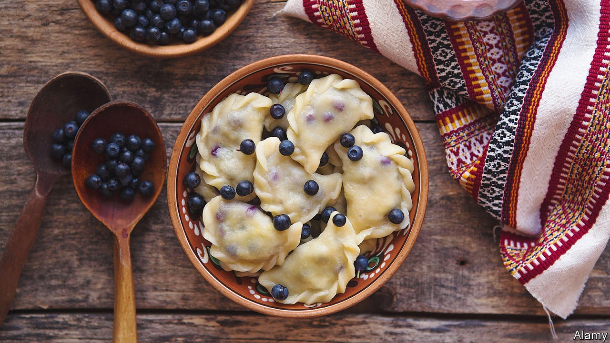

###### World in a dish

# Ukraine has a glorious cuisine that is all its own 

##### Foods, like countries, can be intertwined but still remain distinct 

 

> Mar 5th 2022 

TORTELLINI, SPRING rolls, Cornish pasties, empanadas: nearly every cuisine in the world has a recipe in which meat or vegetables are wrapped in dough to be cooked. Ukraine’s version is vareniki.

The dough, like that of Italian pasta, is a mixture of flour and eggs. The filling choices are limitless, but few can match the comforting sturdiness of cabbage cooked down for an hour with onion and first-rate bacon. The extended cooking time brings out the onion’s natural sweetness, and gives the cabbage a velvety lushness that balances perfectly with the bacon’s chewy salinity. Vareniki make a fine centrepiece of a meal, with sharp pickles on the side and a piquant, sinus-clearing salad of beetroot and horseradish.


Ukrainian cuisine is by no means simple—some of its techniques, particularly the country’s genius for fermentation and sweet baking, are deeply sophisticated—but it is often straightforward. Ukraine’s chernozem (black earth) soil is wildly fertile, producing delicious fruits, vegetables and grains to which wise cooks do as little as possible, instead letting their natural flavours shine.

The country is bigger than France or Spain, with just as much culinary variation. Herbs and warm-weather crops such as tomatoes, aubergines and courgettes thrive in the south, as wild mushrooms and berries do in the colder north. Ukrainians living far from the Black Sea coast make imaginative use of strong-tasting river fish, often cooking it with equally robust flavours such as those of tomatoes and sugar; residents of the port city of Odessa—in peacetime, unquestionably one of the world’s most beguiling places—prefer oily sprats. Despite some Russian claims on it,  borscht is originally Ukrainian, based on home-grown or market-garden vegetables that can be simmered into something memorable.

The rich, largely flat land has proved tempting to big powers, and Ukraine’s territory has for centuries been unwilling host to a stream of invaders. In her magnificent book “Summer Kitchens”, Olia Hercules, a Ukrainian cookery writer now living in London, quotes a friend: “My grandmother was born in Czechoslovakia, got married in Hungary and died in Soviet Ukraine, yet she never left her village.”

That history and geography have brought a lot of suffering to Ukrainians; tragically, they still do. The culinary upshot is a diverse, unique cuisine. Some might carp that bogracz, a meaty stew from the Transcarpathian region, is quite similar to Hungarian gulyas, or that vareniki resemble Russian pelmeni. One rejoinder is that the two stews are spiced differently, and vareniki tend to be made in half-moon shapes, while pelmeni are usually round.

A better answer is that foods, like countries, can be similar and intertwined, but still remain distinct. “Neighbours always enrich each other culturally,” Ukraine’s heroic president, Volodymyr Zelensky, observed on the eve of war. “But that does not make them a single whole.” Vareniki are vareniki, and not pelmeni, just as Ukraine is Ukraine, and always will be. ■

