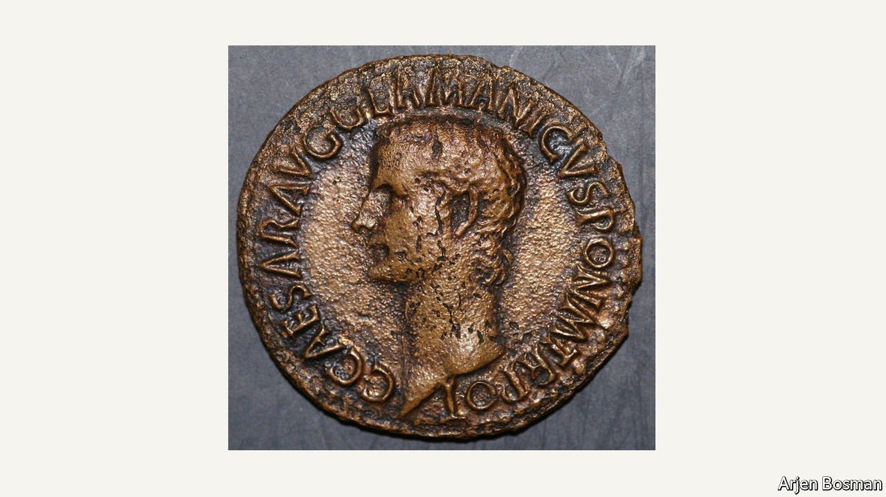

###### Magnum castellum

# A Roman fort in Holland is linked to the conquest of Britain 

##### Dutch archaeologists dig up a remnant of a successful invasion 

 

> Mar 5th 2022 

INVADING A country is rarely easy, as Vladimir Putin discovered this week. Most efforts to conquer Britain, for instance, have been dismal flops. The most recent one, in 1940, never even got out of port. After they gave up, the Nazis studded Europe’s coast with defensive bunkers; many still dot the dunes of Holland.

A few miles from these pillboxes, near the town of Velsen, archaeologists have found remains dating from a more successful invasion. In November the head of a dig sponsored by the Dutch Research Council announced that the Roman fort he was excavating had been bigger than anyone thought. Rather than a castellum, housing a few hundred troops, it was a castra, hosting thousands. A wooden plank dated to the winter of 42AD, just months before Emperor Claudius’s legions crossed the Channel and made Britain a province of the empire.


The Roman presence near Velsen was known since 1945, when children found pottery shards in an anti-tank ditch. The first fort in the area, built around 15AD and rediscovered in 1972, was the site of a nasty battle: archaeologists found slingshot pellets and human remains. Many identify Velsen with Flevum, a castellum which barely survived a clash with the Frisians in 28AD, according to Tacitus.

The much bigger second fort was built under Emperor Caligula, whose coinage was found there (see photo). “Caligula didn’t have any military credentials. So he decided to surpass Julius Caesar, who had briefly conquered [a small part of] Britain, by taking it over permanently,” says Arjen Bosman, the archaeologist leading the dig. The castra in Velsen, he thinks, was needed to protect the northern flank of the Roman invasion fleet from attacks by the Chauci, an obstreperous German tribe.

Caligula seems to have visited the region to inspect the preparations. Wine barrels stamped with his seal have been found near Utrecht and Valkenburg. But by the time the fleet left northern France, he was dead, and Claudius would reap the glory. Invasions are often vanity projects launched by insecure, hedonistic autocrats. They seldom go as planned.

