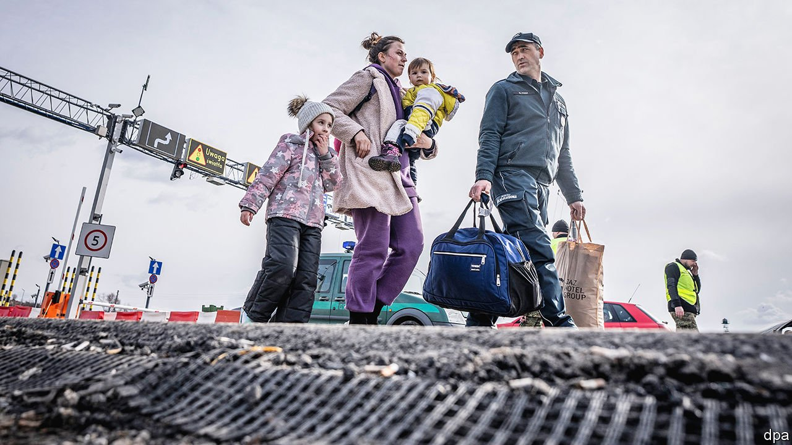
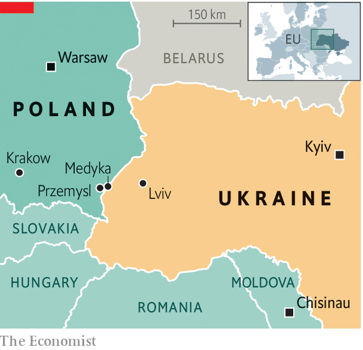

###### Exodus, again

# A new refugee crisis has come to Europe 

##### Ukrainians are pouring into Poland. But many are heading the other way, to fight 

 

> Mar 5th 2022 

A TRAIN PACKED with hundreds of Ukrainians arrives in Przemysl, a city in eastern Poland, after several hours’ delay. Nearly all are women and children, many of them exhausted and crying. At Medyka, the nearby border crossing, the situation is even more desperate. Tens of thousands of Ukrainians, as well as foreigners escaping Ukraine, queue on the Ukrainian side in the cold. Many have left their cars behind in heavy traffic and continued on foot.

Holding a bag in one hand, her young daughter’s hand in the other, and carrying her toddler in a sling, Anastasia describes walking 17km to the border. She was greeted by chaos and impenetrable crowds. A young couple saw a village consumed by flames along the way. “It was hell,” says Katya, recalling how her apartment in Kyiv shook as Russian bombs struck the city. “Fuck Russia,” she says, before correcting herself: “Fuck Putin.”


There are also heartening scenes. Thousands of Poles, Ukrainians living in Poland, and Europeans from farther away have turned up near the crossings, offering free transport and housing. Buses move the newly-arrived to schools and sports halls, now serving as shelters. Volunteers distribute clothing, sim cards, nappies and food. Muhammed Isa, who came to the border from Norway, embraces his elderly father, who has just crossed from Ukraine. They are Syrians from Aleppo, the father displaced for the second time in under a decade, both times by Russian bombs.

 


This is the kind of refugee crisis that Europe hoped never to see again. More than a million have already left Ukraine since the war began, the UN’s refugee agency said on March 3rd. Around two-thirds are arriving in Poland, with Hungary, Moldova, Romania and Slovakia taking the rest. The European Union’s commissioner for crisis management estimates 4m people could flee Ukraine in the next five months. Millions more will take refuge in the country’s west, which many hope will escape the brunt of Vladimir Putin’s invasion.

The EU’s borders, which have gradually closed to most refugees since a big influx from Syria and Afghanistan in 2015-16, are opening up for Ukrainians. Poland, already home to nearly 1.5m Ukrainians—some displaced by Russia’s earlier aggression in the Donbas—will provide “every refugee from Ukraine” with shelter and assistance, says Mariusz Kamiński, the country’s interior minister. Romania is prepared to accommodate up to 500,000.

In contrast to 2015, when four-fifths of adult migrants from Syria and Afghanistan were men, the Ukrainians are almost all women and children. Ukrainian men aged 18-60 are subject to conscription and banned from leaving the country. Such rules create heartbreaking scenes at the border. Roman, a 19-year-old economics student from Kyiv, cradles a three-year-old outside a train station in Lviv. His wife Veronika will take their child into Poland; he is heading back, possibly into battle. Another man in Lviv, Siman, is a construction engineer who until recently was working in France. He returned to Ukraine to bury his grandmother, but now finds himself obliged to take up arms. He is happy about it: “I am Ukrainian. I am ready. There is a first time for everything.”

Other aspects of this migrant wave are different, too. Since 2017 Ukrainians have enjoyed visa-free travel around the EU for 90 days, meaning they need not seek asylum in the first EU country they enter. The task of accommodating them will thus be spread between countries. (In 2015 it fell disproportionately on Greece and Italy, which have long Mediterranean coastlines, and on Germany and Sweden, which threw open their doors.)

Travelling to a land border, often in cars, lets people bring more of their life with them, including their pets. “You don’t have to walk across three countries, cross a desert, and sink into the Mediterranean,” says Hanne Beirens of the Migration Policy Institute, a think-tank. And Ukrainians, though poor by European standards, are highly educated, with 79% of those aged 20-26 possessing a degree.

Ukrainians who live in the EU are helping their compatriots when they arrive. Poles have largely welcomed the Ukrainians, too. But foreigners fleeing Ukraine, especially those who are not white, have reported discrimination. Ukraine is home to thousands of students and workers from Africa and South Asia; non-Ukrainians made up 10% of the initial arrivals in Moldova. In Przemysl, patrols of masked youths have harassed dark-skinned migrants and relief workers.

The European Commission seems willing to let Ukrainians skip the red tape of asylum applications in favour of a new kind of status. On March 3rd member states look set to invoke a law on temporary protection, passed in 2001 but never used, that would let Ukrainians stay in the EU for three years. It will entitle them to benefits such as health care. But the law does not cover non-Ukrainian migrants. It is also unclear what happens after three years. Almost all Ukrainians say they wish to go home when the war ends, but that could change if Ukraine remains dangerous or is partially occupied by Russia.

Now that Mr Putin is bombing Ukrainian cities, the exodus is accelerating. But there is also traffic in the other direction. Scores of Ukrainians, most of them without military experience, are heading home to enlist. “I won’t be able to look other Ukrainians in the eye unless I go back and fight,” says Volodymyr Balychok, 23, a construction worker waiting at passport control. Eva Kravchuk, also 23, who runs an advertising agency in Warsaw, organised a convoy of supplies for the refugees. She, too, plans to go home to fight. Her mother, now sheltering in the basement of her home, does not want her to come, but “I can’t leave her there.” ■

