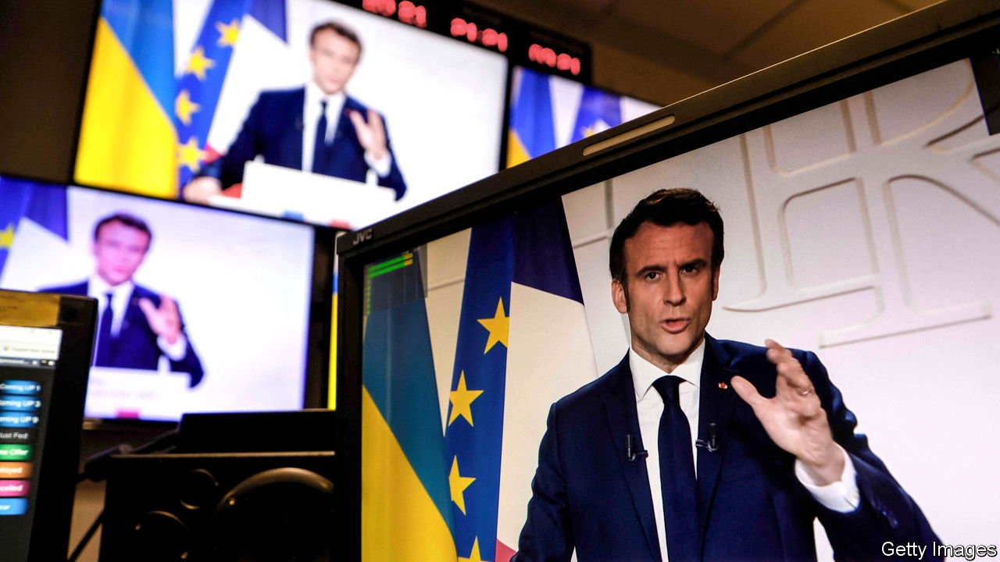
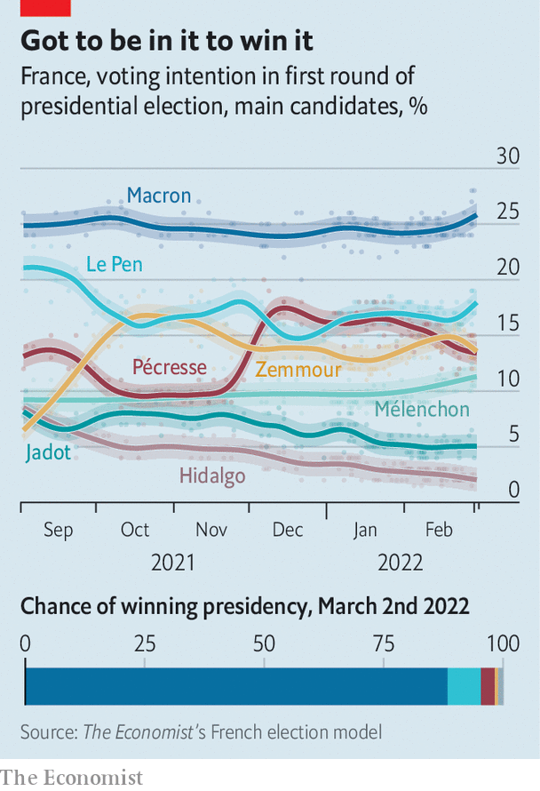

###### Unloved, but respected

# Emmanuel Macron bids for re-election as war roils Europe 

##### France’s president seems highly likely to keep his job 

 

> Mar 5th 2022 

IT IS TURNING out to be one of France’s shortest, and strangest, presidential election campaigns in modern times. Emmanuel Macron, the sitting president, had not yet declared that he was running for re-election as The Economist went to press on March 3rd, a day before the deadline. He had been distracted, aides said, by crises: a surge of covid-19 cases in January, and then his vain efforts to persuade Vladimir Putin not to invade Ukraine. His delayed entry means that it will be a mere five-week full-cast campaign, set against the backdrop of war in Europe. Both factors are likely to favour Mr Macron.

Assuming he declares, the president will be the favourite. On March 2nd The Economist’s forecasting model put Mr Macron’s chances of re-election at 88%. It suggests that his likeliest second-round opponent is Marine Le Pen, the nationalist-populist whom he defeated in a run-off in 2017. The next most-probable is now Eric Zemmour. A far-right polemicist who vows to “save France” from the perils of immigration and Islam, he has been convicted of incitement to racial hatred.


By contrast, the model puts at only 12% the chances that Mr Macron instead faces Valérie Pécresse, the centre-right Republicans’ nominee. She has struggled to make her mark despite a non-stop campaign tour that has taken her from Corsica to Normandy, and put in a particularly poor performance at a big rally in Paris. The probability of Mr Macron facing Jean-Luc Mélenchon, a hard-left firebrand who has been rising in the polls, is lower still. Among these contenders, our model currently suggests that the greatest potential challenge to Mr Macron would come from a run-off against Ms Le Pen. Even then, the odds are in his favour.

 


Yet Mr Macron knows full well that he cannot afford to be either complacent or triumphalist. The one-time investment banker and former economy minister suffers from being seen as distant and remote, an image he cultivated upon taking office. Although 52% of the French think he has the “stature of a president”, only 32% say he is “close to people’s concerns”. Many on the left still judge him the président des riches, due to his early tax cuts—even though on his watch average net household incomes have risen. Mr Macron’s first-round voter base looks remarkably stable. But in a run-off against Ms Le Pen or Mr Zemmour, he will need to reach beyond it, in particular to voters on the left who might be otherwise tempted to stay at home in dismay.

The war in Ukraine will temper the campaign’s tone. Already, plans for Mr Macron to hold a glitzy first rally in Marseille have been shelved. As a candidate he will doubtless strike a solemn note, and stress—naturally—the virtues of stability and experience. The war will also squeeze the time he spends on the campaign trail. “Everything is up in the air,” says Roland Lescure, a deputy from Mr Macron’s party, La République en Marche, and part of his campaign team. “I was hoping we would have a candidate most of the time and a president some of the time, but it’s going to be the other way round.”

Vladimir Putin’s aggression has also exposed the contradictions of some of Mr Macron’s chief opponents. For her campaign Ms Le Pen had printed 1.2m copies of a brochure that included, proudly, a photo of her shaking Mr Putin’s hand at the Kremlin. In 2014 she took a campaign loan from a Russian bank. Ms Le Pen has now sheepishly recognised that Mr Putin’s behaviour is “completely indefensible”. For his part, Mr Zemmour once said that he “dreamed” of there being a “French Putin”, and last month argued that Mr Putin’s stationing of over 100,000 troops on the Russian border with Ukraine was “legitimate”. Unlike Ms Le Pen, he is against even welcoming Ukrainian refugees to France.

At the other extreme, the hard-left Mr Mélenchon, who was in a pineapple plantation on the French island of La Réunion as Russian tanks rolled into Ukraine, has long been fascinated by strongmen such as Mr Putin and Venezuela’s Nicolás Maduro. Although Mr Mélenchon has now condemned Mr Putin’s belligerence, he has also claimed that America and NATO provoked it by threatening to “annex” Ukraine. He, like Ms Le Pen and Mr Zemmour, wants to pull France out of NATO’s integrated military command.

As for Mr Macron, he has been the missing guest at every campaign talk show in recent months. His rivals have spent much time fretting about immigration, and laying into his presidency. Unloved he may be, but Mr Macron now gets grudging respect. He failed to stop Mr Putin’s war, but the French credit him for trying. Fully 58% think he has “risen to the challenge” over Ukraine. In French eyes, the war exposes the need for Europe to reinforce its strategic capacity, a long-standing plea of Mr Macron. He has spent heavily to protect jobs and firms during covid, and to compensate households for energy-related inflation; the economy is rebounding nicely. An upset can never be ruled out. But it is increasingly hard to see how Mr Macron would not, next month, keep his job. ■

