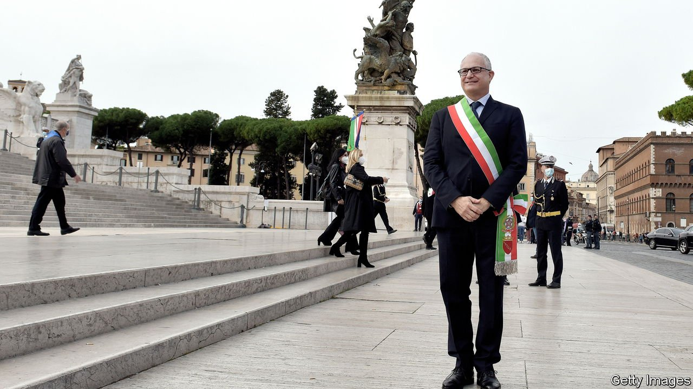

###### A colossal task

# Rome’s new mayor tackles his predecessors’ mess 

##### Roberto Gualtieri is making a fist of Italy’s hardest job 

 

> Mar 5th 2022 

FOR A MAN with the least enviable job in Italian politics, Roberto Gualtieri looks surprisingly cheerful. By last October, when he became mayor of Rome, the city had been visibly deteriorating for years, accumulating such a vast range of problems that its decline seemed irreversible. Wild boar rummaged in mounds of uncollected rubbish and potholes scarred many streets. The city’s highest-profile infrastructure project, the construction of a third underground line, was not even close to finished after 14 years, despite having overrun its budget by €714m ($793m).

Mr Gualtieri’s previous appointment was in Italy’s last government, a coalition between the maverick Five Star Movement and the centre-left Democratic Party (PD) to which he belongs. As finance minister, he had to cope with the grim economic consequences of the pandemic. But governing Rome, he says, is perhaps even more taxing: “The job is broader. You have [to operate in] many different fields.”


Arguably his biggest success has been financial: locating tens of millions of unspent euros in the city’s accounts. The extra resources enabled him to fund a crash programme to clear the worst of the rubbish by Christmas. Another project was launched to repair the most ravaged streets. Mr Gualtieri has started talks to settle a financial dispute with the firms building the metro line. And, more controversially, he has cut a deal with the national tax agency whereby the city council will report suspected evasion in return for the municipal taxes the agency recoups.

Mr Gualtieri acknowledges that he has benefited from “an alignment of the stars”. The PD is part of Mario Draghi’s coalition government, along with all but one of the other big parties. This makes it harder for fellow coalition parties to criticise his performance. It has also helped him build a constructive relationship with the national government. And that in turn should ensure Rome does well out of the EU’s post-pandemic stimulus fund. Though Mr Gualtieri says it is not yet possible to know how much of the roughly €200bn allocated to Italy will come to the capital, he has ambitious plans for whatever money he gets. They include the construction of a network of new nursery schools, the restoration of the Aurelian walls that encircle part of the centre and an upgrade for Rome’s notoriously antiquated bus fleet.

Nevertheless, it is too early to say that the capital has turned a corner. It has been hit viciously hard by the pandemic—and not just because tourists stopped coming. The rise in at-home working has drained the city of the office workers who staff its government departments and corporate headquarters, and who provided much of the income of its shopkeepers, bar-owners and taxi drivers. A third of Rome’s hotels are closed, and in many streets in the city centre between a third and half of premises are shuttered.

Solving Rome’s waste problems will require building new processing facilities, which will doubtless prompt controversy and resistance in the areas where they are to be located. And Mr Gualtieri estimates that giving the city a modern, fully integrated transport system will take another ten years. He is careful not to raise unrealistic expectations. But, he says, “I am more optimistic than when I started.” ■

