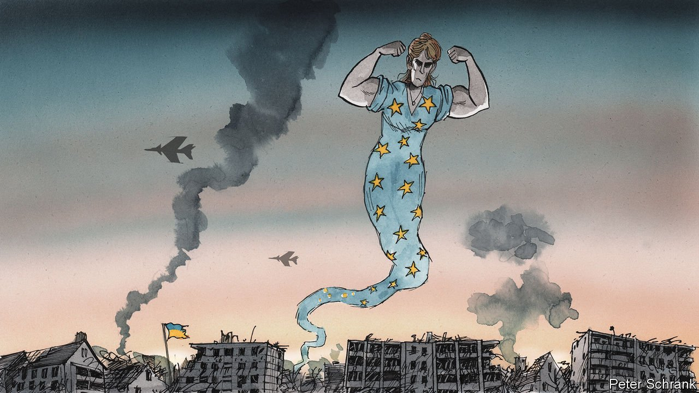

###### Charlemagne

# With war at its doors, Europe discovers a capacity for action 

##### Germany signals the dawn of a new era 

 

> Mar 5th 2022 

GIVEN THE dauntingly long and complex compound-nouns that abound in German, Wende might sound like a modest concept. Yet a Wende—a watershed, a turning-point, the crossing of a Rubicon—is a big, important, intimidating thing. It is when deeply held beliefs are discarded for what was once unthinkable. As communism crumbled it was die Wende that made reunification inevitable, sweeping away the assumption that Germany would remain permanently split into East and West. The Energiewende marked the rash decision a decade ago to ditch nuclear power, to be replaced partly with renewables but also with coal and more Russian gas. Carmakers speak of a Verkehrswende, or transport revolution, which will send the combustion engines at the core of their business to the scrapheap.

Europe today is going through its own Wende. Much of what was accepted as fact before Russia invaded Ukraine on February 24th now seems hopelessly outdated. The EU, at its heart a “peace project”, now dabbles in the vocabulary of war. A continent often hobbled by its propensity to squabble has found a common voice. Once-great powers, mindful of their slipping role in the world and thus fearful of the future, have seemed oddly at ease as decades of geopolitics have unfolded in mere days. European institutions more typically absorbed by the harmonisation of phone-charger regulations have found themselves plotting the best way to get fighter jets into the hands of the Ukrainian air force.


At the crux of the Wende is Germany. That was something few had expected. Whereas other European allies echoed America’s calls for biting sanctions against Russia, Germany initially preferred not to push too hard, lest its own industry and households feel the pain. When Olaf Scholz, the chancellor, delayed the start-up of Nord Stream 2, a gas pipeline from Russia, it was hailed as an uncharacteristically resolute step. Ever mindful of its history, Germany indulged in an earnest pacifism that meant not only refusing to deliver weapons to Ukraine, but also blocking others from passing on German-made kit. The new leader seemed wedded to the incrementalist ways of Angela Merkel, his predecessor, who during the euro-zone crisis perfected the art of putting off decisions for as long as possible.

And then, no longer. A special Sunday session of parliament on February 27th started with a tradition-defying standing ovation for the Ukrainian ambassador. By the time Mr Scholz was done with his speech, quite a few more traditions had fallen by the wayside. What he proposed was no less than a Zeitenwende, a shift in the times, a new epoch. Defence spending would quickly be raised to NATO’S target of 2% of GDP—a level that defies the notion of Germany as somehow exempt from playing a full role in the world. Forget the ban on other countries passing on German arms; Germany decided to send materiel directly to Ukraine. Even sacrosanct budget-balancing rules turned out to be no obstacle to extra cash for the army. Two new gas-import terminals will reduce dependence on Russian energy. “What Olaf Scholz announced was the biggest sea-change of German policy since reunification,” says Tyson Barker of the German Council on Foreign Relations.

The entry into this “new era”, as Mr Scholz put it, means that what seemed tolerable before can no longer be countenanced. Once criticised privately and in hushed tones, Gerhard Schröder, a former chancellor who has become a shill for Russian energy, was denounced publicly—including by former allies in his own party. (Also, the staff in his taxpayer-funded office quit.) Ostpolitik, the decades-old strategy of dealing with Russia based in part on the hope that gas pipelines could promote mutual dependence and therefore peace, is now dead. The self-serving notion that Germany could hold its nose as it traded with despots—that it could bring about “change through trade”—took a possibly fatal hit. Chinese diplomats will wonder what this means for their relationships with Germany and Europe.

The magic of the moment

A sort of Europawende is the inevitable corollary of Germany’s new tack. For decades the EU’s biggest member has been self-effacing. Being constructive in Europe, its voice merely one of many, was Germany’s way of showing penitence for the second world war. Now it may have no choice but to take on the big role the EU needs it to play. In his speech Mr Scholz recycled language long used by France about the need for Europe to be “sovereign”. It cannot be so without Germany pushing its weight about.

The rest of Europe seems equally game for change. Plenty of sacred cows from across the continent were slaughtered along with German ones. The EU budget will be used to fund the purchase of weapons for the first time. Scandinavian countries overcame their own pacifism to arm Ukraine; in Sweden and Finland public opinion shifted strongly in favour of joining NATO. Poland, in recent years an avid sower of discord in the union, pushed for co-operation against Mr Putin. Hungary could have derailed EU sanctions with its veto, yet decided to play along. And whereas the arrival of a wave of war refugees in 2015 prompted a crisis (as many member states demanded everyone but themselves do more), this time plans to take in millions of desperate Ukrainians were hatched in harmony. Ukraine demanded fast-track membership of the EU—and found support in many national capitals.

This is heart-warming stuff. There is a resolve among European diplomats converging on Brussels that Charlemagne has never previously felt. Some of it may not pan out: Ukraine will not be an EU member any time soon, and the idea of sending fighter jets there fizzled within days. Still, Europe is grinding through gears it did not know it had. Later it will ask itself where it went wrong, what mistakes landed Europe in the terrible crisis that is suddenly changing everything. But for now the mood is of a continent that is in mid-Wende, and embracing it. ■

Read more from Charlemagne, our columnist on European politics:

 (Feb 26th) (Feb 19th)

 (Feb 12th)

Our recent coverage of the Ukraine crisis can be found 

