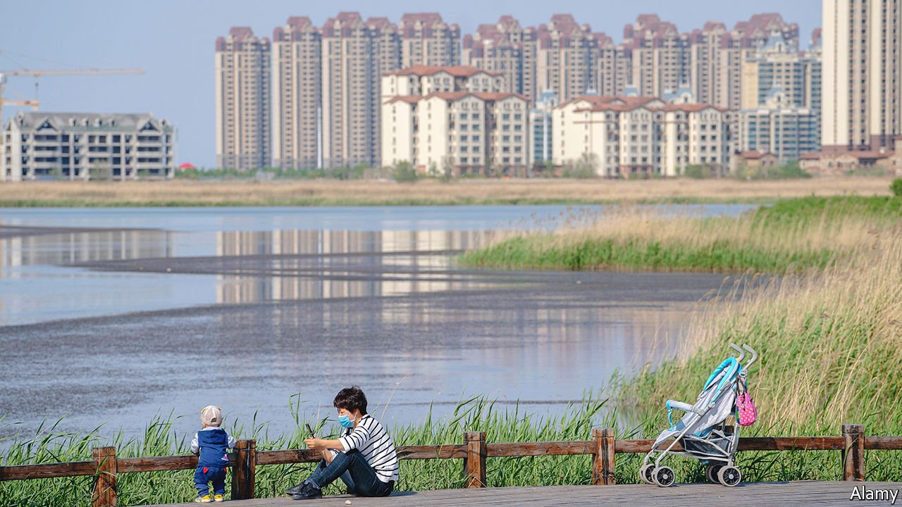

###### The other crisis

# China scrambles to prevent property pandemonium 

##### As defaults escalate, another shock threatens to hit the global economy 

 

> Mar 5th 2022 

NOT LONG ago prospective homebuyers in China would find large maps on the walls of property marketing offices. On display were not only the housing projects for sale. The maps also showed the parcels of government land surrounding the projects and their expected future prices, which were often higher than the home units for sale per square metre. The implication for the anxious buyer-to-be was clear: buy now, or regret it forever. Very soon land prices would be far higher next door.

The maps tell the story of China’s decades-long build-up in property debts. These seemingly endless increases in prices were made possible only because developers had access to almost unlimited credit. Ample loans, offshore-dollar bonds and deposits from buyers once fuelled bidding wars between them that pumped up land values. The winner was sure to turn a huge profit if they held onto the parcel and waited for the price to rise. Local governments, too, happily gorged; land sales contributed 43% of their revenues in 2021.


Homebuyers are seeing a very different picture now. Xi Jinping, China’s president, has been fearful of runaway unaffordability and untenable debt. He has turned off the tap of easy credit by capping developers’ ratios of liabilities to assets, net debt to equity, and cash to short-term debt (known as the “three red lines”). This has pushed China’s property sector to the edge. A dozen developers, including Evergrande, one of the world’s most indebted property groups, have defaulted on bonds since July 2021, or have come close. Companies recently deemed safe bets for investors have suddenly started looking wobbly. One of those, Shimao, missed trust payments on February 24th. Zhenro Properties stunned creditors on February 21st when it said it may not repay creditors in early March.

The implications go far beyond the offshore bond market. Construction has stalled in places. Some developers are now selling assets to patch up their cash flows. Many have stopped buying land, causing the value of parcels sold by local governments to crater by 72% in January year on year. Home prices are falling in many cities, turning off speculators looking for the guaranteed huge gains once advertised on sales-office maps. Families looking for flats wonder if they can even be built.

Whether the central government holds firmly to its red lines is unclear. If it does, the property market will be forced to make a monumental adjustment to better match supply with real household demand for homes. The annual supply of homes is now three times that of future urban-household formation, reckons Rhodium, a consultancy. Sales must fall from around 15m units per year to about 10m.

As the bubble deflates the effects are rippling through the Chinese economy. Senior leaders have yet to issue an economic growth target for 2022 but many economists expect them to draw a line at 5% (China’s GDP grew by nearly 6% in 2019). This will be a difficult rate to defend should the property sector, which makes up an estimated 25% of GDP, continue to crumble. A major slowdown, in turn, would hamper a global economy already hobbled by soaring inflation and geopolitical clashes.

Policymakers in Beijing must fulfil three major tasks if they are to avoid catastrophe. First they must make sure offshore defaults do not spiral out of control, closing out Chinese issuers from the dollar bond market. A second task is to ensure firms continue to build homes and families continue to buy them. This is crucial for economic growth this year. A third daunting challenge is to formulate a long-term plan that brings some stability to the market over the next decade.

Mr Xi probably did not anticipate such a rapid rise in offshore defaults. Altogether some $100bn in debts needs to be repaid this year. Evergrande, the group with $300bn in liabilities, has been the biggest worry. It defaulted in December and has become one of the largest restructuring cases in history. Investors are tracking the case for reasons to be optimistic. The group is now thought to be under a high degree of government control. It has promised to deliver a restructuring plan by July. State involvement is good because it will help avoid a total collapse, says one person involved in the restructuring. It also means that stability will be the main priority, not speed or efficiency.

Resources are running low. Legal expertise on such cross-border situations involving China is limited and, so far, many Chinese defaulters have been unwilling to cough up for high-quality advice. Accounting firms have abruptly resigned from auditing developers’ books. The early restructuring plans for a few Chinese developers have made little room for offshore creditors, says a lawyer working on a case. Evergrande’s offshore bonds currently trade at 15 cents on the dollar—a gloomy signal on what investors expect to get back. High-yield dollar bond issuance by Chinese companies—an important source of credit for them—has fallen substantially.

A second task for the Communist Party will be to keep developers building and buyers buying. Sales for the 100 biggest firms came down by close to half in February compared to the same month last year. Investment in property fell by 14% in December. Prices in many cities have declined. Domestic sales of excavators nearly halved in January year on year.

Policymakers are fidgety. Like global hedge funds, they want to avoid ugly incidents at companies such as Zhenro. The sudden shocks arise because developers have not been giving a clear picture of their total cash positions. They include billions of yuan held tightly in escrow accounts by local governments who want to ensure the money is used to build homes, not pay creditors. When payments come due, the companies cannot access all the cash they say they have. Fitch, a rating agency, downgraded Ronshine, another large developer, on February 22nd on concerns that it would fail to access such funds.

Trapped cash is also halting some construction. Many workers have laid down their shovels after going unpaid. Evergrande has claimed it can build 600,000 homes this year—music to officials’ ears. Yet on February 16th a court in mainland China froze 640m yuan ($101m) of the company’s cash after it could not pay a state-owned construction group.

The central government plans to standardise escrow accounts so that less of the developers’ cash is locked into them. But that will not be enough to rescue the sector. Investors hope that Beijing blinks and reverses some of its tough policies. Some local governments have already flinched. The city of Zhengzhou in central China on March 1st said it would make it easier for people to buy second homes. In the south, the city of Guangzhou cut mortgage-loan rates by 20 basis points on February 22nd. Banks in Shanghai have made similar cuts.

If more cities follow, developers may avoid facing up to the reality that household demand is lower than they want—at least for a bit longer. Analysts still have big questions on developers’ true levels of cash and debt. Many are thought to have huge off-balance-sheet debts that have gone unreported, says Luther Chai of CreditSights, a research firm. Eight large developers with offshore bonds currently have far less unrestricted cash than short-term debts. Evergrande has just 40% of the cash it would need to pay its known short-term debts. Another large developer, Golden Wheel Tiandi, has just 20%.

 


Mr Xi loves to say that the Chinese people face “three great mountains” between them and their prosperity. Those are education, health care and housing. The first two are already dominated by the state. Housing is still largely controlled by tycoons. From the government’s perspective, it would make sense if much more of the property sector eventually became state-run, says Robin Xing of Morgan Stanley.

This appears to be part of the long-term plan—the Communist Party’s third work in progress. The state is already getting involved in two ways. The first is through state-owned asset-management companies (AMCs) that buy up bad debt on command. One of those, Cinda, is already working with Evergrande. But others are said to be quietly absorbing bad debts from developers, in effect acting as a buffer for the banking system. This has ruled out the need for a major state bail-out because the AMCs are drip-feeding support to many companies, says a credit investor.

The state is also set to take a more direct, long-term role in the property market through buying up subsidiaries of private developers. Evergrande said on February 25th that it would sell four projects to state-owned companies. In late January Sunac, once an aggressive private acquirer of property assets, sold a 40% stake in a local subsidiary to state-run Huafa Group. Regulators are encouraging the trend by asking banks to loosen up on lending for mergers and acquisitions. State banks plan to issue about $4bn in bonds to fund property mergers, according to Caixin, a financial magazine. State developers are also buying up swathes of land to help shore up local government finances. Given state firms’ reputation for inefficiency, the potential for waste is huge.

Tax could also become a bigger part of future housing policy. In theory a housing tax would serve two purposes: discouraging speculation and generating local revenues. But experts have noted that those targets conflict. A tax that discourages investment will also limit governments’ income. A tax pilot in Shanghai is set as low as 0.4% of the latest sales price. This has neither deterred investors nor generated much revenue for local officials. There is no neat solution for delinking local revenues from land sales. Few local officials want to make a shift away from easy land sales and receive a “sucker’s payoff” in return, says Adam Liu of the National University of Singapore.

More extreme fixes are being floated. In January Evergrande’s former chief economist, Ren Zeping, said China should bankroll 50m births over the next decade by printing 2trn yuan in new cash for family handouts, effectively creating millions of future homebuyers. The controversial idea got him blocked from posting on Weibo, a Twitter-like platform. But it also highlighted the desperate nature of China’s demographic shortfalls.

If policymakers stick to their guns on limiting developer leverage, the property market must hew to real demand from families in the coming decade. That will mean a much smaller market. New housing starts peaked in 2019 at around 1.8bn square metres, doubling from 2008. In a highly optimistic scenario in which 65% of China’s roughly 170m people currently aged 16-25 eventually live in cities, and 90% of those enter the housing market, that still only creates demand for about 50m homes over the next decade, estimate Allen Feng and Logan Wright at Rhodium.

Even if each of those new households bought two homes, the current rate of building would fulfil that demand in just five and a half years. “Supply needs to adjust,” Mr Wright observes. Not the other way around. ■

For more expert analysis of the biggest stories in economics, business and markets, , our weekly newsletter.

