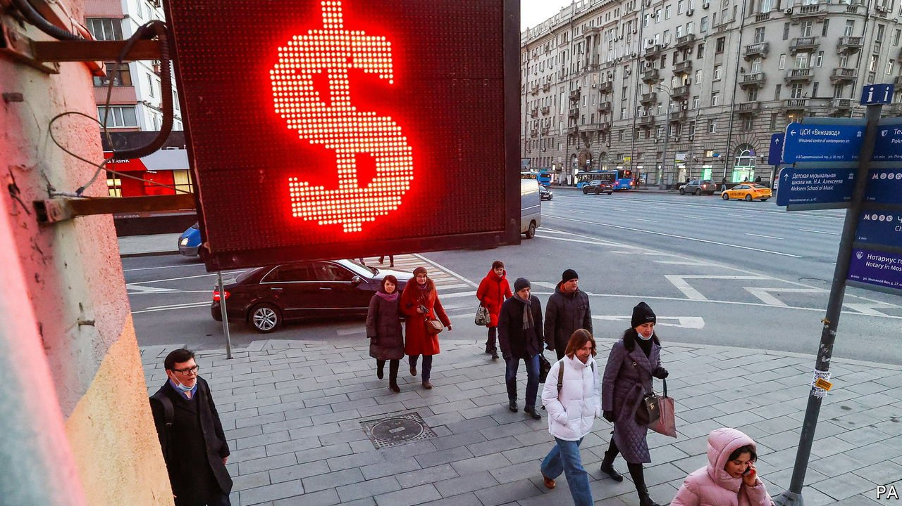
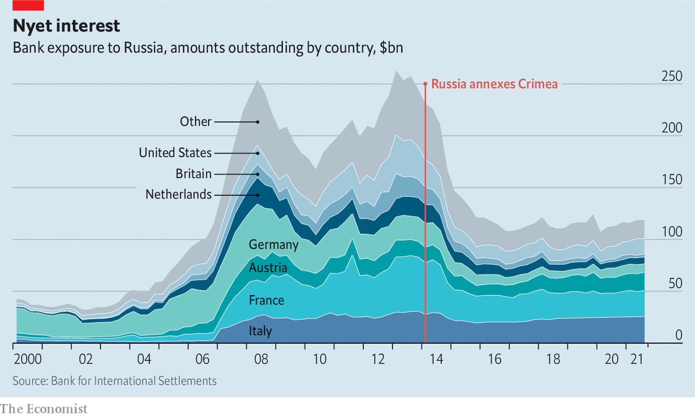

###### Nyet interest

# European banks have most to lose in Russia 

##### And it’s not just about loans 

 

> Mar 5th 2022 


 


AS THE WEST rolls out sanctions against Russia, some foreign banks, mostly European, will suffer collateral damage. Excluding the country from the SWIFT financial-messaging system will make it harder for them to collect payments on their loans. With the rouble so low, these are already less viable. The direct hit will be manageable: at $121bn, the stock of foreign bank loans to Russian firms and households has shrunk since 2014. But there are other costs. The investment-banking units of some big lenders may suffer losses on Russian securities, while private-banking businesses may be whacked by sanctions on Russian oligarchs. Retail-banking branches run by foreigners may also close. And if sanctions ratchet up, the risk of a government default will grow.

For more expert analysis of the biggest stories in economics, business and markets, , our weekly newsletter.

