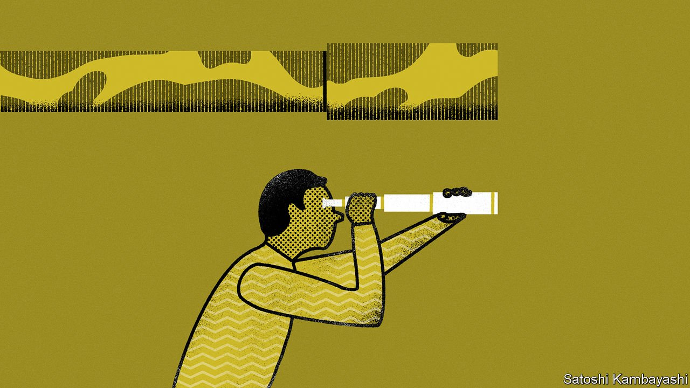

###### Buttonwood

# Investors are terrible at forecasting wars 

##### Markets are just as clueless after conflicts happen 

 

> Mar 5th 2022 

NATHAN ROTHSCHILD was in Waterloo when British troops cornered Napoleon’s into their final defeat. The banker quickly grasped an opportunity to turn field intelligence into financial gain. Having rushed back to London, he spread rumours that Wellington had lost, rocking markets, and picked up heaps of assets on the cheap. Then the real news reached Britain, and he reaped millions of pounds in profit.

That lurid story, published in an anti-Semitic pamphlet long after the battle, has little truth to it. Rothschild was not at Waterloo. No one knows if he made money in the aftermath, and certainly not what would have been an unthinkably large sum at the time. But the legend is also wrong in general. Rather than profiteering, most investors lose money during wars, because they fail to see them coming.


Despite telegraphed preparations, Russia’s invasion of Ukraine stupefied markets. The country’s fiscal balance and current-account surplus had lured foreign investors to its bonds. Exposure to commodities, an inflation hedge, had also made its stocks popular. Between its October high and February 24th, the MSCI Russia stock index did drop by 560 points—60% of its value. But three-fifths of that happened less than three days before the attack. The biggest fall—of 218 points—took place on the day.

This lack of foresight fits a historical pattern. Markets stayed placid through the years of border spats and bellicose rhetoric that led to the first world war. European stocks still did not budge when Austrian Archduke Franz Ferdinand was assassinated in June 1914. It is only when conflict seemed inevitable—days before Austria-Hungary declared war on Serbia, in July—that panic took hold.

Even markets supposedly attuned to geopolitical risk, such as commodities, struggle to price military risk. Despite a build-up of Iraqi troops on the border, investors were wrong-footed by the invasion of Kuwait in 1990. Oil prices doubled in two months as the war disrupted some of the world’s largest oil production sites. Cotton prices, which barely budged when the American civil war began in 1861, surged a year later as a blockade on the Confederacy started to bite.

One problem faced by investors is that they are poorly equipped to assess risks associated with “black-swan” events, which have very low probabilities but which can be extremely costly. Most common market-moving events change the outlook for returns far more incrementally. Take American payroll data: since 1948, moves of even 0.4 percentage points in the monthly unemployment rate have occurred less than 10% of the time.

Many investors do assign probabilities to black swans. But Philip Tetlock, a Canadian scholar, notes that building predictive abilities requires repeated feedback so that participants can hone their accuracy over time. Once-in-a-career events do not offer that. Low odds can also disinterest investors from working out how much freak events might cost. Many still hold Russian assets—even though, with defaults looming and dividends banned, they may soon be worthless.

Wars are not the only black swans. But others tend to be more localised and temporary (natural disasters), more familiar to investors (financial meltdowns, which leave a trail of public data) or easier to forecast (general political risk, which can be gauged through polls). The decision to declare war depends on the thought process of individual leaders (or lack thereof). Regrettably, the track record of the many sciences trying to predict their next move is poor.

It does not help that most investors learn from lesser geopolitical flare-ups that they should not pay attention. Every bull market is littered with sell-offs which are quickly reversed, leaving those who took them seriously nursing losses. The assassination of Iranian commander Qassem Suleimani, and North Korea’s nuclear tests, have been dip-buying opportunities rather than reasons to flee.

Should investors give up trying to forecast wars? Some think it impossible to tame the wildest of black swans. But such animals are becoming harder to ignore. Take the possibility of a Chinese attack on Taiwan, which Russia’s invasion of Ukraine has made frighteningly more real. At risk are not just shareholders in TSMC, a giant chipmaker whose share price has doubled since mid-2020. The island at large forms a linchpin of the global supply chains most industries depend on—reason enough for investors everywhere not to wave the white flag.

Read more from Buttonwood, our columnist on financial markets:

 (Feb 26th)

 (Feb 19th)

 (Feb 12th)

For more expert analysis of the biggest stories in economics, business and markets, , our weekly newsletter.

