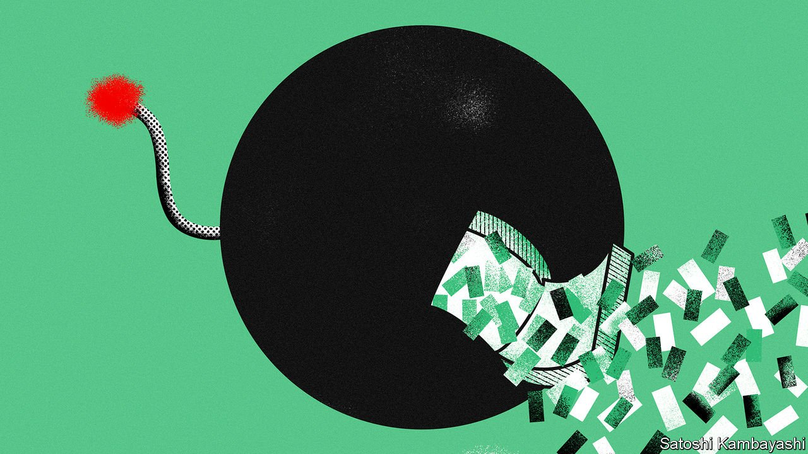

###### Shock, stocks and barrels

# The war in Europe is a triple whammy for emerging markets 

##### They will add to an already long list of headaches 

 

> Mar 5th 2022 

EVEN BEFORE Russia invaded Ukraine, emerging markets were braced for a testing year. The conflict threatens to lengthen a list of woes that already included inflation, slowing growth, public finances strained by rising interest rates and lingering disruptions from covid-19. In a worst-case scenario, the fallout may even top all these concerns.

The main transmission channel is unlikely to be Russia itself, whose economy is falling apart in the face of sanctions. Comparable in size to Australia’s or Brazil’s, the world’s 11th-largest economy is mid-weight and only loosely integrated with global supply chains. It is not a major market for exports. Steps taken by Western banks to reduce their exposure to Russia following its seizure of Crimea in 2014 also limit the risk of direct financial contagion. Instead the fallout for the emerging world will come in three indirect ways.


The first channel is that of global liquidity conditions, which are tightening. Though the war does not seem to pose a serious financial-stability threat at the moment, markets have grown nervier. If worry were to give way to panic, the rush to obtain dollars could cause liquidity to dry up and markets to malfunction—recalling the breakdowns seen in the early months of the pandemic. Then it took huge interventions by America’s Federal Reserve and other central banks to prevent a global financial shock. And even with that mighty support, most emerging economies faced a rapid and painful adjustment as their currencies tumbled. A few were pushed into default.

For now such disasters seem a distant possibility. The invasion has nonetheless prompted investors to flock to assets they deem the least risky. Stockmarkets across the emerging world have slipped since mid-February. Over the week following the beginning of the war, yields on German bunds and American Treasuries, traditional safe havens, have been down by as much as 0.3 percentage points. Slowly but steadily, the dollar is climbing. Some indicators of market strain have begun to increase, too, though not yet into crisis territory. The spread between the rate that rich-world banks charge each other for short-term unsecured loans and the overnight risk-free rate has risen. But the uptick is dwarfed by the spike observed during the wild gyrations of early 2020, to say nothing of the market madness seen during the global financial crisis.

A flight to safety could raise the cost of borrowing across emerging markets and increase the burden of debt. Prices for hard-currency bonds issued by governments and firms have fallen over the past week, while the spread between the yield on emerging-market corporate bonds and that on Treasury bonds has jumped by about half a percentage point. That, too, is a modest rise relative to what markets experienced in the spring of 2020, when the spread leapt by four percentage points in the space of a month. But higher borrowing costs for governments and firms are less easily managed after two years of rising indebtedness. And even in the absence of default, dearer credit stands to crimp private investment and further limit governments’ fiscal room for manoeuvre.

Adverse moves on markets could exacerbate the challenges caused by new macroeconomic headwinds—the second channel of contagion. In peacetime both Russia and Ukraine are big exporters of commodities, including oil and gas, precious and industrial metals, and agricultural products. Since mid-February prices for many of these have jumped. Oil prices are up by more than 25% over the past fortnight. The price of wheat has soared by more than 30%. Some emerging-market exporters stand to benefit from rising proceeds. For Gulf economies the surge in crude prices is an unexpected windfall.

Yet even the biggest commodity exporters are likely to face difficulties when food and energy costs rise above already high levels, squeezing household budgets and putting monetary policymakers in a bind. Before the war a year-long campaign by Brazil’s central bank to rein in high inflation—in which it raised its benchmark interest rate by nearly nine percentage points—seemed to be bearing fruit. Now food and energy price shocks it can do little about threaten to spoil its fragile achievement. Turkey, where year-on-year inflation surged to nearly 50% in January, is in an even stickier spot. On March 1st the Turkish defence minister urged Russia to accept an immediate ceasefire. Large importers of wheat and sunflower oil across north Africa and the Middle East, most notably Egypt, may see the price of staples rocket, fuelling popular discontent.

As these developments unfold a third force will operate in the background. Russian aggression, and the West’s shock-and-awe financial and economic response, represent another jolt to a global economy which over the past half-decade has weathered trade wars, a pandemic, supply-chain disruptions and an increasingly unpredictable policy environment. As firms and investors watch the carnage in eastern Europe, they may reassess how to price geopolitical risk in foreign markets. That could inflate country-risk premiums applied to far-flung assets, increasing the cost of funding for emerging markets and reducing investment volumes.

In difficult times, the saying goes, global investors worry less about the return on capital than the return of it. Should many of them decide to pack up and go home, the war’s collateral damage will include that suffered by the emerging economies they leave behind. ■

For more expert analysis of the biggest stories in economics, business and markets, , our weekly newsletter.

