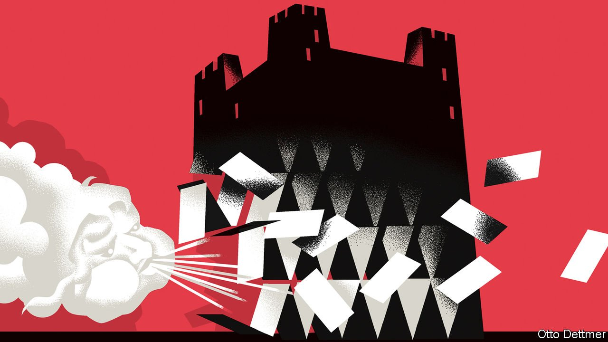

###### Free exchange

# Vladimir Putin’s Fortress Russia is crumbling 

##### The chaos in Russian markets shows the impossibility of economic “self-reliance” 

 

> Mar 5th 2022 

FOLLOWING RUSSIA’S invasion of Ukraine, an economic war has begun. The West has imposed unprecedented sanctions. Investors are dumping Russian assets as fast as they can. So far this year the rouble has lost one-third of its value. The government may soon default. Capital Economics, a consultancy, expects Russian inflation to hit 15% before long, with GDP falling by 5% this year.

The ructions in Russia’s markets have taken many by surprise. For years President Vladimir Putin had, apparently successfully, built up Russia’s economic defences, such that it would easily be able to resist whatever Western governments threw at it—what Timothy Ash of BlueBay Asset Management dubbed the “Fortress Russia” strategy. It turns out that the strategy has been a failure. “From Fortress Russia to Rubble Russia in a week,” says Mr Ash.


Fortress Russia was a product of Russia’s chaotic recent history. Following the dissolution of the Soviet Union in 1991 inflation exceeded 2,000%. In 1998 Russia defaulted, causing the value of the rouble to fall by more than two-thirds. Then in 2014 a collapse in oil prices, plus international sanctions over Russia’s actions in Crimea and the Donbas, sent the economy into a deep recession.

As Fiona Hill and Clifford Gaddy show in “Mr Putin: Operative in the Kremlin”, a book published in 2015, the Russian president has long wished that his country could be self-reliant. Since 2014, however, that ideology has gone into overdrive, with Mr Putin desperate to ensure that the West could never again exert economic control over his country.

The idea for Fortress Russia went something like this. On the economic front, Russia would diversify its economy away from oil and gas, two volatile commodities. It would lessen its dependence on Western technology and trade. On the financial front, it would reduce external debt. It would practise tight fiscal and monetary policy, allowing it to accumulate vast amounts of foreign exchange with which it would be able to defend the rouble, or that it would channel to favoured companies, at times of crisis.

There have been some successes. Take the economy first. Russia is somewhat less dependent on hydrocarbons. In 2019 oil profits accounted for about 9% of GDP, down from around 15% when Mr Putin took office. Oligarchs remain exceptionally powerful, controlling a huge share of overall Russian wealth, but their influence appears to have stopped growing. Between 2000 and 2019 Russia’s services industry grew by seven percentage points of GDP, even if productivity growth in most sectors has been pitiful.

In some areas Russia has developed technologies which operate independently of Western ones. Mir, a Russian payments system, accounted for a quarter of domestic card transactions in 2020, up from nothing five years ago. The share of Russian imports classed as “high-tech” seems to be falling fast, World Bank data suggest. In the past decade European exports of whizzy products to Russia have stagnated, while growing elsewhere.

But the fortress walls have gaping holes. Russia remains enmeshed in the supply chain of Western ideas and technologies. According to our analysis of bilateral data on stocks of long-term investment (control of companies, say, or the construction of new factories), the Russian economy is somewhat more reliant on the West than it was a decade ago. About 30% of Russian imports come from G7 countries, hardly different from 2014. In some industries, such as chipmaking and computers, Russia remains wholly dependent on American parts. The cards of some Russian banks under sanction no longer work with Apple Pay or Google Pay, which on February 28th caused chaos on the Moscow metro as people could not get through the turnstiles.

The chaos in Russia’s financial markets has been an even bigger surprise. After all, by 2022 Russia had $630bn-worth of international reserves (around 40% of GDP), the most ever, and had diversified away from American dollars. It had also greatly reduced its foreign-denominated debt owed to foreigners since 2014.

But the country remains dependent on foreign investors. Their short-term asset holdings (including bank loans and stocks), relative to GDP, are about as high in Russia as they are in other emerging markets—and they have remained steady since 2014. Even without sanctions, Russian assets would be under huge pressure as investors run for the exits.

And Russia always assumed that it would be able to access foreign exchange to defend the rouble. It is not completely cut off: Russia’s energy exports have largely escaped Western bans, so it still has some dollars flowing in. But, because of sanctions, 65% of Russia’s reserves may in effect be worth $0. The other 35%, held in gold and yuan, cannot be used to defend the currency in the dollar and euro markets.

Russia’s difficulties will only compound over time. Being shut out of the SWIFT financial-transfer system will hurt trade; SPFS, a Russian-backed rival, remains far less popular. Russia still needs dollars to pay for a third of its imports, a problem when it has suddenly become harder to get hold of them. Even in its imports from China, where progress has been made on “de-dollarisation”, around 60% of transactions still take place using the greenback.

A test from God

The question is whether Mr Putin really cares about all this. He may not welcome the prospect of angry oligarchs, should some of them indeed dare to raise their voice. But, according to Ms Hill and Mr Gaddy’s book, a core tenet of Putinism is survivalism, where one sees economic warfare as a test of strength. The pain is the point. “In this narrative, Russia constantly battles for survival against a hostile outside world,” they say. “The one critical lesson from history is that Russia, the state, always survives in one form or another.” Russia faces a deep recession. But rather than relent, Mr Putin may double down on his attempts to cut Russia off from the outside world. ■

Read more from Free Exchange, our column on economics: (Feb 26th) (Feb 19th) (Feb 12th)


