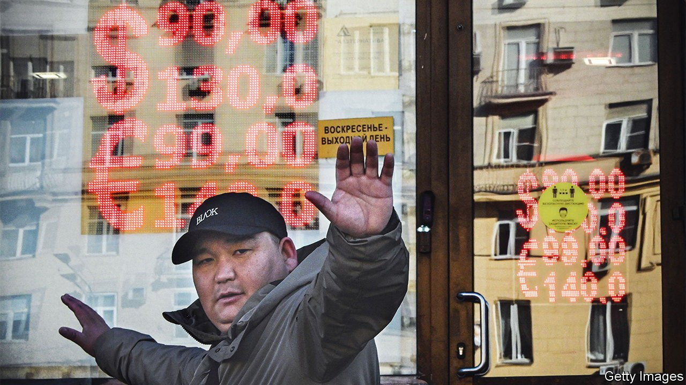
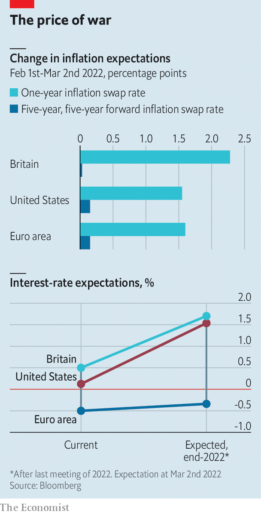

###### The world economy at war

# War and sanctions means higher inflation 

##### But not necessarily higher interest rates 

 

> Mar 5th 2022 

RUSSIA MAY have tried to build a “fortress economy”, but it is the West that currently looks financially impervious. Compared with the deep economic crisis brought about in the country by Western sanctions, the consequences for the rich world have been small. Though American stocks fell sharply when the war started on February 24th, on March 2nd they closed almost 4% higher than their level the night before the invasion. European stocks are about 4% down—a big hit, but nothing compared with the financial rout under way in Russia, where the currency has collapsed and stockmarket trading has been suspended for days.

In part the muted reaction reflects Russia’s low weight in the global economy: about 2% in dollar terms. The country’s relative poverty and smaller population when compared with the rest of Europe mean that its exporters depend on European demand but not vice versa. Goldman Sachs, a bank, estimates that the loss of exports caused by a 10% fall in Russian spending would cost the euro zone only about 0.1% of its GDP, and Britain still less. Financial links are modest.


Yet Russia’s economic importance vastly outweighs its GDP or financial clout owing to its energy exports. It produces nearly a fifth of the world’s natural gas, and more than a tenth of the world’s oil, the price of which drives much of the short-term variation in global inflation. Typically 30-40% of the EU’s gas supply comes from Russia (though this has fallen to about 20% in recent months as Europe has increased its imports of LNG from America). It does not just heat Europe’s homes but also powers much of its industrial production. Among big economies Italy and Germany are particularly exposed.

Energy prices increased dramatically on March 1st and 2nd. European natural-gas spot prices are now more than double their level at the start of February. So are futures prices for delivery in December 2022, reflecting in part the cancellation of the Nord Stream 2 pipeline from Russia to Germany, which had been hoped to ease supply this year. The oil price is up over 25% to about $115 per barrel. The energy squeeze will worsen Europe’s inflation problem while also hitting its growth. JPMorgan Chase, a bank, has raised its forecast for euro-area inflation at the end of the year by 1.1 percentage points, to 3.6%, while cutting its growth forecast for 2022 by 0.6 percentage points, to 4.1%. As a producer of oil and gas America is mostly insulated from the drag on growth, but will feel the inflationary effects of pricier oil.

Things could get much worse should sanctions expand in scope to cover energy purchases or if Russia retaliates against them by reducing its exports. JPMorgan Chase projects that a sustained shut-off of the Russian oil supply might cause prices to rise to $150 per barrel, a level sufficient to knock 1.6% off global GDP while raising consumer prices by another 2%. The stagflationary shock would carry echoes of the Yom Kippur war of 1973, which sparked the first of the two energy crises of that decade. It greatly worsened an existing inflation problem caused in part by the collapse earlier that year of the Bretton Woods system of fixed exchange rates. Today much pricier energy would be layered atop the inflation caused by the pandemic and the associated stimulus.

If the oil and gas keep flowing, the existing increases in their respective prices will still make life uncomfortable for central banks, who were anyway raising or preparing to raise interest rates. They usually tolerate inflation caused by expensive energy. It tends to quickly dissipate, or even go into reverse. But recently they have worried that the persistence of high inflation since last summer might lead companies to think they should continue to increase prices at a rapid pace and workers to continue to ask for higher wages. Inflation, in other words, may have taken on a momentum of its own. Further increases in energy prices can only heighten that danger—while adding to the squeeze on growth that higher interest rates bring about.

 


At present markets are priced for a fairly conventional policy response. Since February 1st investors’ inflation expectations, as revealed by the price of swaps, have risen sharply at a one-year horizon for Britain, America and the euro zone. Yet expectations for longer-term inflation, as measured by long-dated forward swaps, have not changed much (see chart). Projections of the ECB’s policy rate at the end of the year have barely changed. Investors have priced in another quarter-of-a-percentage-point rise in interest rates this year in both Britain and America. On March 2nd Jerome Powell, chairman of the Federal reserve, indicated that it would still raise rates.

There have, however, been sharp movements in bond yields at longer horizons. In mid-February yields on five-year German government bonds had been in positive territory for the first time since 2018. They have since fallen to about -0.25%. On March 1st and 2nd the yield on an American ten-year Treasury bond fell from nearly 2% to 1.7%, a greater fall than in any two-day trading period since March 2020, before recovering slightly to 1.9% the next day.

In other words, investors are betting that today’s inflation, even once exacerbated by the war in Ukraine, will be temporary—and that over the long term interest rates are likely to be a bit lower than on past projections. But that hardly means markets are sanguine. In recent years some scholars have argued that low long-term real interest rates reflect in part the impulse to hoard safe assets as tail risks—rare but highly costly events—grow more likely. After two years of a pandemic and with war raging in Europe, that thesis has never seemed so apposite. ■

For more expert analysis of the biggest stories in economics, business and markets, , our weekly newsletter.

