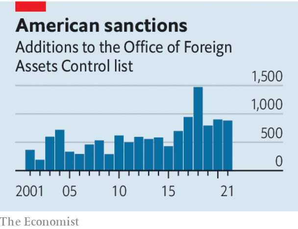

###### The world economy

# A new age of economic conflict 

##### The West has used crushing sanctions on Russia. The implications are huge 

 

> Mar 5th 2022 

RUSSIA’S INVASION of Ukraine could yet become the biggest military action in Europe since 1945. It also marks a new era of high-risk economic warfare that could further splinter the world economy. The measures the West has imposed on Russia are so potent that they have triggered chaos in its $1.6trn economy and prompted the president, Vladimir Putin, to issue nuclear threats. The instant immiseration of a big economy is unprecedented and will cause alarm around the world, not least in China, which will recalculate the costs of a war over Taiwan. The West’s priority must be to win the economic confrontation with Russia. Then it must create a doctrine to govern these weapons in order to prevent a broader shift towards autarky.

The fact that Russia did not take the threat of sanctions seriously at first is . For years they have been plentiful but ineffective. Reluctant to use hard power, America and Europe have reached for economic penalties instead. Some 10,000 people or firms are subject to American sanctions, affecting over 50 countries with 27% of world GDP, and covering everything from torture to cryptocurrencies. Often they make little difference. Autocrats can evade targeted measures. Full embargoes on Iran and Venezuela have been crippling but not toppled regimes. The deterrent effect has been weak, as malefactors have assumed that America would never apply “maximum pressure” on a big economy.


On February 26th that Rubicon was crossed, when sanctions  on the world’s 11th-biggest economy. By making it illegal for Western firms to deal with big Russian banks, except in the energy trade, and expelling them from the global-payments plumbing, the flow of money across borders is seizing up. Action against Russia’s central bank means it cannot gain access to much of its vast . Confidence has evaporated. The  by 28% this year as capital flees, threatening soaring inflation. Russian share prices have dropped by over 90% in offshore trading, and multinationals are . From Moscow to Murmansk, Russians are .

The shock could lead to a coup or a cash-crunch that impedes the war machine. But Mr Putin could retaliate with his own economic weapons including strangling the flow of . After nuclear bombs were used in 1945, it took years to develop a doctrine to govern how to deal with retaliation. Now, amid the chaos, there is no time for an equivalent for sanctions. One principle is clear, though: any Russian economic retaliation must be met by a more damaging response by the West that makes that act of retaliation irrational. Through its ability to stymie tech services and oil exports (from which Russia earns four times more than gas) the West has the advantage.

 


If the West faces down Russia, and cements the new weapons’ deterrent power, the long-run implications will be daunting. The more they are used, the more countries will seek to avoid relying on Western finance. That would make the threat of exclusion less powerful. It would also lead to a dangerous fragmentation of the world economy. In the 1930s a fear of trade embargoes was associated with a rush to autarky and economic spheres of influence.

Autocracies will be most nervous: they own half of the world’s $20trn pile of reserves and sovereign wealth assets. Although China can inflict huge economic costs on the West by blocking supply chains, it is now clear that in the event of a war over Taiwan, the West could freeze China’s $3.3trn reserve pile. Even some democracies like India, which has avoided condemning Russia’s invasion, may worry they are more vulnerable to Western pressure. Over the next decade technological changes could create new payments networks that bypass the Western banking system. China’s digital-currency trial has 261m users. Today it is hard to park trillions of dollars outside Western markets, but in time more countries may seek to diversify their reserves by investing more elsewhere.

Some of this fragmentation has become inevitable. But by applying sanctions to ever more countries over the past two decades, and now also raising their potential severity, the West risks pushing more countries to delink from the Western-led financial system than is desirable. That is why after the crisis in Ukraine passes, the West should aim to make clear how sanctions will be controlled. The relentless proliferation of the low-level sort ought to be contained, although targeted measures against individuals and firms for human-rights abuses remain legitimate, even if they rarely work. And it should be made clear that economy-wide sanctions of the devastating kind being used against Russia are reserved for the worst acts of aggression and war. The West has deployed an economic weapon that was until recently unthinkable. It must be used wisely. ■

Our recent coverage of the Ukraine crisis can be found 

