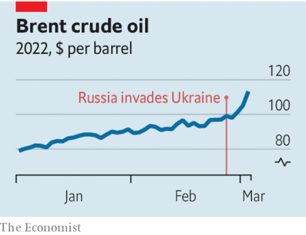

###### War and price

# Central banks should ignore soaring energy costs 

##### But they must continue fighting home-grown inflation 

 

> Mar 5th 2022 

WAR IN UKRAINE has caused European natural-gas prices almost to double and sent oil prices soaring to over $115 a barrel. That has added to the inflation problem facing the world’s central banks. And more pain is probably coming. Western energy giants are getting out of Russia, sanctions are  on Russian commodities exports and the cancelling of the Nord Stream 2 gas pipeline from Russia to Germany will remove a potential source of relief. If Russian energy exports are cut off completely, the oil price could reach $150,  global consumer prices by another 2%.

According to orthodoxy, rich-world central bankers should all but ignore supply shocks such as dearer energy. That is because their direct effect on inflation is only temporary. When policymakers ignore this rule of thumb things usually go wrong. In 2008 and 2011 the European Central Bank (ECB) raised rates because of supply-side factors, and ended up worsening the Great Recession and its aftermath.


But today’s shock comes as inflation is already too high. Central bankers are worried about prices taking on a momentum of their own. They may be reminded of the energy crisis in 1973, when the Yom Kippur war led to an oil embargo and a spike in prices that made a bad inflation problem worse.

It is right to be alert to the danger of a repeat of the 1970s. But there is little central banks can do about expensive energy without unnecessarily crashing their economies. Thankfully, although the public’s expectations for inflation over the next year are up strongly, long-term expectations remain pretty stable, suggesting that it should be possible to follow the standard approach to this supply shock by overlooking energy prices.

 


At the same time, policymakers must be wary of the opposite mistake. Pricier energy will cause slower growth, especially in the parts of Europe that rely on Russian gas. It may therefore be tempting to keep policy very loose. Yet both the experience of America during the pandemic and the history of the 1970s show the folly of creating too much stimulus when supplies are disrupted: it causes overheating.

The right approach is to maintain a laser-like focus on price pressures at home. Wage growth and core inflation, which excludes energy and food prices, are the indicators to watch. In America, where wages are 5.7% higher than a year ago and core inflation is 5.2%, the Federal Reserve should raise interest rates sharply in 2022. (The energy shock might also benefit the economy by boosting investment in shale oil and gas.) In the euro zone, although core inflation, at 2.7%, is too high, the arguments are more balanced because of the absence of fast wage growth. Unless the job market weakens, it would be right to raise rates in 2022 at the pace that had been expected before the war. The same goes for the Bank of England.

Though central bankers should not yet rewrite their plans for managing interest rates, they may need to pare back their ambitions to shrink their balance-sheets. That is because, as sanctions take effect, the global financial system may need support. There have been signs of stress in offshore dollar-funding markets, meaning foreign central banks may ask the Federal Reserve for dollars. In Europe worries about the sustainability of countries’ debts could resurface as growth is squeezed by high energy prices—Italy is vulnerable on both counts. During the pandemic the euro zone benefited from financial solidarity created in part by the ECB’s implicit mutualisation of government debt. The central bank may need to stand behind vulnerable countries in an energy crisis, too. ■

