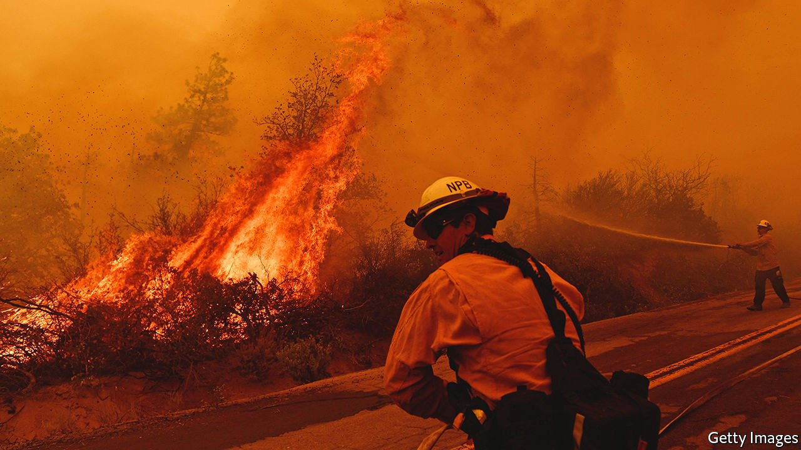

###### Climate change

# Climate change must be adapted to as well as opposed 

##### Efforts to reduce its impact on lives and ecosystems are falling ever shorter 

 

> Mar 5th 2022 

IN NORMAL CIRCUMSTANCES the Intergovernmental Panel on Climate Change (IPCC) can take media attention for granted. Its infrequent and authoritative analyses of how much climate change human activity is causing, and will cause, and its weighty warnings about the consequent rising seas, deepening droughts, failing crops and so forth lead front pages and news bulletins alike. This week, though, circumstances are anything but normal, and the panel found that getting the world to pay attention to a 3,600-page document describing in great detail the current and future impacts of climate change was hard.

To add to the sidelining, the fact that the Russian invasion of Ukraine is likely to bring about a  in European energy policies makes the war particularly fascinating to the sort of climate wonks who are normally fixated on the utterances of the IPCC. And to pile on yet more distraction, the biggest climate story of the week could end up being the attitude which America’s  takes to the federal government’s powers over greenhouse-gas emissions.


But if the report’s launch has been overshadowed, it is important that its messages should not be—all the more so because it shows that “usual conditions” of all sorts are a thing of the past. It provides a fuller documentation than any of the IPCC’s previous studies of the profound shifts which the climate is undergoing. This is not because its authors are more diligent than their predecessors, but rather because there is more going on. Previous reports on impacts, vulnerabilities and adaptation relied on prediction. In  the authors need only to look around them to catalogue increased flooding, more heatwaves, stressed ecosystems and millions of lives that have become harder to live.

The “emissions gap” that dogs climate policy is well known. Though the reductions in emissions that the world’s countries have pledged themselves to make are steeper than they used to be, they still fall well short of those needed to give the world a good chance of keeping the rise in average temperature relative to pre-industrial levels well below 2°C. The new report highlights a parallel adaptation gap. Though efforts to reduce the impact of climate change on lives and ecosystems are greater than they once were, the extent to which they fall short of what circumstances require is increasing, as impacts pile up apace.

There are success stories, though. The use of sand dams in Kenya increases groundwater storage and thus permits the weathering of droughts. In many cities better warning of heatwaves has reduced the number of deaths they bring. Well-thought-through urban planning and building codes can be a protection against heat and flood alike.

Being overshadowed is not a new experience for those who identify the people most vulnerable to climate change and work out ways to help them—and ways to help them help themselves. The fact that the underlying driver of climate change is the total amount of carbon dioxide emitted means that reducing net emissions will always have a logical pride of place that translates into the lion’s share of attention. Without mitigation, adaptation will run out of road. As a result, adaptation gets short shrift and too little investment.

The disparity is less obvious now than it was in past decades. But for as long as it persists, the adaptation gap will widen. The good news from the IPCC is that successful adaptation is still possible, for now, and it makes real improvements to people’s lives. The more this is understood, the more spending on adaptation should grow. ■

