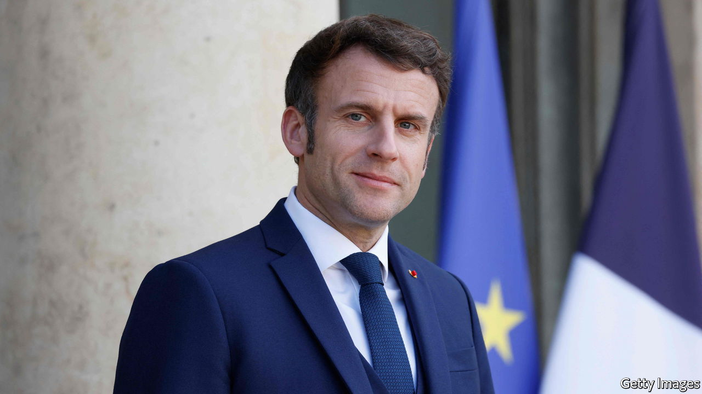

###### Macron, and on

# France needs a proper debate ahead of its presidential election 

##### But time is running out 

 

> Mar 5th 2022 

FIVE YEARS ago a little-known former economy minister won the French presidency in his first bid for elected office. Emmanuel Macron, then 39, became the country’s youngest leader since Napoleon Bonaparte. On April 10th and 24th France will hold its next two-round presidential election. Mr Macron hopes to defy precedent again by securing a second term. This would be quite a feat. For the past 20 years no French president has been re-elected. Only two, François Mitterrand and Jacques Chirac, have won a second term since Charles de Gaulle in 1965.

Mr Macron is nonetheless the strong favourite. Our model gives him an 88% probability of re-election, even though he has yet to hold a rally or take to the campaign trail. Mr Macron has had a lot on, softening the impact (successfully) of a surge in covid-19 cases in January and then (unsuccessfully) trying to talk Vladimir Putin out of going to war. But this is making for an , as his rivals criss-cross France and take part in endless TV debates without the one candidate they all denounce. Assuming he declares by the legal deadline on March 4th, Mr Macron has just five weeks to lay out what he wants to do with a second term, and how he plans to do it.


On Mr Macron’s watch the French economy has become more business-friendly, enterprising and job-creating, and less heavily taxed. Having promised to spend “whatever it costs” during the pandemic, he has kept people in jobs and firms in business. The rich have gained from his tax cuts and other policies, but so has everyone else: average net household incomes have increased across every income decile. Gay and single women can now get free IVF treatment; 300,000 school pupils, free breakfasts. Abroad, Mr Macron’s cherished idea of fostering European “strategic sovereignty” may get some impetus from Germany’s recent decision to increase spending dramatically on defence.

Yet the record is far from faultless. Mr Macron’s diplomatic efforts have been energetic, but the results mixed. He failed to coax Mr Putin to behave better, or to stop France’s counter-terrorism operation in Mali from unravelling. At home, the president’s haughty governing style has not united France: nearly half of voters plan to back a candidate from one or other political extreme, just as they did in 2017. Above all, there is unfinished business. France needs to reform pensions to persuade people to keep working for longer. It also needs to get public finances under control without harming the economy or denting incomes. It is one of the more indebted countries in the euro zone.

Such measures will require plenty of hard choices and unpopular decisions. A second-term president, forbidden constitutionally from running again immediately, could afford to be unpopular. But Mr Macron, even if he is re-elected, may lose his parliamentary majority at legislative elections in June. Moreover there is precious little time for voters to engage in a serious debate about these choices. So far the campaign has been mediocre, framed by the identity politics and toxic diatribes against immigration of the candidates on the nationalist hard right, Eric Zemmour and Marine Le Pen. If Mr Macron faces either in the run-off, his probable victory would owe as much to those who want to keep them out as those who want him in.

The horrifying spectacle of war on Europe’s eastern flank will draw attention away from the vote. Yet, as the euro zone’s second-biggest economy and the EU’s only serious military power, France matters more than most. An upset cannot be ruled out. Mr Macron, of all people, knows the value of transparency and clarity before an election. In 2017 he broke with tradition and told the French before they voted that he would swiftly pass decrees to loosen the labour market—measures that helped encourage the private-sector job-creation now benefiting the economy. Unless he embraces a proper debate in the short time left before the vote, he will find it a whole lot harder, if he is re-elected, to finish what he has begun. ■

