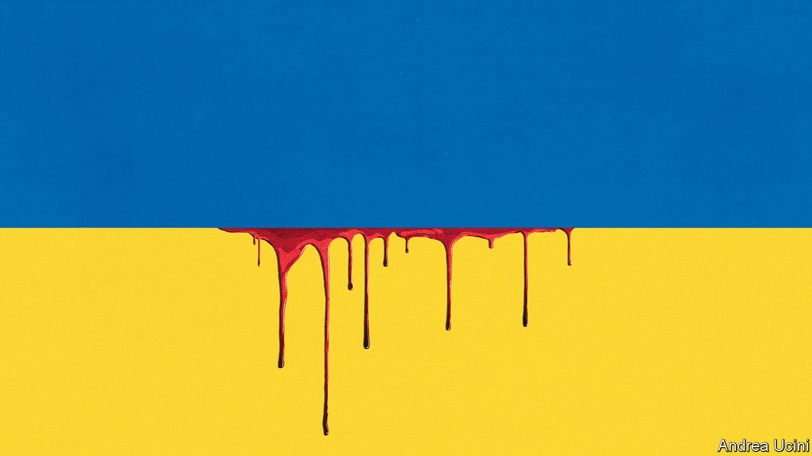

###### The invasion of Ukraine

# When Vladimir Putin escalates his war, the world must meet him 

##### Muttering nuclear threats, Russia’s president vows to prevail in Ukraine whatever it takes 

 

> Mar 5th 2022 

MARVEL AT THE heroism and resilience of Ukraine. In the first days of war, the armoured might of Vladimir Putin shrivelled before the courage of the nation he had attacked. In the face of Mr Putin’s invasion, the Ukrainian people have discovered they are ready to die for the idea that they should choose their own destiny. To a cynical dictator that must be incomprehensible. To the rest of humanity it is an inspiration.

If only this week’s bravery were enough to bring the fighting to an end. Alas, Russia’s president will not withdraw so easily. From the start, Mr Putin has made clear that this is a war of escalation—a hygienic word for a dirty and potentially catastrophic reality. At its most brutal, escalation means that, whatever the world does, Mr Putin threatens to be more violent and more destructive even, he growls, if that means resorting to a nuclear weapon. And so he insists that the world back off while he sharpens his knife and sets about his slaughter.


Such a retreat must not happen. Not only because to abandon Ukraine to its fate would be wrong, but also because Mr Putin will not stop there. Escalation is a narcotic. If Mr Putin prevails today, his next fix will be in Georgia, Moldova or the Baltic states. He will not stop until he is stopped.

Escalation is at the heart of this war because it is how Mr Putin tries to turn defeat into victory. The first wave of his invasion proved as rotten as the cabal who planned it—just like his earlier efforts to suborn Ukraine. Mr Putin seems to have believed his own propaganda that the territory he has invaded is not a real country. The initial assault, which led with botched helicopter strikes and raids by lightly armed units, was conceived for an adversary that would implode. Instead, Ukrainian spirits have flourished under fire. The president, Volodymyr Zelensky, has been transformed into a war leader who embodies his people’s courage and defiance.

The optimism of the warmonger made Mr Putin lazy. He was so sure Ukraine would fall rapidly that he did not prepare his people for it. Some troops have been told they are on exercises, or that they will be welcomed as liberators. Citizens are not ready for a fratricidal conflict with their fellow Slavs. Having been assured that there would be no war, much of the elite feels humiliated. They are horrified at Mr Putin’s recklessness.

And Russia’s president believed that the decadent West would always accommodate him. In fact, Ukraine’s example has inspired marches through the capital cities of Europe. Western governments, having listened, have imposed severe sanctions. Germany, which only a week ago drew the line at sending anything more lethal than helmets, is  anti-tank and anti-aircraft weapons, overturning decades of policy based on taming Russia by engaging with it.

Faced with these reverses, Mr Putin is escalating. In Ukraine he is moving to besiege the main cities and calling up his heavy armour to wantonly kill their civilian inhabitants—a war crime. At home he is bringing Russians to heel by redoubling his lies and subjecting his people to the harshest state terror since Stalin. To the West he is issuing threats of nuclear war.

The world must stand up to him, and to be credible it must demonstrate that it is willing to bleed his regime of the resources that enable him to wage war and abuse his own people even if that imposes costs on Western economies. The sanctions devised after Mr Putin annexed Crimea in 2014 were riddled with loopholes and compromises. Instead of being deterred, the Kremlin concluded that it could act with impunity. By contrast, the latest sanctions, imposed on February 28th, have crumpled the rouble and promise to cripple Russia’s financial system. They are effective because they are destructive.

The danger of escalation is that this can easily become a test of who is most willing and able to go to extremes. Recent wars have been asymmetric. Al-Qaeda and Islamic State would commit any atrocity, but their power was limited. America could destroy the planet, but against foes like the Taliban in Afghanistan, nobody imagined it was willing. The invasion of Ukraine is different, because Mr Putin can charge all the way to Armageddon and he wants the world to believe he is ready to do so.

The idea of Mr Putin using a battlefield nuclear weapon is surely unlikely, but not impossible. He has, after all, just invaded his neighbour. And so the world must deter him.

Some will say there is no point in saving Ukraine only to trigger a spiral that may destroy civilisation. But that is a false choice. Mr Putin says he wants to drive NATO out of the former Warsaw Pact countries and America out of Europe. If escalation serves him, the next confrontation will be even more dangerous because he will be less ready to believe that, for once, the West will stand its ground.

Others may conclude that Mr Putin is insane and deterrence is hopeless. True, his goals are abhorrent, as are his means of achieving them. Neither does he have Russia’s true interests at heart. But he nonetheless has an understanding of power and how to keep it. No doubt he is alive to the language of threats.

By contrast, still others will want to short-circuit escalation, saying that Mr Putin must be stopped before it is too late. As images of suffering emerge from the ruins of Ukraine’s cities, calls are going up for NATO to do something, such as to create a no-fly zone. However, enforcing one requires shooting down Russian aircraft and destroying Russian air-defences. Instead, NATO needs to preserve a clear line between attacking Russia and backing Ukraine, while leaving no doubt that it will defend its members. That is the best brake on escalation.

What, then, can it do to deter Mr Putin without courting devastation? Only Mr Zelensky and his people can decide how long to fight. But if Mr Putin causes a bloodbath, the West can tighten the screws. An oil-and-gas embargo would  Russia’s economy. Ukraine’s backers can send more and better arms. NATO can deploy more troops in its frontline states.

Diplomacy matters, too. At peace talks in Belarus this week Russia still made outrageous demands, but negotiations should continue because they could help avert a war of attrition. The European Union has done well to  to Ukrainian refugees, who already exceed 1m. A haven can strengthen the hand of the Ukrainian negotiators, as would a path to EU membership. China and India have so far refused to condemn Mr Putin. As he escalates, they may be sufficiently alarmed to be willing to try to talk him down.

And there is work to do in Russia. Military commanders should know they will be prosecuted for war crimes using the evidence generated by innumerable smartphones. So should Mr Putin’s entourage. His enforcers signed up to line their pockets in a kleptocracy, not for a ticket to The Hague. The West can discreetly assure them that, if they remove Russia’s president from power, Russia will get a fresh start. However nauseating, the West should give Mr Putin a route into retirement and obscurity—just as it should give asylum to those fleeing his terror.

A palace coup may come to seem more plausible as the horror of what Mr Putin has done sinks in. The economy faces disaster. Russian military casualties are growing. Russians’ Ukrainian kin are being massacred in a conflict unleashed to satisfy one man. Even now brave Russians are taking to the streets to protest against a crime that stains their country. In a deep sense, Mr Putin’s needless war is one that neither he nor Russia can win. ■

Our recent coverage of the Ukraine crisis can be found .

For subscribers only: to see how we design each week’s cover, sign up to our weekly .

