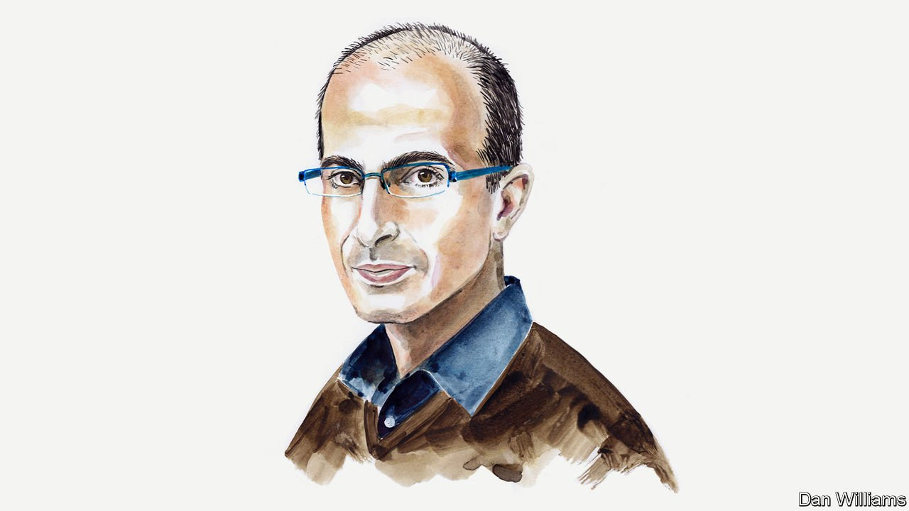
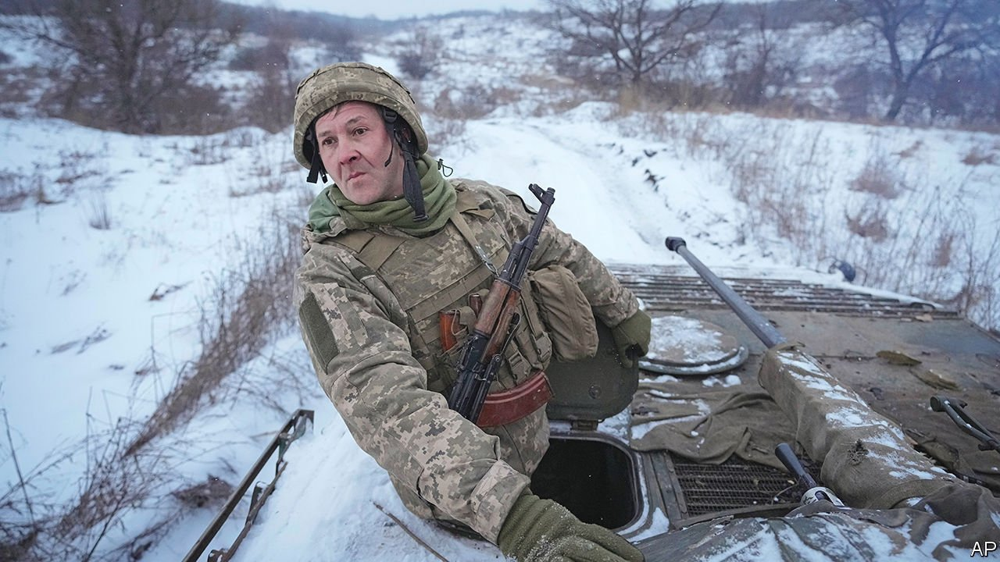
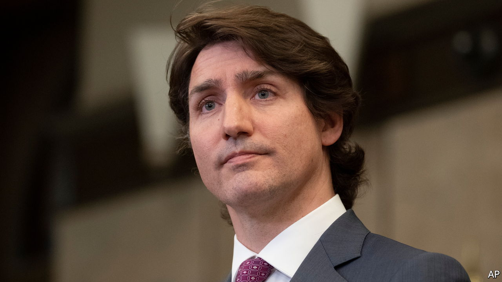
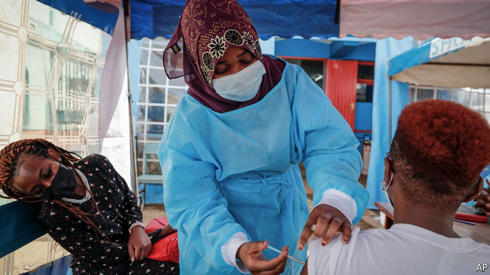
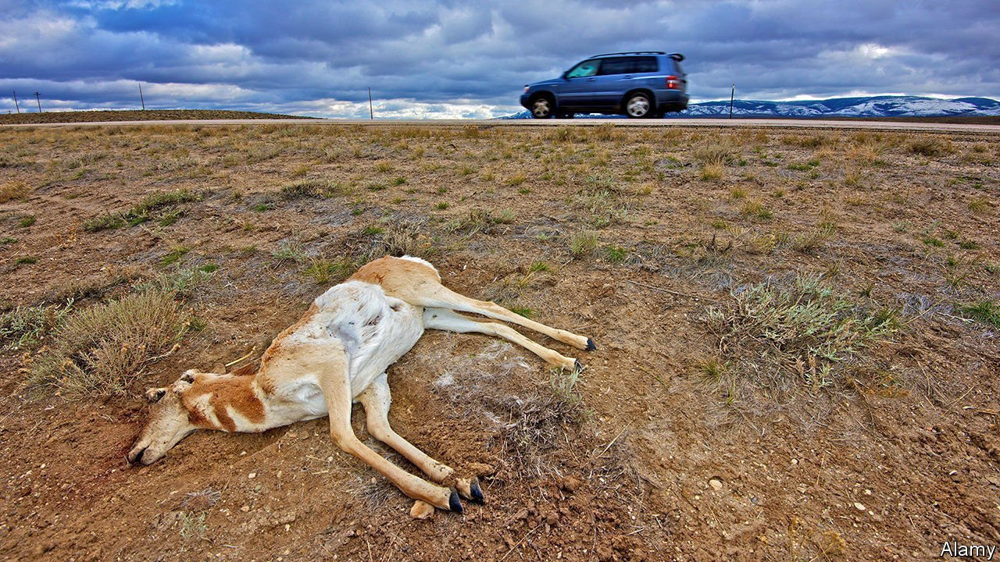

###### On Vladimir Putin, Canada, vaccines, roadkill, Wordle

# Letters to the editor 

##### A selection of correspondence 

 

> Mar 5th 2022 


Dealing with tyrants

Yuval Noah Harari’s essay explored how the vast majority of humanity today has chosen not to make war but follow a peaceful co-existence with their fellow beings (, February 9th). The big problem, highlighted by Ukraine, is how do these peaceful people get rid of the minority who choose violence to further their ends? How do you control someone who is pointing a gun in your face?


Protests don’t work. Tyrants just send in the secur ity forces, such as in Belarus, or tanks, as in Tiananmen Square. Speaking the truth about the regime gets you branded a terrorist and thrown in prison, which silences you and deters others. Feminism can go only so far in exerting soft power over dominant and determined men. The internet, once seen as an enabler of resistance for the oppressed that would help co-ordinate their fight, is now monitored and blocked by those in power. Sanctions are a long game and could hurt the peaceful majority of people. Vladimir Putin will continue to live in isolation, luxury and delusion; I doubt he cares that Russia will be worse off economically for invading Ukraine. As long as his army obeys him, nothing can stop him.

The uncomfortable truth is that we can stop dictators only through an internal coup, which may just replace one despot with another, or by meeting violence with violence: war. Modern democracy was born from the English civil war, American war of independence and French revolution.

No, if the free world really wants to stop Mr Putin it will have to treat Ukraine as if it is already a member of NATO. The destiny of humanity is in all our hands. The question is how to act?

TREVOR PREW

Sheffield

 


As your briefing made clear, Mr Putin is riding a very dangerous tiger by threatening Ukraine (“”, February 19th). John F. Kennedy once wrote: “Those who foolishly sought power by riding the back of the tiger ended up inside.” Attacking his smaller neighbour might keep Mr Putin on the outside of the tiger for a time, but what he must fear most, and ultimately cannot avoid, is the dismount.

MARTIN BIRTUxbridge, Canada

Following the Soviet invasion of Czechoslovakia W.H. Auden published this poem, “August 1968”. If nothing else, it reminds us that very little has changed in Russia’s attitude towards its neighbours.


PAUL D'EATH

Toronto

 


The blockades in Canada

Regarding your leader on the demonstrations across Canada (“”, February 19th), the illegal blockades and occupations were not a normal “peaceful” protest. They were well-organised, well-funded attempts to damage Canada’s economy, undermine Canadian democracy and reverse the result of a free election, and take away the freedoms of other Canadians by harassing them in their neighbourhoods and workplaces.

The leaders of the blockades and occupations have links to ideologically motivated violent extremists. A significant portion of their funding came from outside Canada. They helped push out terabytes of disinformation, a large amount of which came from beyond Canada’s borders. Their explicit goal was to replace our government.

Implementing the Emergencies Act did not curtail anyone’s right to free speech. It was applied, reluctantly, to provide law enforcement with the necessary tools to end the illegal behaviour. It allowed the free movement of goods and access to critical infrastructure to resume. It meant people in Ottawa could walk the streets without being harassed and businesses could re-open after being forced to close for three weeks.

We promised Canadians we would limit the use of the emergency powers and revoke them as soon as possible. We kept that promise, ending the emergency declaration after just ten days once law enforcement had restored order.

DAVID LAMETTI

Minister of justice and attorney-general of Canada

MARCO MENDICINO

Minister of public safety

Ottawa

 


Vaccines in Africa

Your leader on building a vaccine industry in Africa placed the burden for resolving this problem on African countries (“”, February 19th). There is indeed a need for a functional market that provides stability and demand; the EU and the Bill and Melinda Gates Found ation have announced new support for the African Medicines Agency and more is needed to scale up regulatory capacity. Gavi and other multilateral funds and donors could commit to purchasing more of their supply from African manufacturers to stimulate demand. But your piece assumes that a business-as-usual approach is appropriate during a global pandemic.

Other regions took extraordinary measures to ensure supply because they had the power to do so. A global agreement on a temporary intellectual-property waiver is one such crisis response. It should not indicate an uncertain investment climate in one region but rather an extraordinary measure to respond to an extraordinary crisis.

GAYLE SMITH

Chief executive and president

ONE Campaign

Washington, DC

 


Grub’s up

“” (February 12th) praised the benefits of eating roadkill. I also don’t think we should waste food, but there are some disadvantages to roadkill. There is no profess ional meat inspection, risking the spread of infection from possibly sick animals. The decomposition process could have started. Bacterial growth and contamination from the carcass’s stomach contents or other body fluids make it a questionable delicacy. Good reasons to be a vegetarian.

DIETMAR MEHLHORN

FALK ZURHEIDE

Heidelberg, Germany

If you accidentally kill a moose in Alaska you report it to the Department of Fish and Game. They have a list of people who want the carcass. The family at the top of the list goes out to the kill site, dresses the carcass, takes it home and butchers it. If they can’t do it the moose goes to the next family.

ANDREW WARFORD

Coupeville, Washington

Your report on finger-licking roadkill reminded me of the catchy slogan I read on the menu of the Roadkill Cafe in Seligman, Arizona, on Route 66: “You kill it, we grill it.” The breakfast was delicious.

LEOPOLD STOLLWITZER

Vienna

Readers swear by it

For those readers who might want to find the right “four-letter words” to express their disgust at the possibility of the New York Times charging for Wordle, may I suggest Lewdle (, February 5th)? It is similar to Wordle, except you get to guess only crude and vulgar words.

HELEN THOMAS

London

