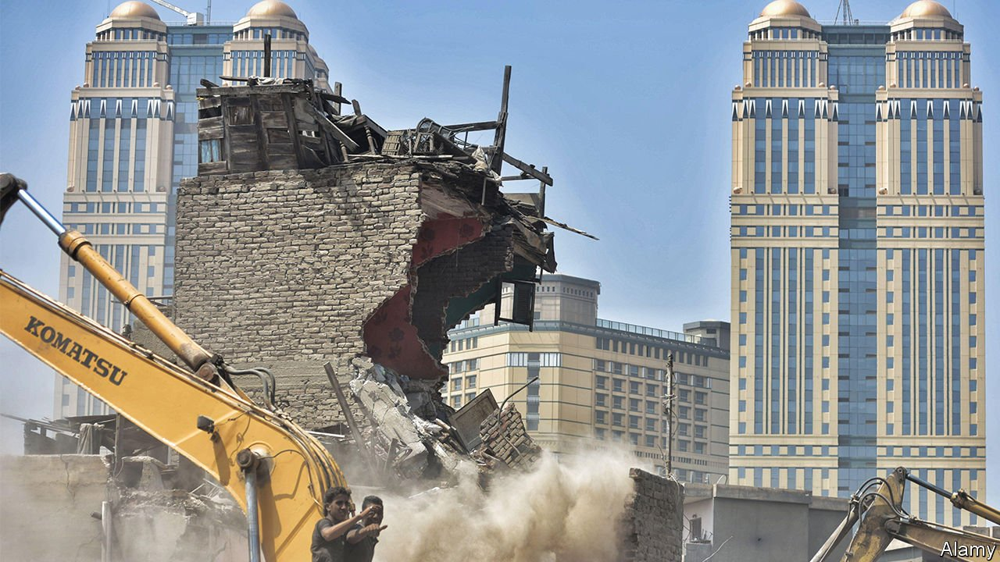
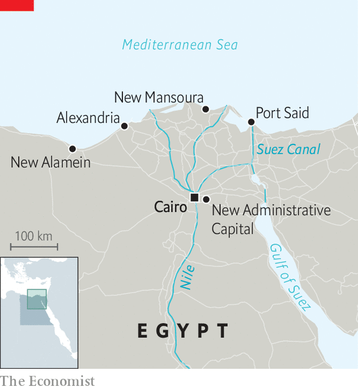

###### General engineering

# Egypt’s President Sisi wants to reshape its cities 

##### The rich will get luxury homes and quick commutes. The poor fear displacement 

 

> Mar 5th 2022 

TO JUDGE BY his social-media feeds, Abdel-Fattah al-Sisi missed his calling as a foreman. Egypt’s general-turned-president, who seized power in a coup in 2013, spends a fair bit of time on construction sites, poring over blueprints and chatting with men in hard hats. On February 28th he boarded a plane for a bird’s-eye view of the vast new capital rising in the eastern desert (see map). The $58bn project is still a construction site. After years of delays, though, the government hopes to start moving civil servants this month.

 


Mr Sisi is not the first modern leader to build a new capital. Governments in Myanmar, Brazil and Pakistan, among others, have decamped to new digs. His pharaonic predecessors were fond of moving their capitals, too. But his ambitions go beyond a new administrative hub. He is building new cities on the northern coast and razing parts of Cairo (pictured) for highways and purpose-built communities. Thousands of Egyptians have been moved. Millions more may soon follow.


If all goes to plan, the government hopes to reshape the country’s urban fabric. But it is doing so in a way that bespeaks a military man’s understanding of cities: not as messy, organic places where people live but as orderly and functional spaces populated by like-minded, and mostly prosperous, groups.

No one doubts that Cairo needs an overhaul. Around two-thirds of Cairenes live in shoddy informal housing. The World Bank estimated in 2012 that Cairo’s incessant traffic cost 4% of GDP in lost productivity and wasted fuel. A study by Cairo University in 2016 found noise levels in some residential districts averaged 80 decibels, akin to living on a factory floor.

Designed for 6.5m people, the new capital will replace tumult with tidiness. Instead of clogged flyovers and narrow alleys it will boast wide, tree-lined boulevards. Officials hope big firms will move their offices to a planned business district.

Similar things are happening on the northern coast. Locals call Alexandria the “bride of the Mediterranean”, but decades of runaway development spoiled its fair-maiden status. Mr Sisi’s regime wants to arrange new suitors for the sea. New Alamein’s planned high-rises west of Alexandria could serve as a summer capital. To the east, the $4bn New Mansoura imagines a pattern of artificial islands curving into the sea. A project near Port Said aims to attract 1m young people and entrepreneurs.

Much of this is aimed at the elite. Apartments in New Alamein run into millions of pounds, pricing out most Egyptians. At the Badr public-housing complex in the new capital, state employees can buy a discounted flat for 450,000 pounds ($28,640), almost 14 years’ pay at the public-sector minimum wage. (Those who cannot afford to move will get a transport allowance.)

Some developers muse that the wealthy may soon have little reason to visit Cairo at all, save for visiting family. From the western suburbs, with names like Palm Hills and Dreamland, downtown Cairo is a 25km journey, which can take more than an hour to cover in traffic. The new capital is 70km away, but motorists can zoom to it on newly built motorways. “The commute is three times farther, but it may not take much longer,” says one executive.

The new thoroughfares come at a cost to residents—living and dead. In Heliopolis, a middle-class district, thousands of trees have been uprooted to widen the roads. The authorities may also bulldoze parts of Cairo’s City of the Dead, a centuries-old necropolis and UNESCO world heritage site, to make room for a motorway.

Pouring so much concrete helps Mr Sisi cement his image as a man who gets things done. Billboards on new highways extol his “eight years of achievements”. But it also helps cement his control. Many of his new cities are billed as “smart”, a reference not only to services but to surveillance. An estimated 6,000 cameras, for example, will monitor the streets of the new capital. One activist likens it to the fictional capital from “The Hunger Games”.

The government says all this will transform Egypt: better housing, quicker commutes, less stressful cities. But that may only be true for a small minority. About two-thirds of Egyptians work in precarious and poorly paid informal jobs. They cannot afford cars to cruise along the new motorways, let alone luxurious new homes. Many of them fear they will be displaced by construction or forgotten amid an exodus of the better-off.

Residents of the “Maspero triangle”, a slum wedged behind the state-television building downtown, were recently moved out to make way for a fancy mixed-use development. Some were sent to a bleak new district on the outskirts of town. Others took a payout—but say it was not enough to buy flats in their former neighbourhood.

The area is now a sprawling construction site. On a busy street next to it, a young man hawking T-shirts gestures to the sign above his wares: everything costs 35 pounds ($2) each. “If I sell every one of these,” he says, before pointing to the high-rises sprouting behind him, “I cannot afford one of those.” ■

