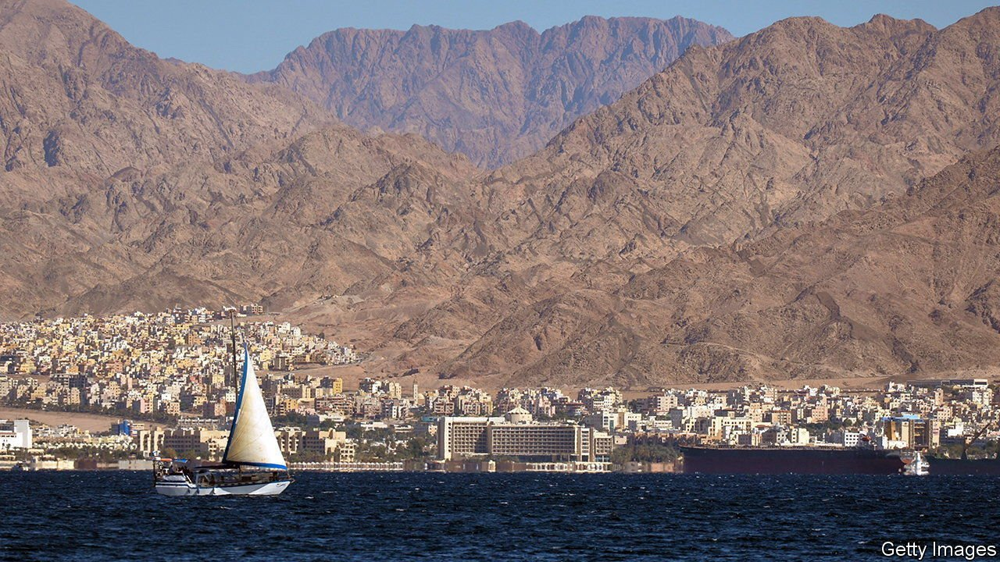
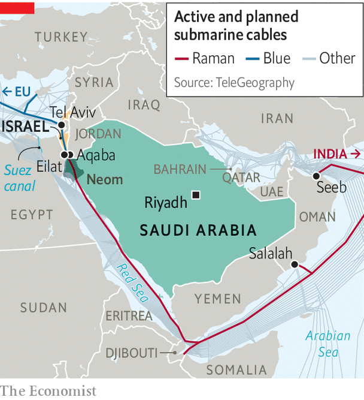

###### Message in a bottleneck

# Israel hopes new data cables can make friends of former enemies 

##### They will also break an Egyptian monopoly on internet traffic 

 

> Mar 5th 2022 

UNDER THE clear waters of the Red Sea, a high-speed data cable is being laid that will connect—for the first time—Israel to Saudi Arabia. The new link, which is part of two longer submarine cables running all the way from France to India, promises not only to improve the speed and lower the cost at which information can whizz between Europe and Asia. It is also knitting together a new regional alliance between Israel and countries in the Gulf that once regarded it as an enemy.

 


There is a solid business case for the new data pipeline, which is being built by Google and Telecom Italia, an Italian telecommunications firm, and is due to be finished in 2024. All other internet cables between Europe and Asia nip through Egypt along the route of the Suez canal (see map), or take a very long detour around Africa. Egypt’s government reckons that more than 90% of data between these regions goes through its territory. Internet firms grumble that this near-monopoly allows Egypt to charge extortionate transit fees. They also fret that this bottleneck makes them vulnerable to disruption.


For Israel, though, the new cable, named Blue-Raman, is far more than the sum of its 16 pairs of fibre-optic strands. It also represents a diplomatic thaw in the region. “For over seven decades all the Middle East’s trade routes and communications networks bypassed Israel,” says an Israeli official. “For the first time since Israel’s establishment, we’re becoming part of a regional infrastructure.”

Israel and Saudi Arabia do not have diplomatic relations and officially this route consists of two separate cables, one ending in the Jordanian port of Aqaba, the other starting in the nearby Israeli city of Eilat. In reality, it will be a single pipeline, built with the support of both governments.

The Saudis, who want to use the cable to plug in Neom, a planned high-technology city, are keeping mum. Muhammad bin Salman, the crown prince, has been quietly pushing the kingdom towards closer ties with Israel. But King Salman bin Abdulaziz has long held that normal relations cannot be established with Israel until Palestinians achieve statehood.

Nevertheless, the Saudis have given their blessing to their neighbours on the Persian Gulf to improve their own relationships with Israel. On February 14th Naftali Bennett became the first Israeli prime minister to visit Bahrain. “We wouldn’t be here if the Saudis weren’t fully aboard,” said a member of Mr Bennett’s delegation.

Bahrain was the second country after the United Arab Emirates (UAE) to establish ties with Israel under the so-called “Abraham Accords” in 2020. All parties hoped this would improve business ties. Yet progress has been slow. Israeli tech entrepreneurs and venture capitalists went to Dubai to court investors, but were disappointed. “The Emiratis are used to making major investments in established companies,” says one of the Israeli businessmen.

Infrastructure projects may have more success. Last year Israel and Jordan agreed to build an Emirati-financed desalination plant on Israel’s Mediterranean coast. It is to be powered by solar energy from Jordan, which will also get its water. And there are more undersea cables in the offing that would link Israel with the Gulf and Europe.

Israel’s data-cable diplomacy comes as it is also trying to improve its own internet infrastructure to spread tech jobs to poorer parts of the country. Most are currently concentrated in cities such as Tel Aviv, which was ranked as the world’s most expensive city to live in last year by the Economist Intelligence Unit (a sister company to The Economist).

Yoaz Hendel, the communications minister, has pushed through reforms to spread high-speed internet to smaller towns. In doing so Mr Hendel, a historian, is looking to the past as well as the future. He sees the new network of cables in the Middle East as “the 21st-century version of the Silk Road” connecting countries that, until recently, were enemies. ■

