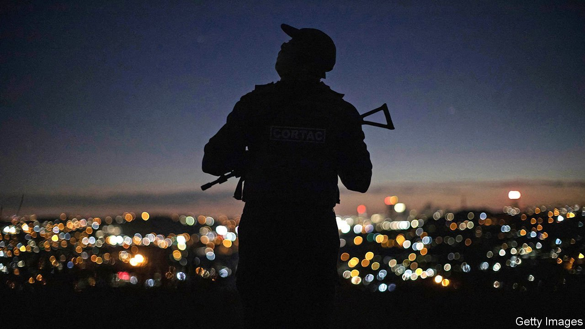

###### The parallel state

# South Africans are building alternatives to public services 

##### When the government fails, people fend for themselves 

 

> Mar 5th 2022 

JOHANNESBURG CLAIMS to be the largest city in the world that is not built on a coast, river or lake. But geography is no concern for the couples steering pedalos or the toddlers zooming down slides at the “lagoon”, a 300m stretch of watery fun that opened in September at Steyn City, the largest private estate in South Africa. Situated in the north of Johannesburg, Steyn City has shops, a school, generators, a petrol station, golf, 50km of biking trails, fishing dams, 24-hour security and a dinosaur-themed playground. There is even a helipad; but residents need never leave.

That, for some, is the point. The appeal of estates like Steyn City, which account for nearly one in five property transfers (a proxy for sales), is partly that they are fun. Yet they also represent a broader demand: for a sanctuary in a country where the state cannot seem to curb crime or provide decent services. And it is not just the rich who are fending for themselves. So, increasingly, is everyone else.


Since 1997 the number of pupils in private schools has tripled, from 236,000 to 703,000, while those in state schools inched up from 12.0m to 12.7m. (These figures downplay the popularity of fee-paying schools, since some state schools charge for attendance.) The increase is not happening in the most expensive schools, which are, in fact, becoming easier to get into, because so many well-heeled South Africans are emigrating. “The growth is in the low-to-mid range of the market,” says Lebogang Montjane, the head of the Independent Schools Association.

Private school groups such as Spark, Curro and ADvTECH promise a better alternative to the state sector. Though state schools in areas once reserved for black South Africans have improved since apartheid, on current trends it will still take 80 years before all ten-year-olds can understand what they are reading. Private fees are priced to be affordable for the black middle class. Spark costs 28,050 rand ($1,800) a year for primary school, roughly a fifth of what the dearest schools charge. Paying is a mark of status, notes Mr Montjane. “When you say you send your child to a private school it sounds a lot more impressive at a braai.”

At first glance health care is a different story: 15% of South Africans have health insurance, the same share as two decades ago. But many more avoid state hospitals if they fall ill. The nationally representative General Household Survey, published in December, found that people in 27% of households would go to a private provider if they were sick.

It would make sense. During the pandemic, hospitals gutted by graft were unable to cope with the influx of patients. Meanwhile the then health minister was accused in a report by state investigators of “improper” or “unlawful” conduct in relation to the diversion of millions of rands of covid-related funds to cronies and family members. (He has denied wrongdoing and asked the courts to set aside the report.)

Security is the clearest case of where private companies are replacing the state. In 1997 there were roughly as many police officers (110,000) as active security guards (115,000). Since then officer numbers have increased by 31% (to 144,000) but the number of private guards has ballooned by 383% (to 557,000). Gun-carrying watchmen and ubiquitous surveillance cameras that feed footage to security firms’ operation rooms are everyday sights in suburbs and high-walled estates.

In Steyn City one resident explains that her sons can go out cycling “and you don’t have to worry about them.” Another says: “It’s the closest I can give my children to what I had growing up: being able to walk outside without fearing for their safety.” It is easy to dismiss such views as hysterical responses to life in a highly unequal country or as veiled pretexts by whites for wanting to live in racially homogenous communities. But the sense that the state cannot protect citizens—underlined dramatically last year when the country saw the worst civil unrest since apartheid—is widely felt.

Just north of Steyn City is the township of Diepsloot. (Meaning “deep ditch” in Afrikaans; accurate, if unappealing branding.) Its plots are smaller than the bedrooms in a place like Steyn City; its shacks are smaller than the bathrooms. Toddlers splash in burst sewage pipes, not lagoons.

“Police cannot control the crime and the community is angry,” says Peter Molatjane, the chairman of a local business forum. Diepsloot has the fourth-highest rate of violent assault of any police precinct in the country. Addiction to nyaope—a mix of cheap heroin, cannabis, antiretroviral drugs and dilutants—is common. Criminal gangs make life hell. A lack of electricity makes nights darker and more dangerous (though, in a version of what is happening in richer suburbs where roofs glisten like fish scales, some residents use solar panels rather than rely on Eskom, the unreliable state utility.)

Few residents expect the cops to keep them safe. “The police are part of the problem,” says Philemon Mulovhedzi, a welder turned lay preacher, adding that they are bribed by gangs to turn a blind eye.

Instead residents are organising, in ways vaguely reminiscent of what happens in richer areas. Willie Hlungwane, who lives with his wife and four children in a shack, shows the gate he built and which he closes at night to keep out intruders. It is a ramshackle kind of “boom gate”, like those common at the end of streets in wealthier suburbs. Residents chip in a few rand to keep an armed guard fed throughout the night.

Occasionally there is vigilantism. Last year 300 Diepsloot residents seized two alleged robbers from police and killed the suspects. “I’m not saying it’s right but mob justice shows people care about their area,” says Papi Sathekge, a local activist.

Some South Africans emigrate to escape failing public services. But most cannot leave, or do not want to. Instead, argues Gwen Ngwenya of the opposition Democratic Alliance, they slip across an imaginary border, migrating, as it were, into the arms of “the private parallel state”. ■

