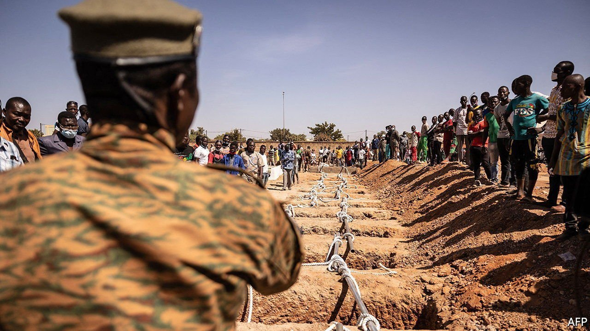
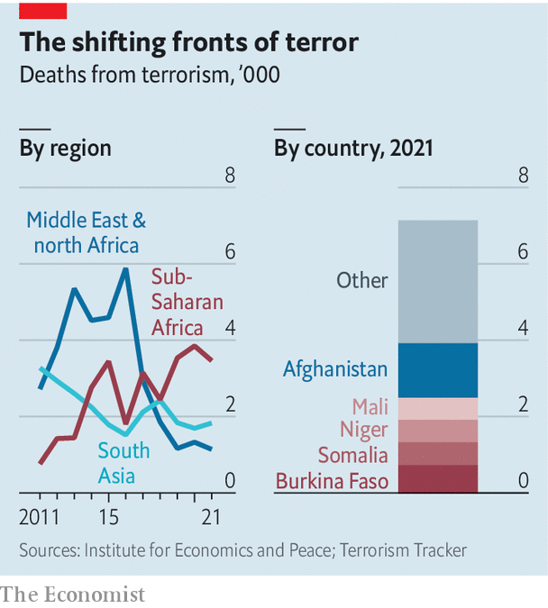

###### Fear moves south

# The world’s centre of terrorism has shifted to the Sahel 

##### Last year almost half of those killed by terrorists were in sub-Saharan Africa 

 

> Mar 5th 2022 

 


EVERY YEAR since 2017 more people have been killed in terrorist attacks in sub-Saharan Africa than in either South Asia or the Middle East and north Africa. By 2021 almost half of all those killed by terrorists globally were in sub-Saharan Africa, according to the Global Terrorism Index compiled by the Institute for Economics and Peace. Worst hit is the Sahel, a poorly governed strip of scrub south of the Sahara, which accounts for 35% of all deaths. One Sahelian group affiliated to al-Qaeda, Jama’at Nasr al-Islam wal Muslimin, is the fastest-growing terrorist group in the world.

